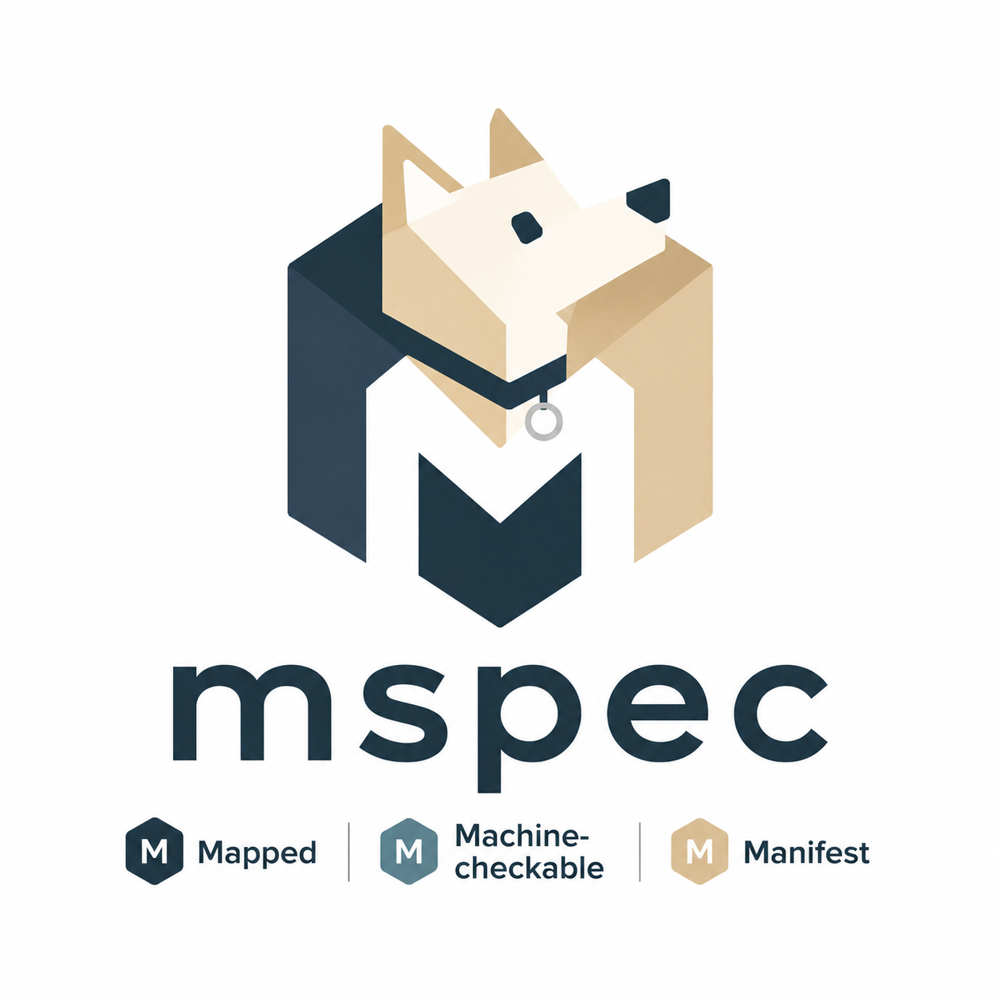

<!-- @mspec-delta 2026-05-15-063805-fix-command-name-consistency/specs/cli-core/spec.md -->
<!-- Requirements implemented: FR-002 -->
<!-- Change: fix-command-name-consistency -->

#  mspec



> **A spec-driven development framework for Claude Code that keeps LLM-authored specs and LLM-authored code locked together with machine-checkable links.**
>
> Spec, code, and tests can no longer drift apart without the CLI noticing.

[](https://opensource.org/licenses/MIT)


**[📖 Documentation](https://tubone24.github.io/mspec/)** — tutorials, how-to guides, reference, and explanation

---

## What the **M** stands for

mspec is named for **むぎぼー (mugibo)** — our project mascot dog — but the same **M** points at the three properties that define the framework. They are not slogans; each one maps to a concrete CLI check and a section in this README:

| M | Property | Enforced by |
|---|---|---|
| **Mapped** | Every line of code points back at the FR-ID it implements (and vice-versa). | `@mspec-delta` anchors + `mspec anchor check` |
| **Machine-checkable** | Validation, linting, merge, and TDD evidence are all deterministic — no LLM in the gate path. | `mspec validate` / `spec lint` / `archive` / `test expect-red\|green` |
| **Manifest** | Every artifact declares its purpose (Diátaxis `doc_type:`); the reader never has to guess. | `template-doc-type-invariant` e2e test |

The three sections below ("Three things that make mspec different") expand each **M** in order.

---

## What mspec is

mspec is a CLI plus a set of Claude Code slash commands, skills, and subagents that turn a single change request into a structured 11-step pipeline. Each step produces one Markdown artifact (`proposal.md`, `design.md`, `tasks.md`, …); the CLI deterministically validates the artifacts and, on archive, parser-merges the change into a long-lived source-of-truth spec.

The framework is **opinionated about three things** — the rest is intentionally minimal.

## Three things that make mspec different

### 1. **Mapped** — Anchors (`@mspec-delta`) link spec ↔ code in both directions

Every implementation file and every E2E test carries a 3-line comment block pointing back at the Delta Spec and the FR-IDs it implements:

```ts
/**
 * @mspec-delta 2026-05-14-093015-add-search/specs/search-engine/spec.md
 * Requirements implemented: FR-005, FR-007
 * Change: add-search
 */
export function searchDocs() { /* ... */ }
```

`mspec anchor check` walks the tree and rejects:
- Anchors pointing at a spec or FR-ID that does not exist.
- FR-IDs in the Delta Spec that no code or test claims.

The check is plain regex + filesystem lookup — no LLM in the validation path. See [`docs/reference/anchors.md`](docs/reference/anchors.md).

### 2. **Machine-checkable** — Tests are checked *against* the anchors

The `implement` step is the only step that runs code. It refuses to mark itself done unless three round-trip invariants hold:

| Flag | Invariant enforced |
|---|---|
| `enforce_anchor` | Every `FR-NNN` in the Delta Spec has at least one anchor pointing back to it. |
| `enforce_e2e` | Every `#### Scenario:` block has a corresponding E2E task in `tasks.md`. |
| `enforce_tdd` | Each task ran through `mspec test expect-red` before `mspec test expect-green`. Evidence is written to `.mspec/cache/`. |

Together those flags close the loop:

```
Delta Spec FR-NNN  ──── anchor ────  implementation code
       │
       └── Scenario ──── E2E task ──── E2E test (green)
```

If any leg of the round-trip is missing, the workflow blocks. Details in [`docs/reference/workflow.md`](docs/reference/workflow.md).

### 3. **Manifest** — `doc_type` makes every artifact declare its Diátaxis quadrant

mspec adopts the [Diátaxis](https://diataxis.fr/) documentation framework as the taxonomy for change artifacts. Each template's YAML frontmatter has a mandatory `doc_type:` field whose value MUST be one of:

| `doc_type` | Reader's question |
|---|---|
| `Tutorial` | "Teach me by walking me through it." |
| `How-to` | "How do I get this specific thing done?" |
| `Reference` | "What are the exact parameters / structure?" |
| `Explanation` | "Why was it built this way?" |

Custom or compound values (`AI-Internal`, `Mixed`, …) are explicitly forbidden by `specs/artifact-taxonomy/spec.md:FR-002`, and the rule is enforced by `tests/e2e/template-doc-type-invariant.e2e.test.ts`.

Why it matters: the reader of `design.md` arrives knowing "this is Reference, I am looking up a decision," not "this is mixed, I have to skim it all." It forces the writer to commit to a purpose per artifact. The current per-artifact mapping (and the open debates around `design.md` and `tasks.md`) lives in [`docs/reference/doc-types.md`](docs/reference/doc-types.md).

---

## Install

```bash
npm install -g @mspec/cli
```

Verify:

```bash
mspec --version      # 0.1.0
```

The Web UI is included as an optional dependency. If not automatically installed:

```bash
npm install @mspec/web-ui
```

> **For contributors developing on mspec itself:** clone the repo and use `npm link` instead.
>
> ```bash
> git clone https://github.com/tubone24/mspec.git ~/tools/mspec
> cd ~/tools/mspec/packages/cli
> npm install
> npm run build
> npm link             # exposes `mspec` on your PATH
> ```
>
> Running `mspec init` from inside the mspec source repo will run `npm run build && npm link` for you automatically (see `packages/cli/src/commands/init.ts:133`).

## Use

In your target project:

```bash
mspec init                          # writes .mspec/, memory/, .claude/
mspec new add-search                # creates changes/<ts>-add-search/
```

Then open Claude Code in that project and run:

```
/mspec:new
```

…and follow the prompts. Every blocking step pauses for review; `/mspec:continue` advances. Full walkthrough in [`docs/tutorials/getting-started.md`](docs/tutorials/getting-started.md).

---

## Web UI


`@mspec/web-ui` starts automatically when you run `mspec new` or `mspec continue`. Open the dashboard at `http://localhost:3847`. It is an optional peer of `@mspec/cli`; if it was not installed automatically, install it manually with `npm install @mspec/web-ui`.

### Opening the Dashboard

Start any mspec command that drives the workflow (`mspec new`, `mspec continue`) and the dev server starts in the background. Navigate to `http://localhost:3847` in a browser. No separate process management is required.

### The Dashboard

```
┌─────────────────────────────────────────────────────────────────┐
│  mspec              / dashboard           [search]  [◐ theme]   │
├───────────────┬─────────────────────────────────────────────────┤
│  STATUS       │  Changes                                        │
│  In progress  │  ─────────────────────────────────────────────  │
│  Ready        │  Add search feature           full · 3m ago     │
│  Shipped      │  2 reqs · 4 scenarios · 5 artifacts   [▓▓▓░░░]  │
│  ─────────    │                                                  │
│  MODE         │  Fix login redirect           bugfix · 1h ago   │
│  All          │  1 req · 2 scenarios · 3 artifacts    [▓▓▓▓▓░]  │
│  Full         │                                                  │
│  Bugfix       │                                                  │
│  Minor        │                                                  │
│  Typo         │                                                  │
│  ─────────    │                                                  │
│  NAVIGATE     │                                                  │
│  ◈ Spec View  │                                                  │
└───────────────┴─────────────────────────────────────────────────┘
```

- Filter by **status**: In Progress, Ready to Read, Shipped, Archived
- Filter by **mode**: Full, Bugfix, Minor, Typo
- **Live search** across name, title, summary, tags
- **Step progress bars**: done (green), ready (blue+pulse), blocked (gray), skipped (yellow), invalid (red)
- Sorted by most-recently-updated with relative timestamps

### Browsing artifacts


```
┌──────────────┬──────────────────────────────────────────────────┐
│  Artifacts   │  proposal.md                              [✕]   │
│ ─────────    │  ─────────────────────────────────────────────── │
│  proposal.md │  # Add full-text search                          │
│  design.md   │                                                  │
│  tasks.md    │  ## Why                                          │
│  spec.md     │  Users asked for search across changes…          │
│              │                                                  │
│              │  ```mermaid                                       │
│              │  graph LR                                         │
│              │    A --> B                                        │
│              │  ```                                              │
└──────────────┴──────────────────────────────────────────────────┘
```

- **Diátaxis doc_type color coding**: Reference (blue), Explanation (purple), How-to (green), Tutorial (yellow)
- **Mermaid diagrams** rendered inline
- **Syntax-highlighted code blocks** (via Shiki, github-light/dark themes)
- **EARS/Gherkin keywords** colorized (SHALL, MUST, GIVEN, WHEN, THEN, AND, BUT)
- **HTML prototype preview** via inline iframe
- **@mspec-delta comment anchors** visually dimmed

### Reading source-of-truth specs

The Spec Viewer (◈ Spec View in the sidebar) lists every capability spec under `specs/`. Select a spec to read its full content with the same rendering pipeline as the artifact viewer — Mermaid, syntax highlighting, and keyword colorization all apply.

### Test results

The test results page shows pass/fail/skip counts for the most recent `mspec test expect-green` run, with expandable failure details per task. Navigate to it from the change detail view once the implement step has recorded evidence.

### Themes

Four reading themes are available, toggled via the `[◐ theme]` control in the header. Selection persists across sessions via `localStorage`.

| Theme | Description |
|---|---|
| Light | Default white |
| Sepia | Warm parchment |
| Green | Terminal-style |
| Dark | Low-light reading |

---

## What `mspec init` actually writes

```
your-project/
├── .mspec/
│   ├── config.yaml              # locale, test runner, project meta, integrations
│   └── workflow.yaml            # 11 steps + lightweight modes
├── memory/
│   └── constitution.md          # 5 project principles, evaluated per step
├── .claude/
│   ├── commands/mspec/*.md      # 12 slash commands (incl. /mspec:continue)
│   ├── skills/mspec-*/SKILL.md  # 11 step skills
│   └── agents/mspec-*.md        # 3 subagents (omit with --no-subagents)
├── changes/                     # work-in-progress changes
└── specs/                       # source-of-truth specs (per capability)
```

`mspec init` also appends `.mspec/cache/` to `.gitignore` if missing. It refuses to overwrite existing files unless you pass `--force`.

The slash commands, skills, and subagents are copied verbatim from `packages/cli/templates/claude/` — what you see in this repo's `.claude/` is exactly what new users receive.

---

## Workflow at a glance

```
new ─▶ proposal ─▶ delta ─▶ research ─▶ design ─▶ quickstart
                                                       │
        ┌──────────────────────────────────────────────┘
        ▼
   checklist ─▶ self-review ─▶ tasks ─▶ implement ─▶ archive
```

| Step | Slash command | Artifact | What it does |
|---|---|---|---|
| 1 | `/mspec:new` | `readme.md` | Bootstraps the change dir. |
| 2 | `/mspec:proposal` | `proposal.md` | Clarification Q&A → Why / Goals / Capabilities / Constitution Phase 0. |
| 3 | `/mspec:delta` | `specs/<capability>/spec.md` | Auto-numbered FR-NNN Delta Spec skeleton. |
| 4 | `/mspec:research` | `research.md` | Subagent does web search + codebase grep, returns trade-off matrix. |
| 5 | `/mspec:design` | `design.md` + `architecture-overview.md` | Decisions + Mermaid + Constitution Phase 1. |
| 6 | `/mspec:quickstart` | `quickstart.md` | Golden path / verify / troubleshooting (How-to). |
| 7 | `/mspec:checklist` | `checklist.md` | Auditor subagent produces Delta + regression checks. |
| 8 | `/mspec:review` | (appends to `design.md`) | Independent self-review subagent. |
| 9 | `/mspec:tasks` | `tasks.md` | Numbered tasks with anchor blocks; E2E tasks come before implementation. |
| 10 | `/mspec:implement` | code + tests | TDD red→green, anchors enforced. |
| 11 | `/mspec:archive` | `changes/archive/<ts>-<feature>/` | Deterministic parser merge of Delta into SoT spec. |

Lightweight modes for typo / minor / bugfix changes skip the heavier steps — see [`docs/how-to/lightweight-changes.md`](docs/how-to/lightweight-changes.md).

---

## Configuration

`.mspec/config.yaml`:

```yaml
version: 1

# Artifact output language (ISO 639-1; ja and en ship out of the box)
locale: ja

# Test runner — used by `mspec test expect-red/expect-green`
test:
  command: "vitest run"
  expect_red_on_exit: [1, 2]
  expect_green_on_exit: [0]

# Project-wide metadata
project:
  default_capability: ""
  language: "typescript"

# Integrations
integrations:
  claude:
    enabled: true
    subagents: true
```

> `locale` is a **top-level** key — `project.locale` is ignored. To add a new locale, drop `templates/artifacts/*.<code>.md` + `templates/questions/*.<code>.yaml` in either the package or `.mspec/templates/artifacts/`; `mspec init` is not required.

`.mspec/workflow.yaml` declares the steps and the enforcement flags (`block`, `subagent`, `enforce_anchor`, …). Full schema in [`docs/reference/workflow.md`](docs/reference/workflow.md).

---

## CLI quick index

```bash
mspec init                              # bootstrap
mspec new <feature>                     # start a change
mspec continue                          # next-step prompt for the LLM
mspec status [--change <name>] [--json] # artifact status
mspec validate [--strict]               # markdown + anchor + scenario check
mspec spec lint                         # forbid implementation-detail leak in SoT
mspec anchor check                      # bi-directional anchor verification
mspec test expect-red <task-id>         # TDD evidence: failing test recorded
mspec test expect-green <task-id>       # TDD evidence: passing test recorded
mspec archive <change> [--dry-run]      # parser-merge Delta into SoT spec
```

Full reference (every flag, every exit code) in [`docs/reference/cli.md`](docs/reference/cli.md).

---

## Documentation

Organized with Diátaxis — pick by intent:

| You want to... | Go to |
|---|---|
| **Learn** by walking through a first change | [`docs/tutorials/getting-started.md`](docs/tutorials/getting-started.md) |
| **Solve a task** (skip steps, customize workflow) | [`docs/how-to/`](docs/how-to/) |
| **Fix anchor errors** (`mspec anchor check` / `list` failures, `[orphan]` tags) | [`docs/how-to/fix-anchor-errors.md`](docs/how-to/fix-anchor-errors.md) |
| **Look up** a CLI flag or YAML key | [`docs/reference/`](docs/reference/) |
| **Understand why** mspec works the way it does | [`docs/explanation/why-mspec.md`](docs/explanation/why-mspec.md) |

---

## Constitution

`memory/constitution.md` defines 5 project principles, each evaluated at Phase 0 (proposal) and Phase 1 (design / self-review):

1. **Step independence** — each step runs in an isolated context and re-reads prior artifacts.
2. **Deterministic merge** — Delta → SoT merge is CLI-only, byte-identical across runs.
3. **Question-driven requirements** — humans answer via `AskUserQuestion`; no free-form Markdown brainstorm.
4. **Bi-directional anchors** — `@mspec-delta` mandatory in implementation and E2E.
5. **Separation of mandatory and extension steps** — Spec / Delta Spec / Archive are non-removable.

`mspec constitution show` to print the current file.

---

## Project status

- **Version**: `0.1.0`. Single tooling target: Claude Code.
- **Tests**: 336 passing across 64 files (`cd packages/cli && npm test`).
- **Runtime**: Node.js ≥ 18, TypeScript 5.6+, ES2022.
- **Major deps**: commander, zod, remark/unified, yaml, gray-matter, picocolors.

## License

MIT.
