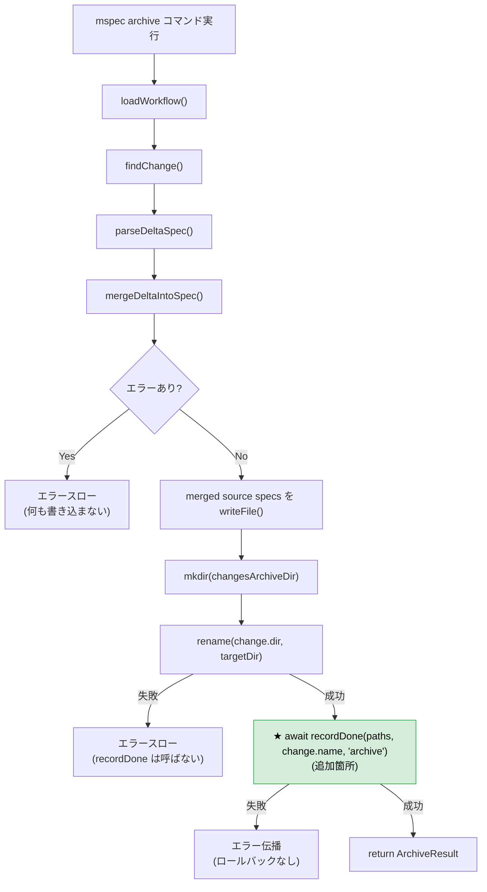
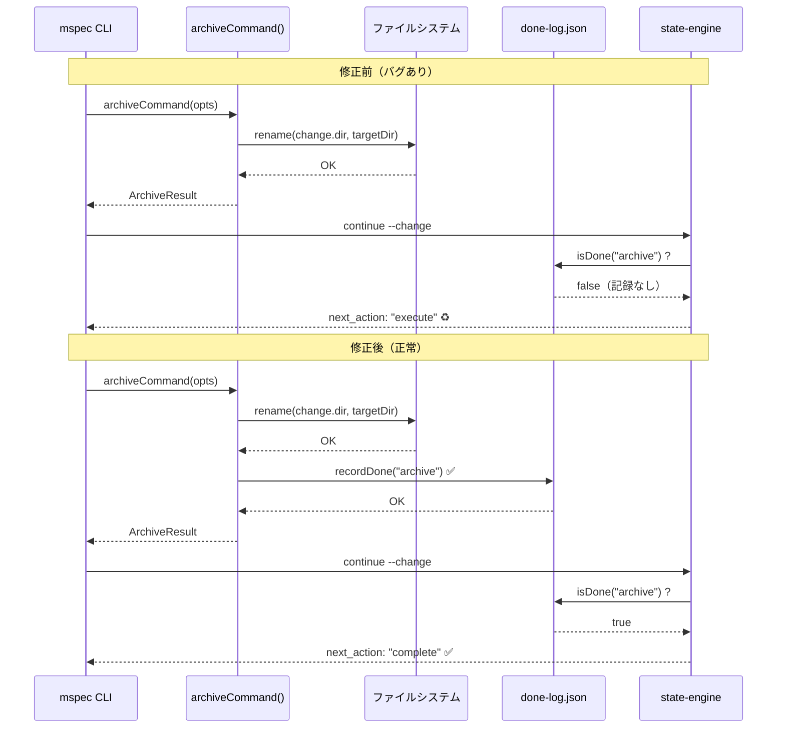
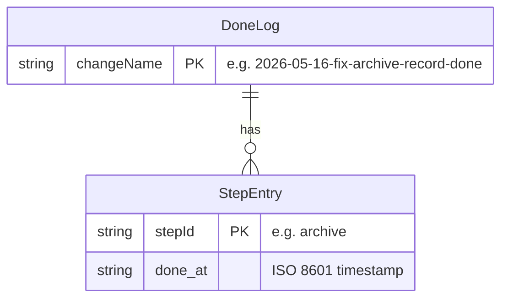

# Architecture Overview: fix-archive-record-done

## System Diagram

## Sequence Diagram: `mspec continue` 完了検知の修正前後

## Data Model: done-log.json

**書き込みタイミング**: `archiveCommand` が `rename()` 成功後に `recordDone()` を呼ぶことで追加される。

## Constitution Check

> Step: design (architecture-overview) | Constitution Version: 1

| Principle | Phase 0 | Phase 1 | Notes |
|-----------|---------|---------|-------|
| I. ステップ独立性 | ✅ | ✅ | 図はarchive.tsの単一変更を表現 |
| II. 決定論的マージ | ✅ | ✅ | アーキテクチャ変更なし、フロー追加のみ |
| III. 質問駆動の要件確定 | ✅ | ✅ | シーケンス図は確定済み仕様を図示 |
| IV. 双方向アンカー | — | ✅ | シーケンス図の「修正後」がFR-003シナリオに対応 |
| V. 強制ステップと拡張ステップの分離 | ✅ | ✅ | 図の変更範囲はarchiveステップのみ |

### Complexity Tracking

None
