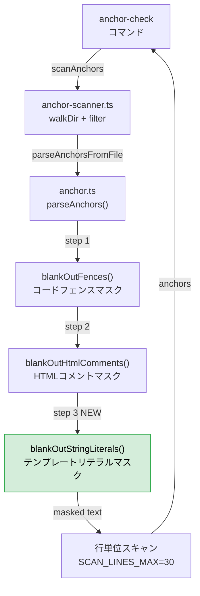
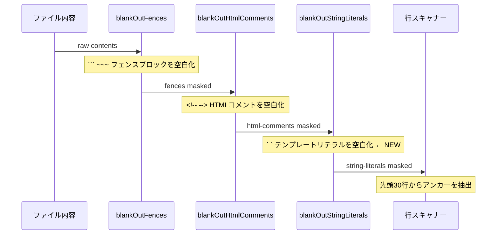
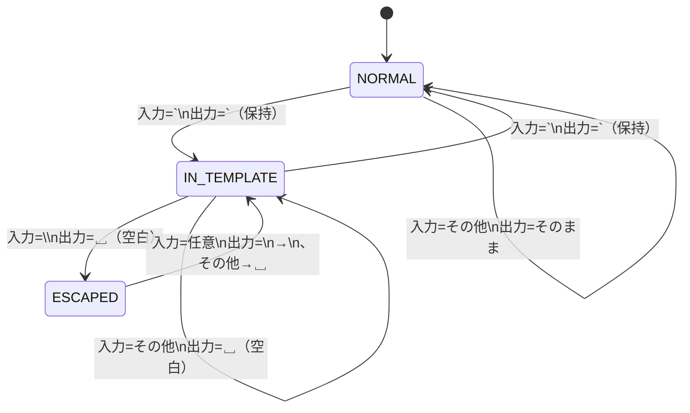

# Architecture Overview: fix-anchor-change-dir-lookup

## System Diagram



## Mask Chain Sequence



## State Machine: `blankOutStringLiterals`



## Data Model

### 変更前後の `parseAnchors` 処理フロー

| ステップ | 関数 | anchor.test.ts への効果 |
|----------|------|-------------------------|
| 1 | `blankOutFences` | 変化なし（フェンスなし） |
| 2 | `blankOutHtmlComments` | 変化なし（HTMLコメントなし） |
| 3（NEW） | `blankOutStringLiterals` | テンプレートリテラル内の `@mspec-delta` が空白化 → 偽陽性を排除 |

### 入出力例

入力（`anchor.test.ts` の一部）:
```
const src = `
 * @mspec-delta 2026-05-14-093015-apply-css/specs/theme-engine/spec.md
 * Requirements implemented: FR-005, FR-007
`;
```

`blankOutStringLiterals` 適用後:
```
const src = `
                                                                                     
                                                                  
 `;
```

行番号・行長さは保持されるためオフセット計算に影響なし。

## Constitution Check

| Principle | Phase 0 | Phase 1 |
|-----------|---------|---------|
| I ステップ独立性 | OK | OK — マスクチェーンへの純粋追加。既存の図に示す通り上流/下流への影響なし |
| II 決定論的マージ | OK | OK — 状態マシンは参照透明。同一入力→同一出力 |
| III 質問駆動の要件確定 | OK | OK — Option B 採用をユーザーと合意済み |
| IV 双方向アンカー | OK | OK — 実装時に `anchor.test.ts` へ FR-018 アンカーを追加 |
| V 強制ステップと拡張ステップの分離 | OK | OK — research ステップ強制実行済み |

### Complexity Tracking

None
