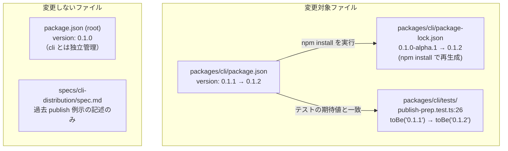
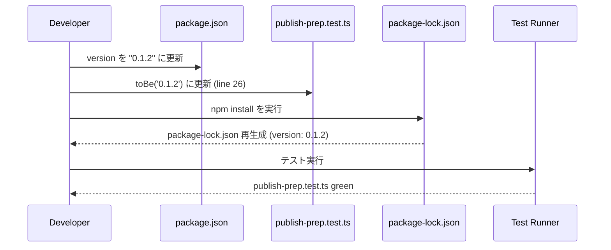

# Architecture Overview: bump-cli-version-0-1-2

## System Diagram

## Change Sequence

## Scope Boundary

| ファイル | 対象 | 理由 |
|----------|------|------|
| `packages/cli/package.json` | ✅ 変更 | メインの version 定義箇所 |
| `packages/cli/tests/publish-prep.test.ts` | ✅ 変更 | version 直値検証のため更新必要 |
| `packages/cli/package-lock.json` | ✅ 再生成 | npm install で自動更新 |
| `package.json` (root) | ❌ 対象外 | cli とは独立したバージョン管理 |
| `specs/cli-distribution/spec.md` | ❌ 対象外 | 過去の例示記述のみ、現行要件ではない |

## Constitution Check

| Principle | Phase 0 | Phase 1 |
|-----------|---------|---------|
| I. ステップ独立性 | ✅ architecture-overview.md のみ生成 | ✅ 他ステップの成果物に依存せず独立 |
| II. 決定論的マージ | ✅ 新規ファイルのみ、競合なし | ✅ スコープ境界が明確に定義されている |
| III. 質問駆動の要件確定 | ✅ research で解消済み | ✅ 追加判断事項なし |
| IV. 双方向アンカー | ✅ design.md D-001〜D-003 と整合 | ✅ 図が実装タスクのスコープを正確に反映 |
| V. 強制ステップと拡張ステップの分離 | ✅ 強制ステップのみ実行 | ✅ 拡張ステップへの依存なし |

### Complexity Tracking

None
