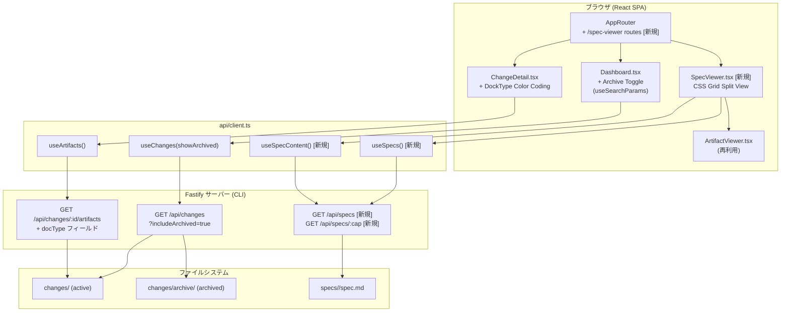
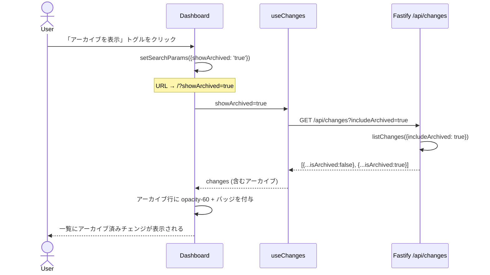
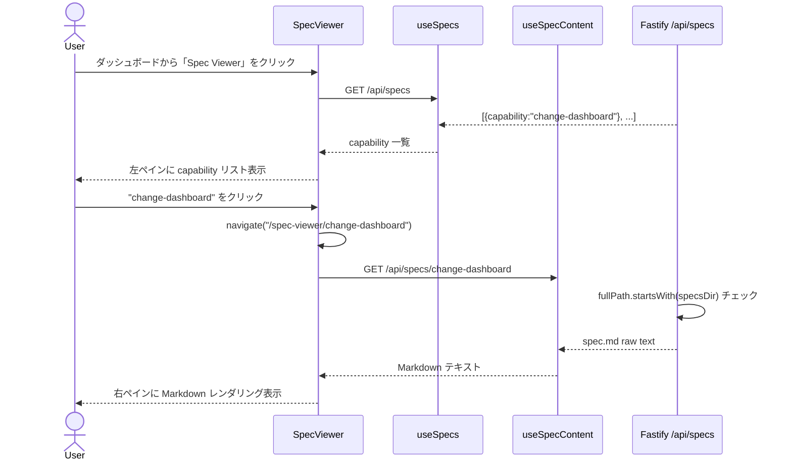
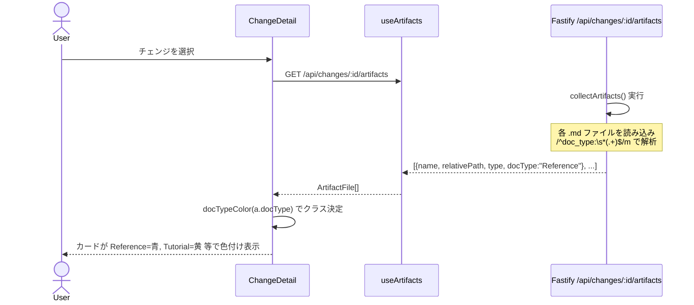
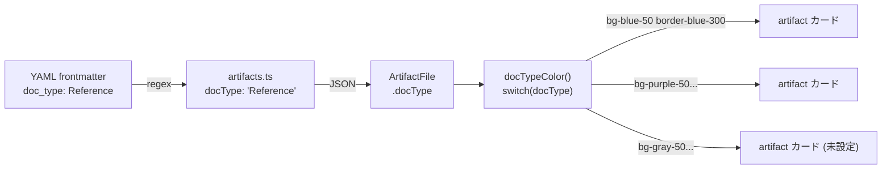

# Architecture Overview: web-ui-enhancements

## System Diagram

## Sequence: アーカイブフィルター ON (FR-008)

## Sequence: SoT Spec ビューアー表示 (FR-009)

## Sequence: DockType 色付き artifact 一覧 (FR-011)

## Data Flow: DockType 色パレット

## Constitution Check (Phase 0 + Phase 1)

| 原則 | Phase 0 | Phase 1 |
|------|---------|---------|
| I. ステップ独立性 | ✅ architecture-overview はコードを書かない | ✅ 図は design.md と整合 |
| II. 決定論的マージ | ✅ 新規 FR のみ図示 | ✅ 既存ルーティングへの追記のみ |
| III. 質問駆動 | ✅ Open Choices は解決済み | ✅ 未決定事項なし |
| IV. 双方向アンカー | ✅ 実装時に各ファイルに `@mspec-delta` アンカーを付与 | ✅ |
| V. 強制/拡張分離 | ✅ architecture-overview は強制ステップの成果物 | ✅ |
| VI. Security by Default | ✅ パストラバーサル防止をシーケンス図に明記 | ✅ |

### Complexity Tracking

None
