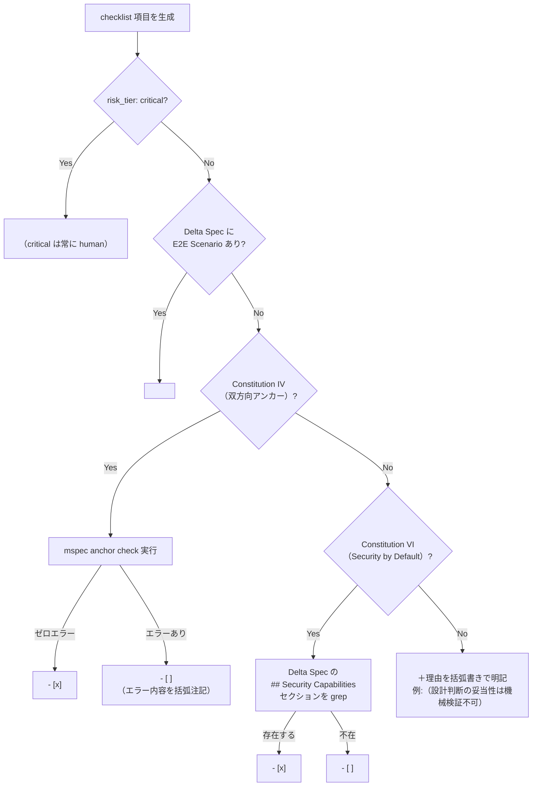
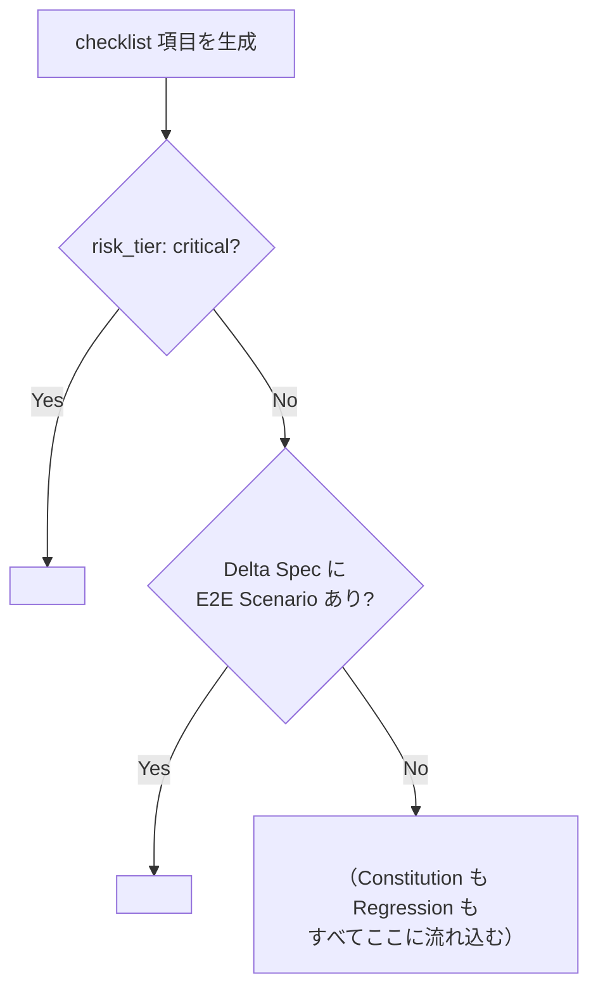
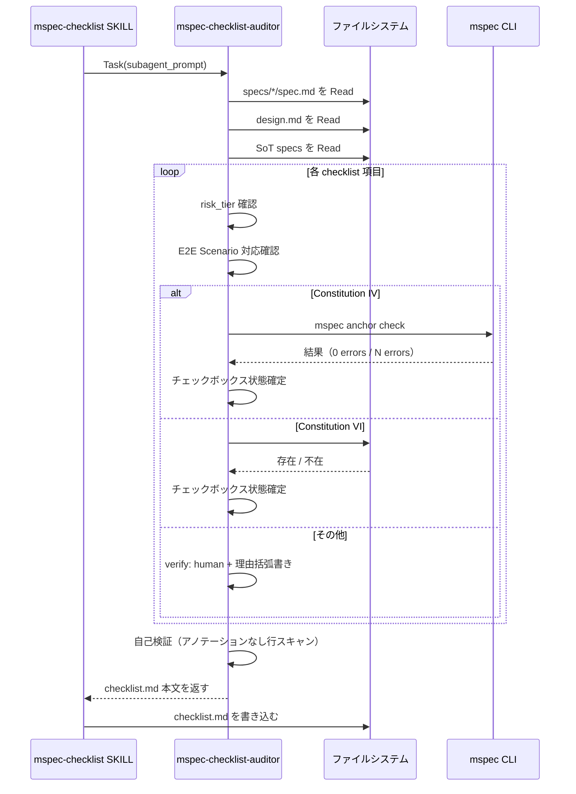

<!-- @mspec-delta 2026-05-26-084133-reduce-verify-human-in-checklist/specs/verify-routing/spec.md -->
<!-- Requirements implemented: FR-006, FR-007 -->
<!-- Change: reduce-verify-human-in-checklist -->

# Architecture Overview: reduce-verify-human-in-checklist

## System Diagram

変更前後の verify アノテーション決定フローを示す。

### 変更後: verify ルーティングフロー（mspec-checklist-auditor 内）

### 変更前: verify ルーティングフロー（旧）

---

## Sequence Diagram: checklist.md 生成フロー

---

## Data Model: verify アノテーション分類

| 項目カテゴリ | 条件 | アノテーション | チェックボックス初期値 |
|------------|------|--------------|-------------------|
| critical FR | risk_tier: critical | `<!-- verify: human -->` | `- [ ]` |
| Delta Spec FR | E2E Scenario あり | `<!-- verify: fr-NNN -->` | `- [ ]` |
| Constitution IV | `mspec anchor check` ゼロエラー | `<!-- verify: human -->` | `- [x]` |
| Constitution IV | `mspec anchor check` エラーあり | `<!-- verify: human -->` | `- [ ]` + 注記 |
| Constitution VI | Security Capabilities 存在 | `<!-- verify: human -->` | `- [x]` |
| Constitution VI | Security Capabilities 不在 | `<!-- verify: human -->` | `- [ ]` |
| その他すべて | — | `<!-- verify: human -->` | `- [ ]` + 理由括弧書き |

---

## Constitution Check

| Principle | Phase 0 | Phase 1 |
|-----------|---------|---------|
| I. ステップ独立性 | auditor 変更は checklist ステップのみに閉じる | ✅ 他スキル・他ステップへの依存追加なし |
| II. 決定論的マージ | Mermaid 図・データモデルは設計を記述するのみ。マージロジック変更なし | ✅ architecture-overview.md は読み取り専用成果物 |
| III. 質問駆動の要件確定 | AskUserQuestion で全 Open Choices 確定済み | ✅ 未確定事項なし |
| IV. 双方向アンカー | `@mspec-delta` アンカー付与済み | ✅ `mspec anchor check` で確認予定 |
| V. 強制ステップと拡張ステップの分離 | 既存ステップ内の拡張のみ。新ステップ追加なし | ✅ workflow.yaml 変更なし |
| VI. Security by Default | ファイル変更はエージェント定義 2 件のみ | ✅ 外部ネットワーク依存・権限境界変更なし |
