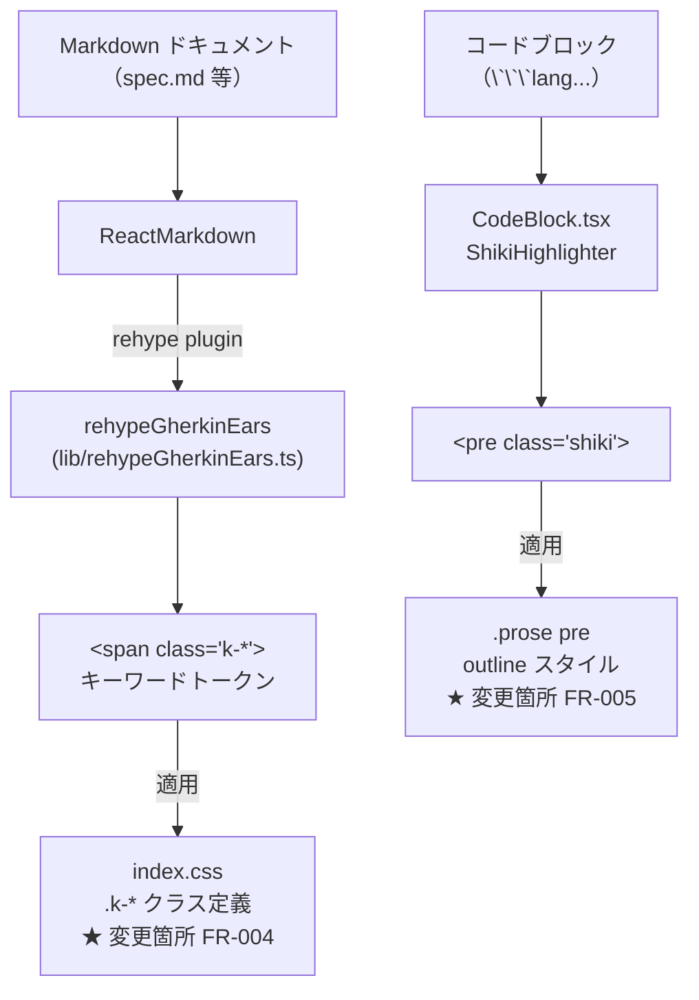

# Architecture Overview: webui-keyword-badge-style

## System Diagram



## Data Flow: キーワードバッジ（FR-004）

```mermaid
sequenceDiagram
    participant MD as Markdown テキスト
    participant RE as rehypeGherkinEars
    participant HTML as HAST/HTML
    participant CSS as index.css (.k-*)

    MD->>RE: テキストノードを検査
    RE->>RE: RULES でキーワードを検出
    RE->>HTML: &lt;span class="k-shall"&gt;SHALL&lt;/span&gt; に変換
    HTML->>CSS: className="k-shall" でスタイル適用
    Note over CSS: color + font-weight (既存)<br/>background-color + border-radius + padding (追加)
```

## 変更対象ファイル

| ファイル | 変更種別 | 変更内容 |
|----------|----------|----------|
| `packages/web-ui/src/index.css` | 修正 | `.k-*` クラスに `background-color`, `border-radius: 3px`, `padding: 1px 5px` を追加（FR-004） |
| `packages/web-ui/src/index.css` | 修正 | `.prose pre` に `outline: 1px solid var(--color-border); outline-offset: 0` を追加（FR-005） |

## CSS 変更差分イメージ

```css
/* Before */
.k-shall { color: #dc2626; font-weight: 600; }

/* After */
.k-shall { color: #dc2626; font-weight: 600; background-color: #fee2e2; border-radius: 3px; padding: 1px 5px; }
```

```css
/* After (新規追加) */
.prose pre {
  outline: 1px solid var(--color-border);
  outline-offset: 0;
}
```

## テーマ対応マトリクス

| キーワード | light bg | dark bg | 元テキスト色 (light) |
|-----------|----------|---------|---------------------|
| SHALL / MUST / MUST NOT | #fee2e2 (red-100) | #450a0a (red-950) | #dc2626 |
| SHOULD / SHOULD NOT | #fef3c7 (amber-100) | #451a03 (amber-950) | #b45309 |
| MAY | #fef9c3 (yellow-100) | #422006 (yellow-950) | #a16207 |
| GIVEN | #dbeafe (blue-100) | #172554 (blue-950) | #1d4ed8 |
| WHEN | #e0f2fe (sky-100) | #082f49 (sky-950) | #0369a1 |
| THEN | #dcfce7 (green-100) | #052e16 (green-950) | #15803d |
| AND | #cffafe (cyan-100) | #083344 (cyan-950) | #0891b2 |
| BUT | #ede9fe (violet-100) | #2e1065 (violet-950) | #7c3aed |

## Constitution Check

| Principle | Phase 0 | Phase 1 |
|-----------|---------|---------|
| I. ステップ独立性 | ✅ CSS のみの変更 | ✅ ダイアグラムは他ステップへの依存なし |
| II. 決定論的マージ | ✅ | ✅ 変更対象ファイルと差分を明示済み |
| III. 質問駆動の要件確定 | ✅ | ✅ テーマ対応マトリクスで全ケースを網羅 |
| IV. 双方向アンカー | ✅ | ✅ FR-004/FR-005 と変更箇所が対応 |
| V. 強制ステップと拡張ステップの分離 | ✅ | ✅ |
| VI. Security by Default | ✅ | ✅ CSS のみ、セキュリティリスクなし |
