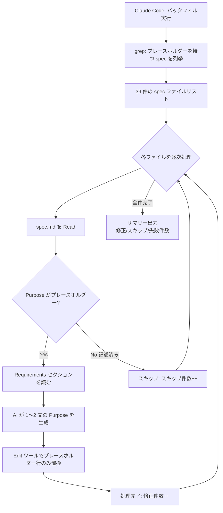
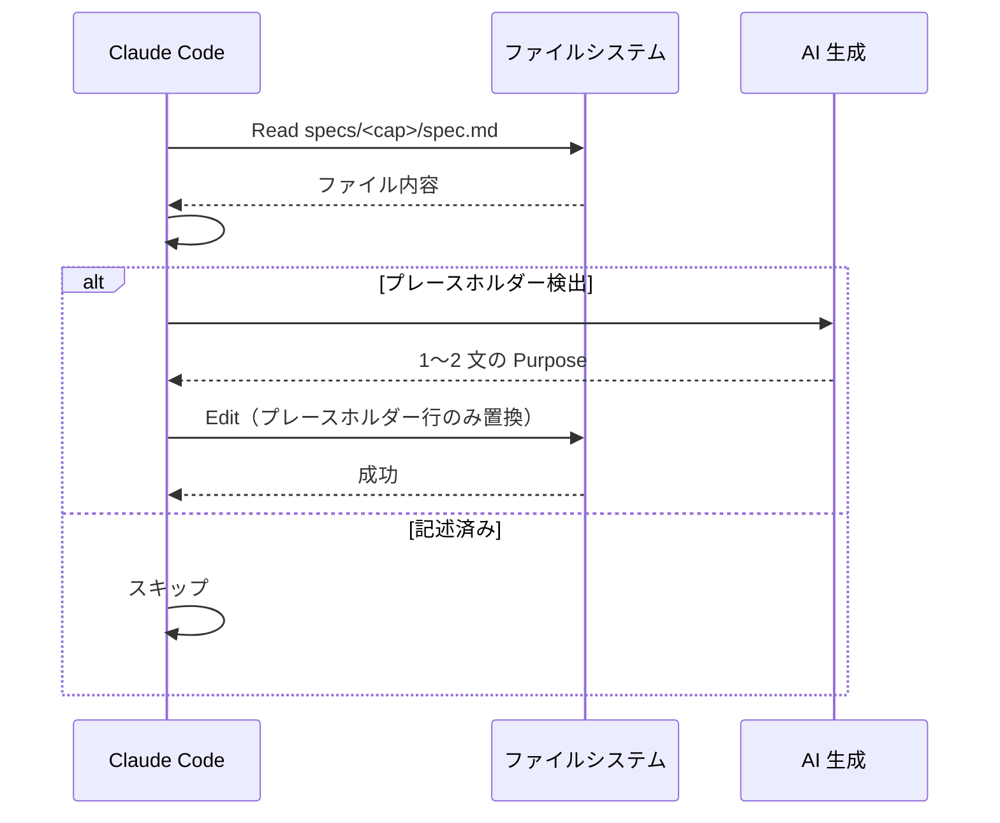

# Architecture Overview: fix-existing-purpose-placeholders

## System Diagram

## Sequence Diagram: 1 ファイルの処理フロー

## Constitution Check

| Principle | Phase 0 | Phase 1 | Notes |
|-----------|---------|---------|-------|
| I. ステップ独立性 | ✅ | ✅ | アドホック実行。他ステップへの副作用なし |
| II. 決定論的マージ | ✅ | ✅ | CLI マージは変更なし |
| III. 質問駆動の要件確定 | ✅ | ✅ | 全決定事項が proposal に記録済み |
| IV. 双方向アンカー | N/A | N/A | アドホック実行のためアンカー対象なし |
| V. 強制ステップと拡張ステップの分離 | ✅ | ✅ | SKILL.md・workflow.yaml 変更なし |
| VI. Security by Default | ✅ | ✅ | ローカル書き込みのみ。外部 API なし |
| VII. 設計意図と実装の対応確認 | ✅ | ✅ | FR-005 の設計意図を FR-006 で明示的に記録・実装 |
