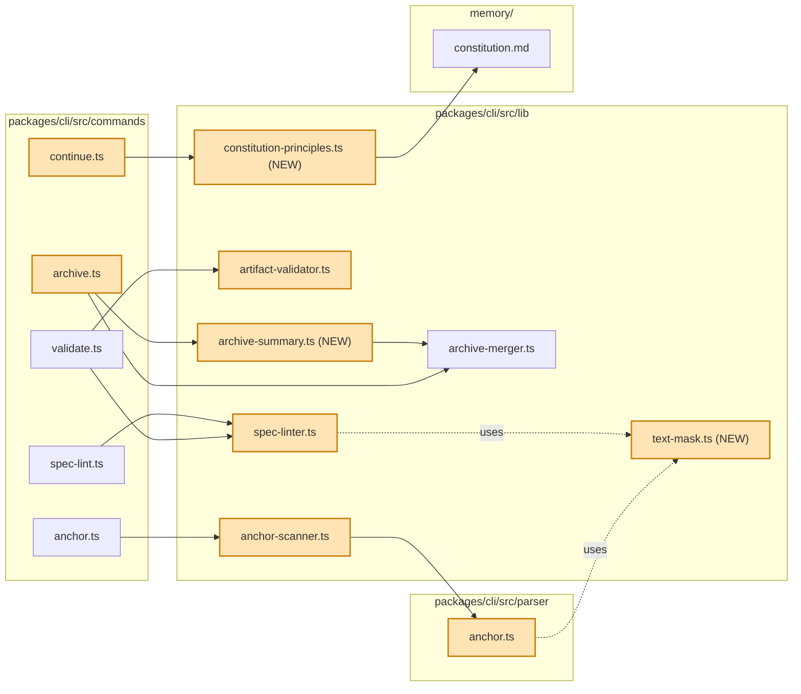
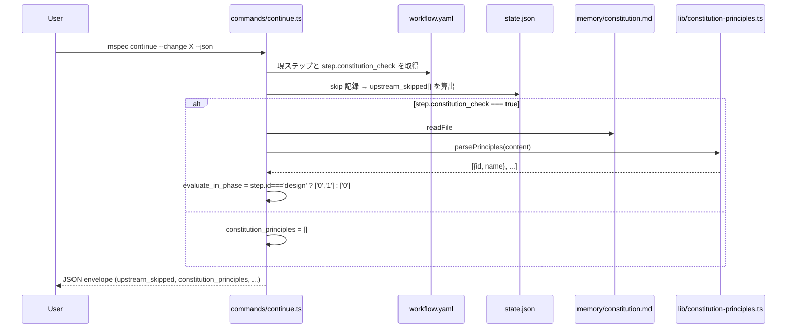
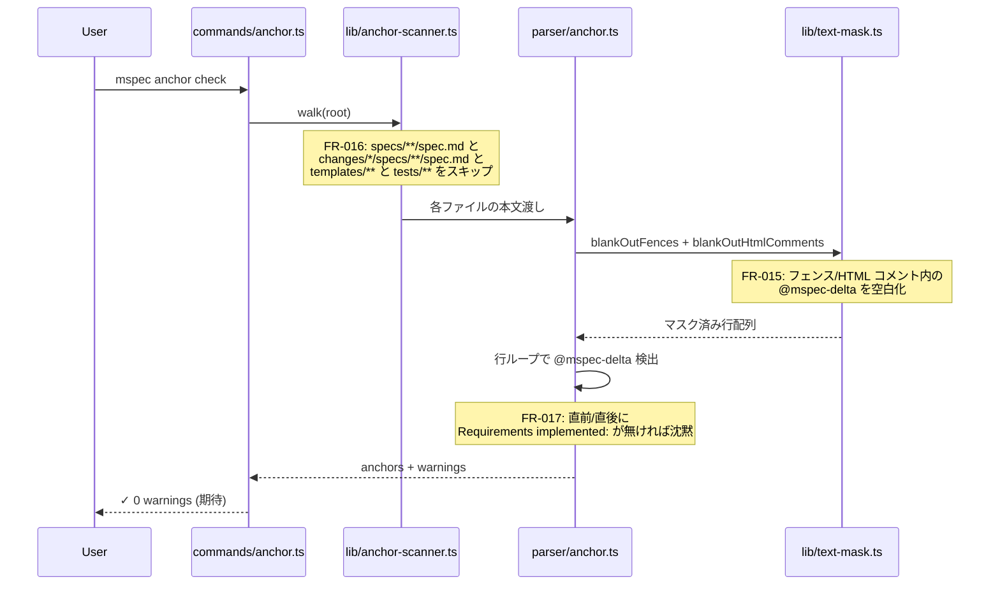
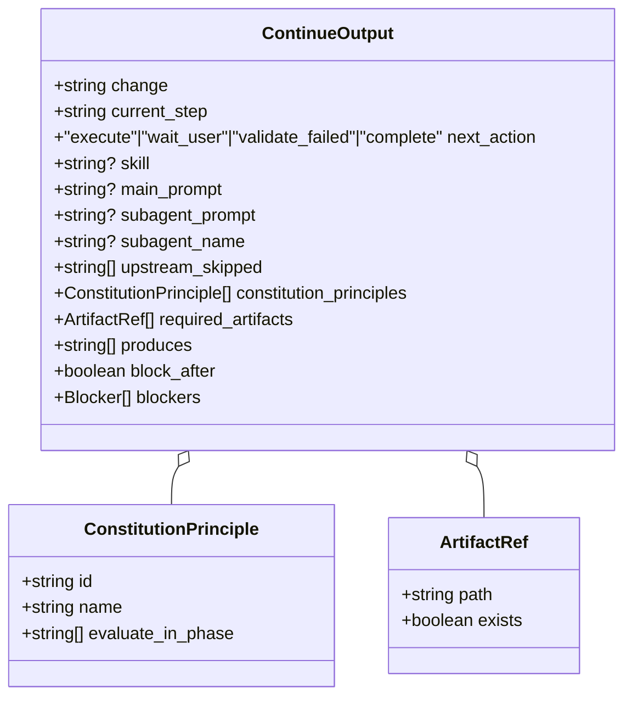
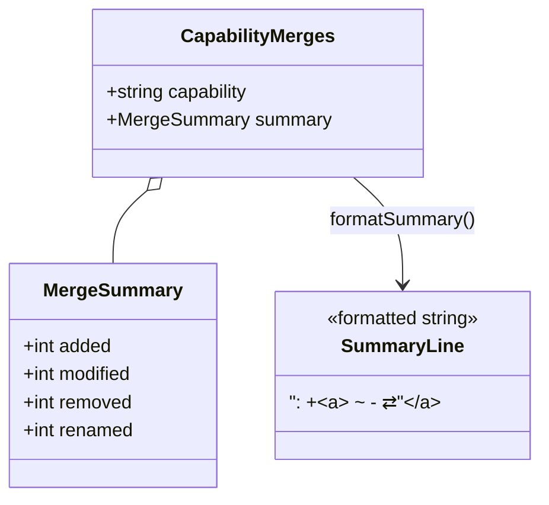

# Architecture Overview: Claude 向け mspec v0 機能ギャップ充足

## System Diagram

`packages/cli` 内のモジュール依存と本チェンジで触る箇所 (太線) を俯瞰する。

## Sequence: `mspec continue` envelope 生成

`constitution_principles[]` と `upstream_skipped[]` を含む新エンベロープの組み立て手順。

## Sequence: `mspec anchor check` の false-positive 抑制パス

FR-015 (フェンス/HTML コメント除外) と FR-016 (spec ファイルスキップ) と FR-017 (ブロック形状ガード) の三段防御。

## Data Model: `ContinueOutput` 型拡張

`mspec continue --json` が返すエンベロープの構造化定義 (本チェンジで追加するフィールドを太字)。

## Data Model: archive サマリの整形

`MergeSummary` から 1 行サマリへの変換。

## UI Mockup

本チェンジは CLI のみで GUI 変更は無いため省略。CLI 出力例は `quickstart.md` で具体化する。

## Constitution Check

> Step: design | Constitution Version: 1.0.0

| Principle | Phase 0 | Phase 1 | Notes |
|-----------|---------|---------|-------|
| I. ステップ独立性 (P1) | ✅ | ✅ | `continue` envelope は後方互換、validate/archive のワークフロー位置は不変。 |
| II. 決定論的マージ (P2) | ✅ | ✅ | `archive-summary.ts` は純関数、lexicographic ソート + 既存 `MergeSummary` 値の直接フォーマット。 |
| III. 質問駆動 (P3) | ✅ | ✅ | research の Decisions と design の Decisions に意思決定の根拠を全て残し追跡可能。 |
| IV. 双方向アンカー (P4) | ✅ | ✅ | tasks.md で各 FR に anchor block を必須化し、実装ファイルから SoT spec へ双方向リンク。 |
| V. 強制/拡張ステップ分離 (P5) | ✅ | ✅ | workflow.yaml と skill 定義は変更なし。Mermaid 必須化は produced artifact 側のチェックで完結。 |

### Complexity Tracking

None — 違反 0 件。
