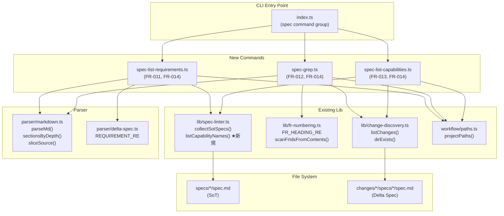
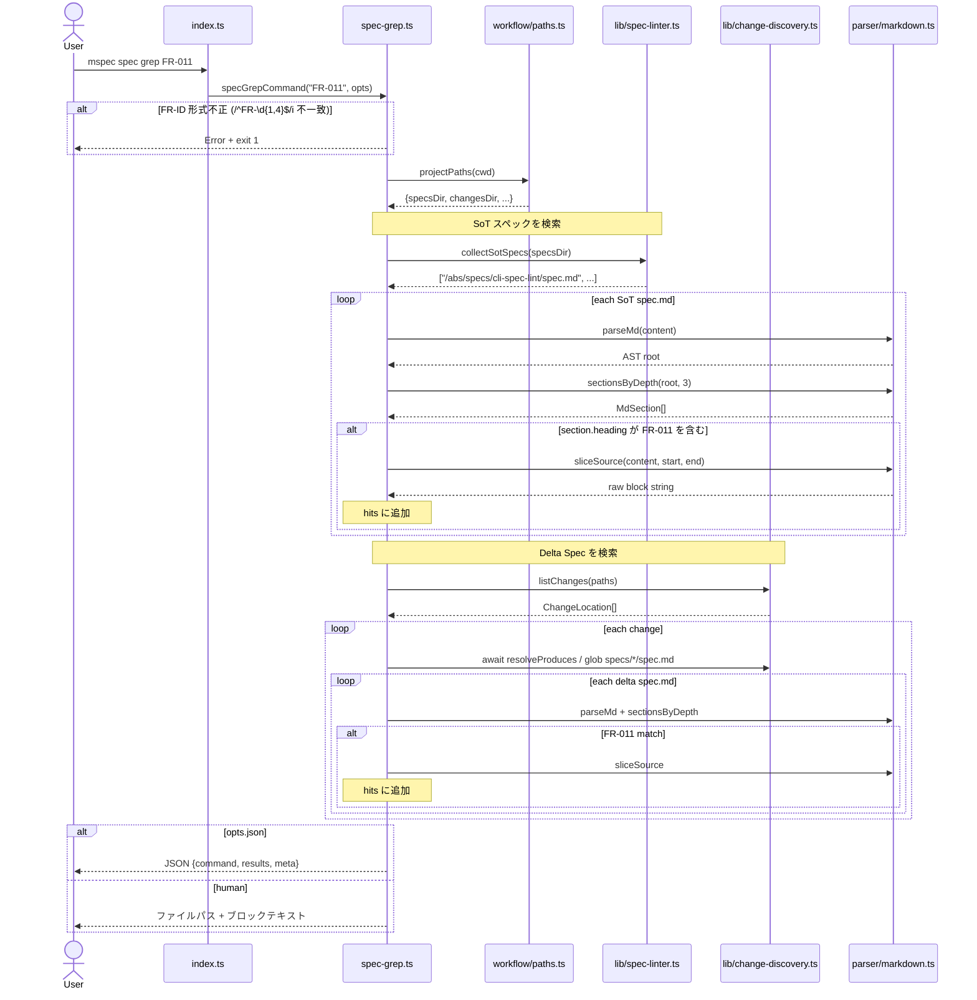
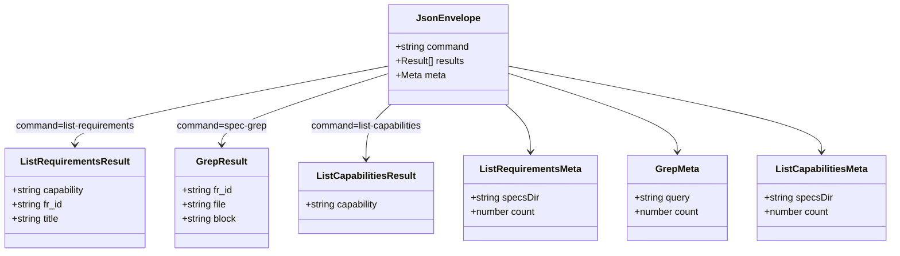

# Architecture Overview: spec grep/list サブコマンド

## System Diagram



## Sequence Diagram: `mspec spec grep FR-011`



## Data Model: JSON Envelopes (FR-014)



## Anchor Placement

E2E テストファイル（`tests/e2e/spec-grep.e2e.test.ts`）の先頭に以下を配置する：

```typescript
// @mspec-delta 2026-05-14-050811-spec-grep/specs/cli-spec-lint/spec.md
// Requirements implemented: FR-011, FR-012, FR-013, FR-014
// Change: spec-grep
```

実装コマンドファイル（`src/commands/spec-grep.ts` 等）にも同じアンカーを付与し、双方向追跡を保証する。

## Constitution Check

> Step: design (architecture-overview) | Constitution Version: 1.0.0

| Principle | Phase 0 | Phase 1 | Notes |
|-----------|---------|---------|-------|
| I. ステップ独立性 | ✅ | ✅ | アーキテクチャ図は設計ドキュメント。実装ファイルへの副作用なし。 |
| II. 決定論的マージ | ✅ | ✅ | `architecture-overview.md` は archive の直接マージ対象ではない。 |
| III. 質問駆動の要件確定 | ✅ | ✅ | ユーザー入力不要の純粋な構造説明。 |
| IV. 双方向アンカー | ✅ | ✅ | アンカー配置先を明示（E2E テスト + コマンドファイル）。implement で実施。 |
| V. 強制ステップと拡張ステップの分離 | ✅ | ✅ | ワークフロー構造を変更しない。 |

### Complexity Tracking

None — 違反 0 件。
