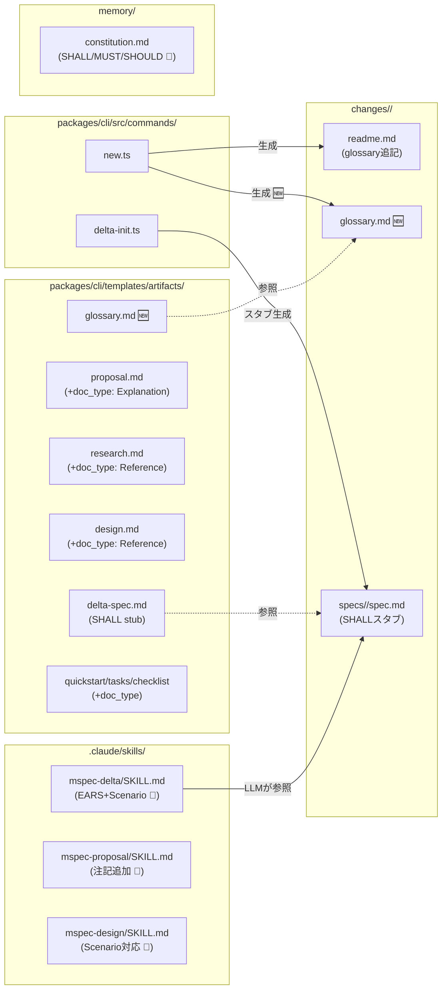
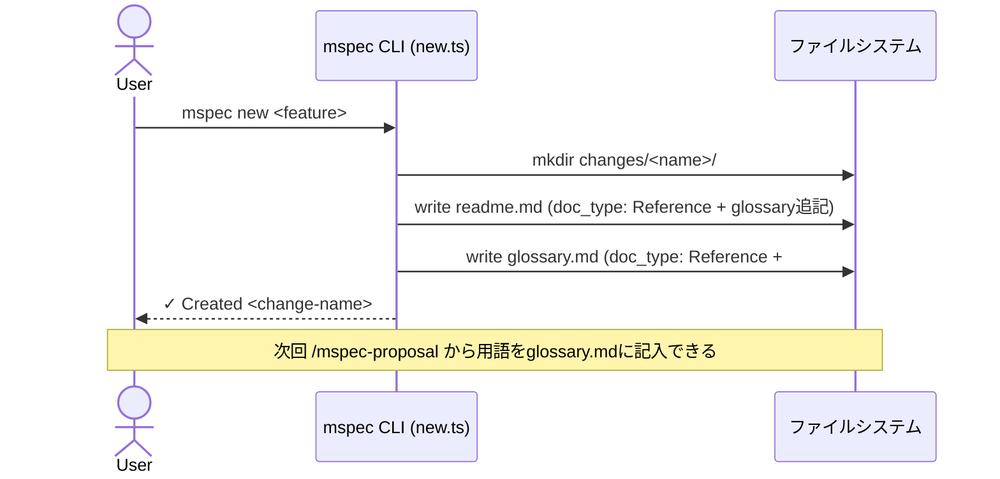
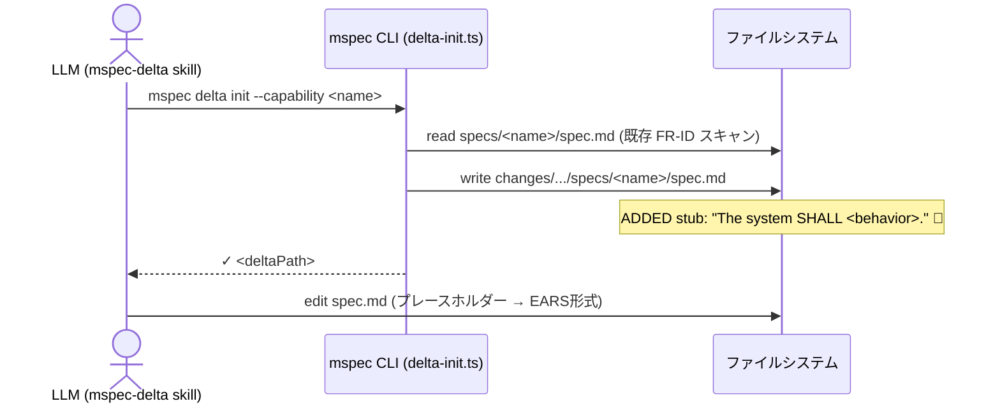
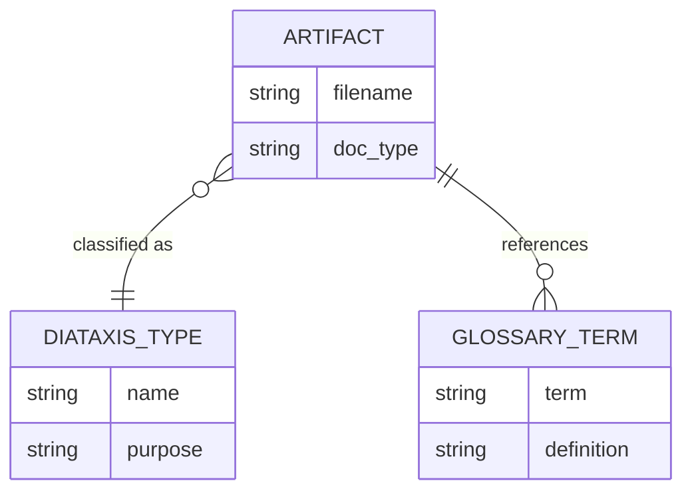

# Architecture Overview: Diátaxis Artifact Structure

## System Diagram

変更が影響するコンポーネントと成果物の関係を示す。

## Sequence

`mspec new` の変更後の実行フロー（glossary.md 自動生成追加）。

`mspec delta init` の変更後の実行フロー（SHALL スタブ）。

## Data Model

成果物（Artifact）と Diátaxis ドキュメントタイプの対応関係。

## Constitution Check

> Step: design | Constitution Version: 1.0.0

| Principle | Phase 0 | Phase 1 | Notes |
|---|---|---|---|
| I. ステップ独立性 | ✅ | ✅ | アーキテクチャ変更はテンプレート・スクリプト・SKILL.md の修正のみ。ステップ間依存関係に影響なし |
| II. 決定論的マージ | ✅ | ✅ | YAML フロントマターは archive パーサーに透過的。Mermaid ブロックも archive 対象外 |
| III. 質問駆動の要件確定 | ✅ | ✅ | research の Open Choices・design の trade-off をすべてユーザー回答済み |
| IV. 双方向アンカー | ✅ | ✅ | delta-init.ts・new.ts に @mspec-delta アンカーを実装ステップで追加する |
| V. 強制ステップと拡張ステップの分離 | ✅ | ✅ | workflow.yaml の強制ステップ定義（removable フラグ）に触れない |
