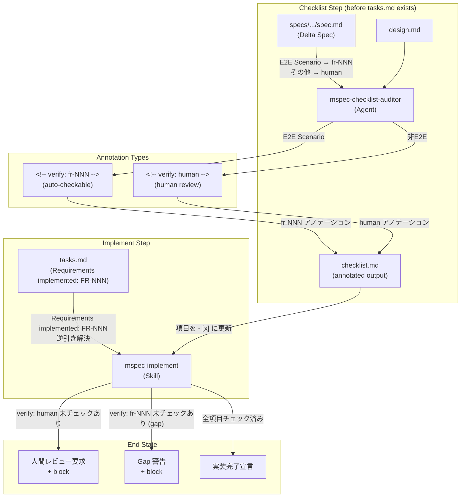
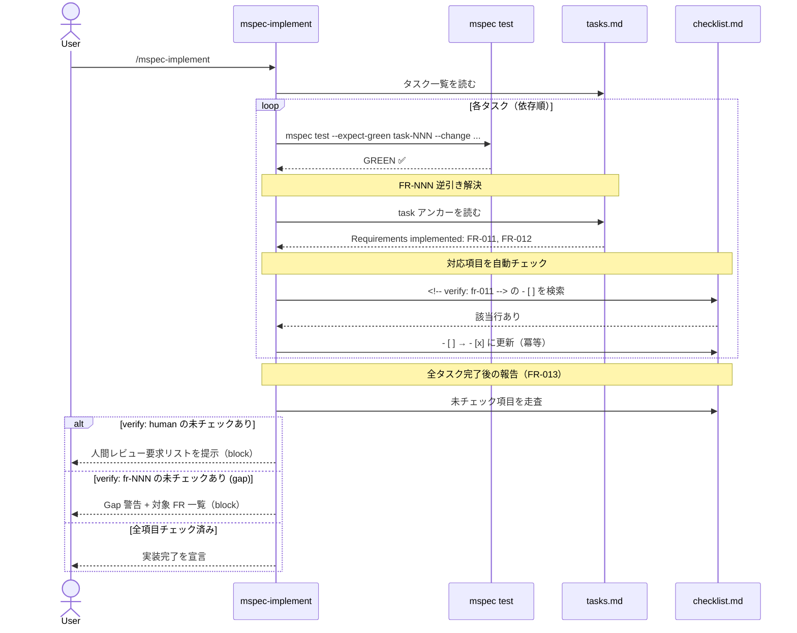
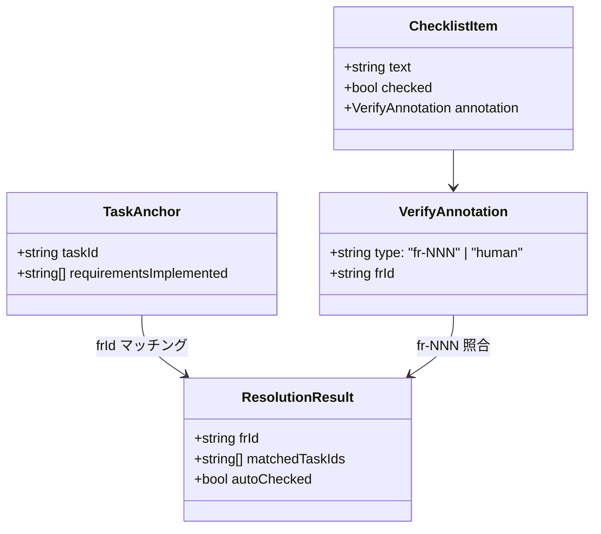

# Architecture Overview: checklist AI-driven verification

## System Diagram



## Sequence Diagram: タスク GREEN → チェックリスト自動更新（FR-012）



## Data Model: verify アノテーション解決フロー



## Anchor Placement（FR-014）

4 ファイルすべての YAML frontmatter 直後に HTML コメント形式で付与する。

**mspec-checklist-auditor.md（runtime + template）:**
```markdown
---
name: mspec-checklist-auditor
...
---
<!-- @mspec-delta 2026-05-14-105021-checklist-ai-driven-verification/specs/claude-integration/spec.md -->
<!-- Requirements implemented: FR-011, FR-014 -->
<!-- Change: checklist-ai-driven-verification -->
```

**mspec-implement/SKILL.md（runtime + template）:**
```markdown
---
name: mspec-implement
...
---
<!-- @mspec-delta 2026-05-14-105021-checklist-ai-driven-verification/specs/claude-integration/spec.md -->
<!-- Requirements implemented: FR-012, FR-013, FR-014 -->
<!-- Change: checklist-ai-driven-verification -->
```

## Constitution Check

> Step: design (architecture-overview) | Constitution Version: 1.0.0

| Principle | Phase 0 | Phase 1 | Notes |
|-----------|---------|---------|-------|
| I. ステップ独立性 | ✅ | ✅ | アーキテクチャ図は設計ドキュメント。実装ファイルへの副作用なし。 |
| II. 決定論的マージ | ✅ | ✅ | `architecture-overview.md` は archive の直接マージ対象ではない。 |
| III. 質問駆動の要件確定 | ✅ | ✅ | ユーザー入力不要の純粋な構造説明。 |
| IV. 双方向アンカー | ✅ | ✅ (条件付き) | アンカー配置先を明示（4 Markdown ファイル）。implement で実施。`mspec anchor check` の `.md` HTML コメント対応は tasks.md で確認タスクを追加（design.md 参照）。 |
| V. 強制ステップと拡張ステップの分離 | ✅ | ✅ | ワークフロー構造を変更しない。 |

### Complexity Tracking

None — 違反 0 件。
