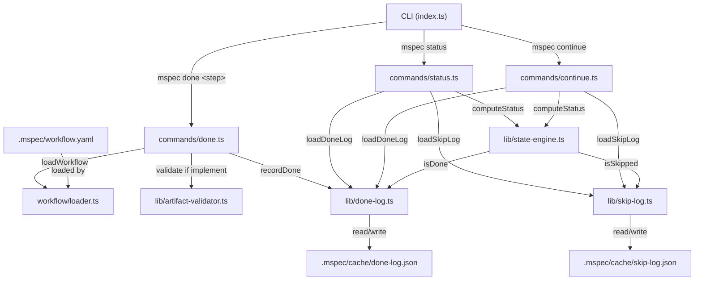
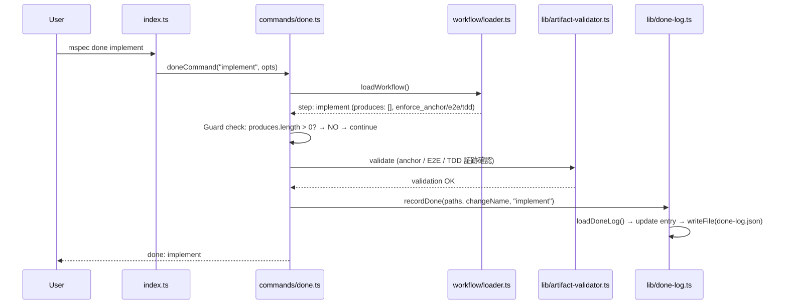
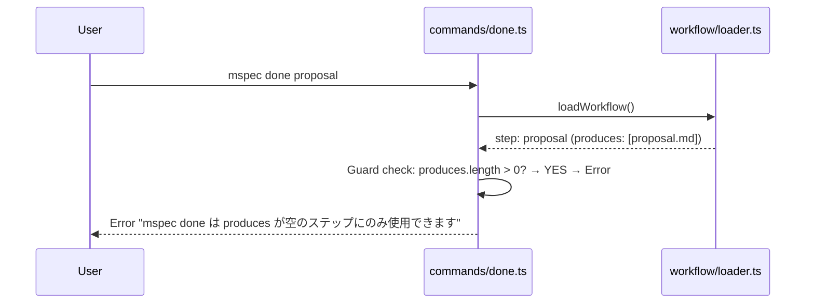
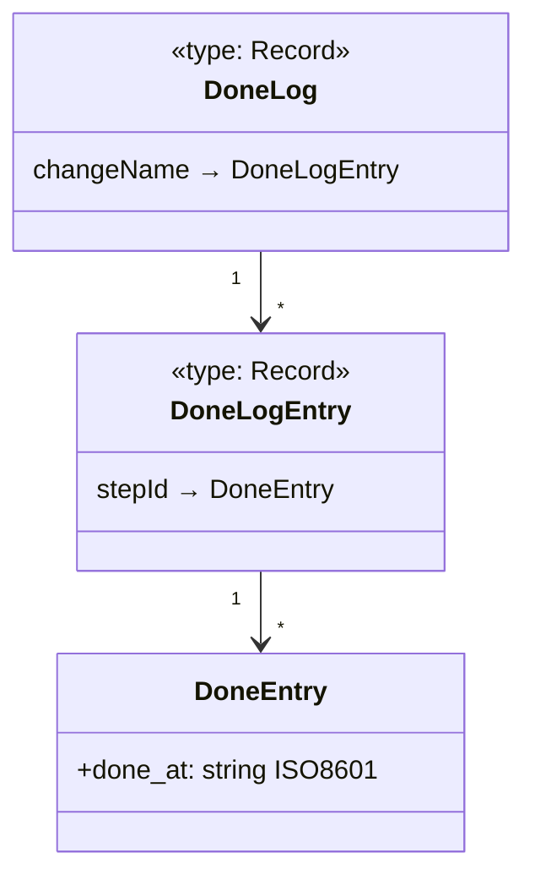

# Architecture Overview: fix-special-step-produces

## System Diagram



## Sequence Diagram — `mspec done implement`





## Data Model — done-log.json



### skip-log との対称性

| | skip-log.json | done-log.json |
|--|--|--|
| パス | `.mspec/cache/skip-log.json` | `.mspec/cache/done-log.json` |
| Entryフィールド | `reason: string`, `skipped_at: string` | `done_at: string` |
| Load 関数 | `loadSkipLog(paths)` | `loadDoneLog(paths)` |
| Record 関数 | `recordSkip(paths, change, step, reason)` | `recordDone(paths, change, step)` |
| Query 関数 | `isSkipped(log, change, step)` | `isDone(log, change, step)` |
| トリガー | `mspec skip <step> --reason <text>` | `mspec done <step>` |

## State Transition — produces レスステップ（BEFORE / AFTER）

```mermaid
stateDiagram-v2
    direction LR
    [*] --> blocked : 前ステップが done/skipped でない

    state "BEFORE fix" as before {
        blocked --> ready : 前ステップが done/skipped
        ready --> ready : (stuck — done 遷移なし)
        note right of ready : skippable: true で\n擬似的に skip → done 連鎖
    }

    state "AFTER fix" as after {
        blocked --> ready2 : 前ステップが done/skipped
        ready2 --> done : mspec done &lt;step-id&gt;
    }

    ready2 : ready
```

## state-engine.ts 変更差分（擬似コード）

```
// BEFORE
if (produces.length === 0) {
  return 'ready';
}

// AFTER
if (produces.length === 0) {
  if (isDone(doneLog, change.name, step.id)) return 'done';
  return 'ready';
}
```

`evaluateStep` の引数 `EvaluateInput` に `doneLog: DoneLog` を追加し、`ComputeStatusInput` にも同フィールドを追加する。`status.ts` と `continue.ts` で `loadDoneLog()` を `loadSkipLog()` と並走して呼び出す。

## Constitution Check

> Step: design (architecture-overview) | Constitution Version: 1.0.0

| Principle | Phase 0 | Phase 1 | Notes |
|-----------|---------|---------|-------|
| I. ステップ独立性 | ✅ | ✅ | `done-log.ts` は独立モジュール。既存コマンドへの変更は引数追加のみ |
| II. 決定論的マージ | ✅ | ✅ | `done-log.json` は `.mspec/cache/` 配下（gitignore 済み）。archive マージ対象外 |
| III. 質問駆動の要件確定 | ✅ | ✅ | 新規アーキテクチャ上の疑問点なし。全決定は research.md に記録済み |
| IV. 双方向アンカー | — | — | アンカーロジックへの直接変更なし |
| V. 強制ステップと拡張ステップの分離 | ✅ | ✅ | `done-log` が強制ステップ専用の done 機構として分離された設計 |

### Complexity Tracking

None
