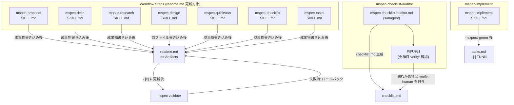
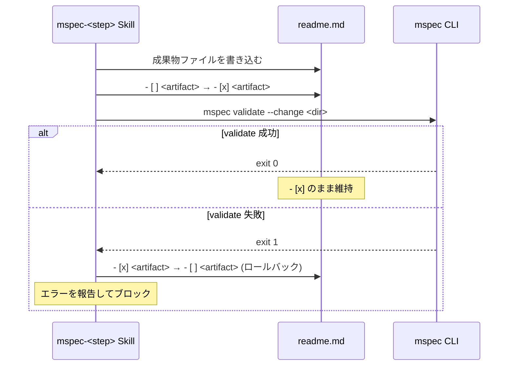
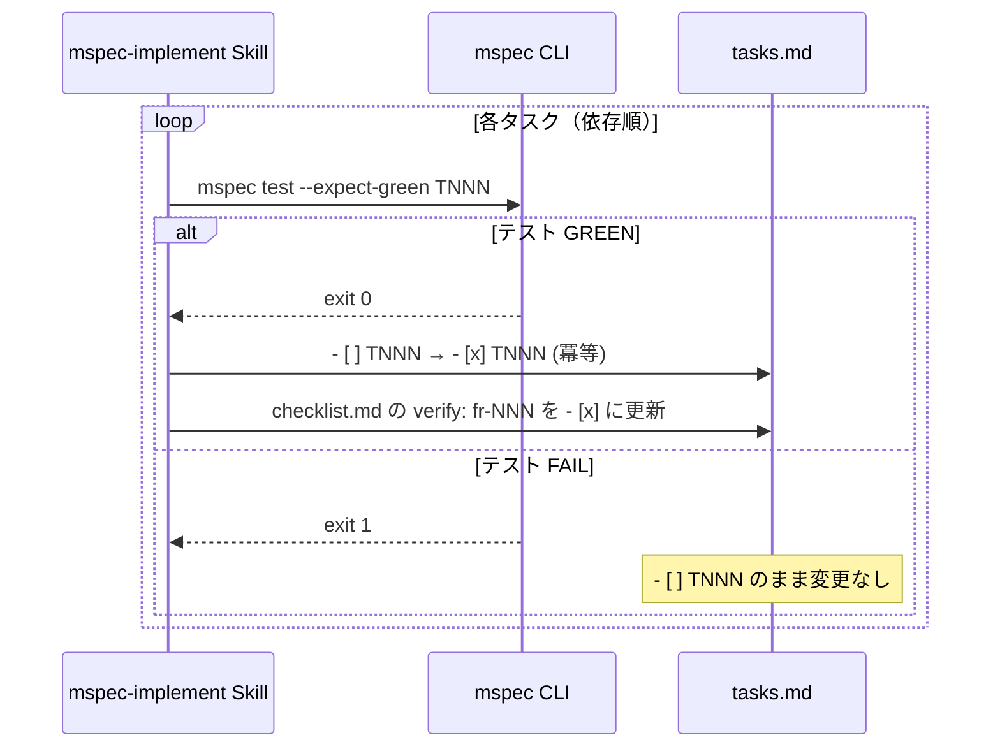
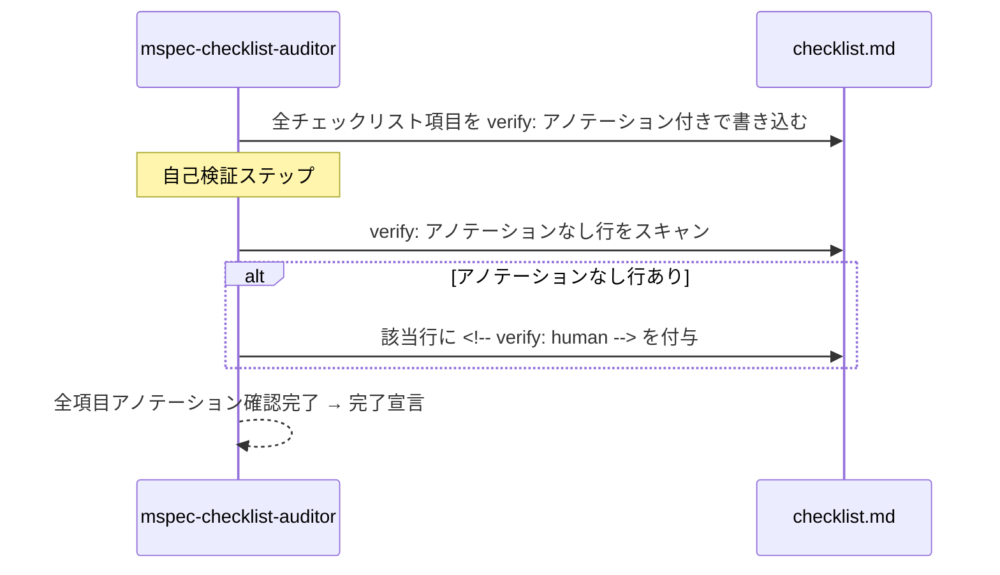
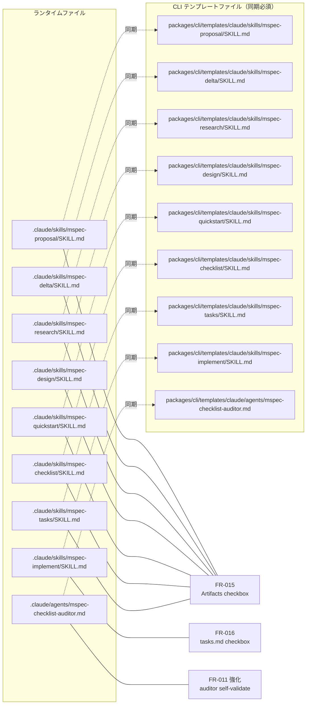

# Architecture Overview: step-checkbox-update

## System Diagram

## Sequence Diagram: readme.md Artifacts 更新フロー（FR-015）

## Sequence Diagram: tasks.md タスクチェックボックス更新フロー（FR-016）

## Sequence Diagram: checklist-auditor 自己検証フロー（FR-011 強化）

## File Change Map

## Constitution Check

> Step: design | Constitution Version: 1.0

| Principle | Phase 0 | Phase 1 | Notes |
|-----------|---------|---------|-------|
| I. ステップ独立性 | ✅ | ✅ | 各スキルが自ステップの Artifacts 行のみを更新。他ステップの行への影響なし。Sequence Diagram で独立性を図示 |
| II. 決定論的マージ | ✅ | ✅ | `- [ ]` → `- [x]` の exact-string 置換のみ。CLI archive / merge ロジックへの変更なし |
| III. 質問駆動の要件確定 | ✅ | ✅ | research ステップで 3 問（specs 行・validate 失敗時・design タイミング）を Q&A 解決済み |
| IV. 双方向アンカー | ✅ | ✅ | File Change Map に全 18 ファイルと対応 FR を明示。HTML コメント形式アンカーは前 change で `.md` 対応済み |
| V. 強制ステップと拡張ステップの分離 | ✅ | ✅ | `workflow.yaml` 不変。既存ステップへの Procedure 追加のみ。新ステップ・新スキル追加なし |
