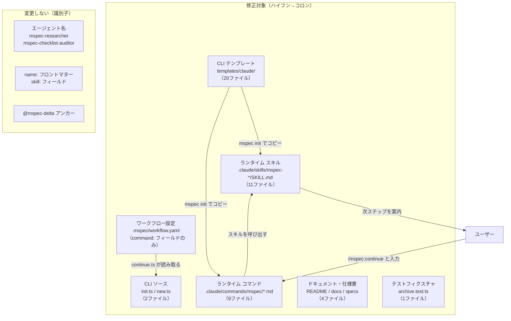
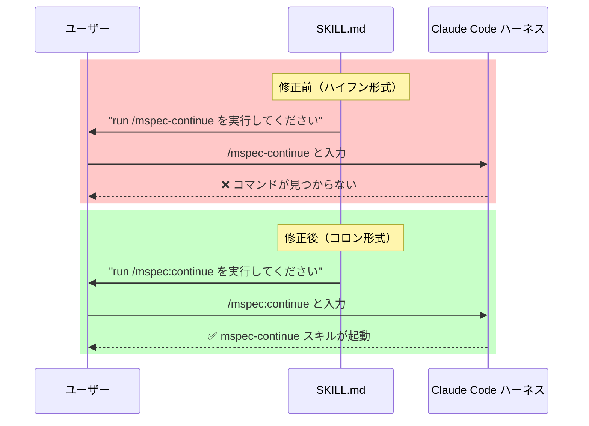
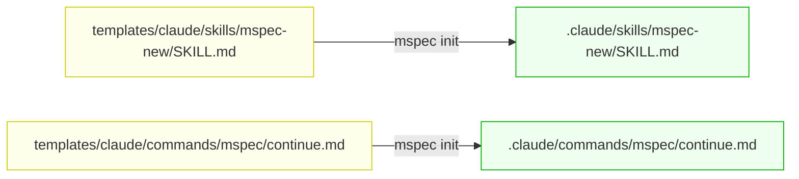

# Architecture Overview: fix-command-name-consistency

## System Diagram

修正対象ファイルのカテゴリと、「変更する」「変更しない」の分類を示す。

## Sequence: ユーザーがスキル指示を受けてコマンドを実行するまで

修正前後のフローの違いを示す。

## ファイル対応関係: ランタイム ↔ テンプレート

`mspec init` を実行すると、テンプレートがランタイムファイルとしてコピーされる。
両者を同時に修正することで新規プロジェクトも即座に正しいコマンド形式を持つ。

## Constitution Check

> Step: design | Constitution Version: 1.0

| Principle | Phase 0 | Phase 1 | Notes |
|-----------|---------|---------|-------|
| I. ステップ独立性 | ✅ | ✅ | architecture-overview は設計ドキュメントのみ；コード変更なし |
| II. 決定論的マージ | ✅ | ✅ | 図はファイル分類を決定論的に表現；曖昧な分岐なし |
| III. 質問駆動の要件確定 | ✅ | ✅ | スコープは proposal・research で確定済み |
| IV. 双方向アンカー | ✅ | ✅ | 各カテゴリが FR-017・FR-001・FR-002 に対応 |
| V. 強制ステップと拡張ステップの分離 | ✅ | ✅ | 既存ファイル修正のみ；新ステップ・新コマンド不要 |

### Complexity Tracking

None
