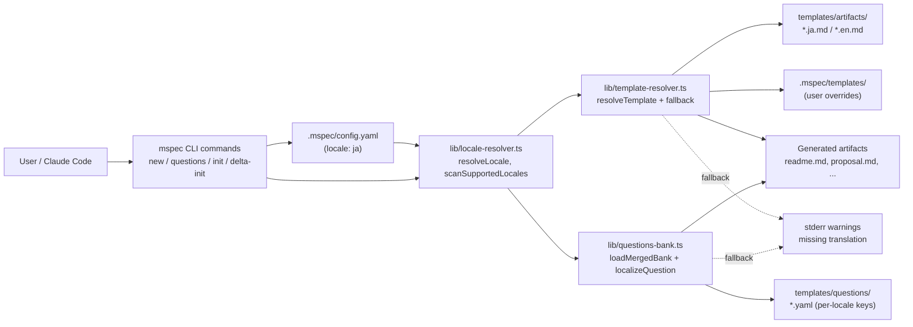
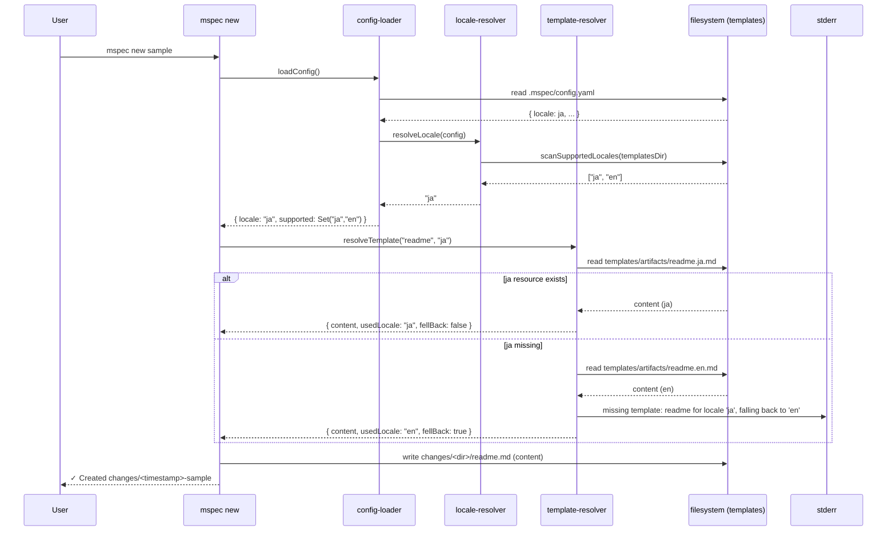
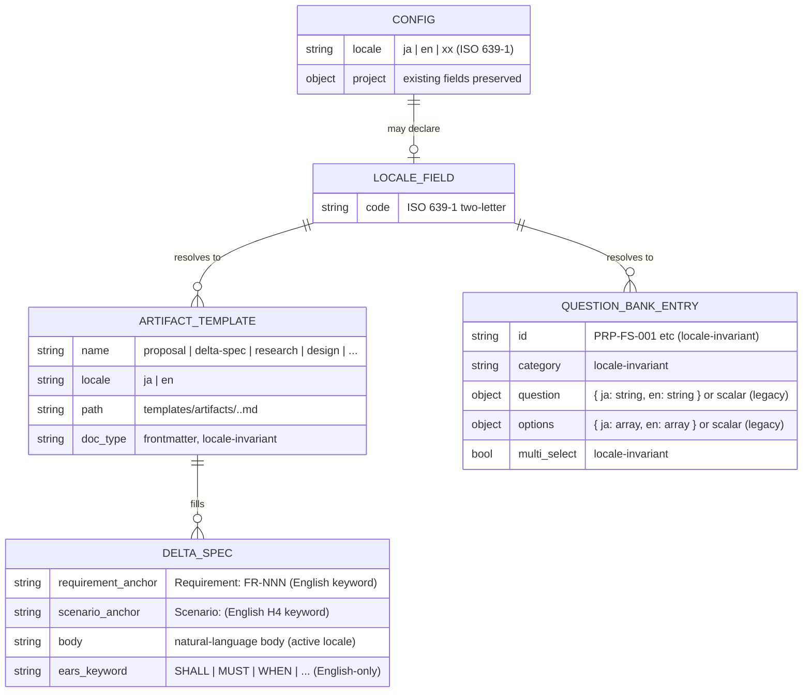
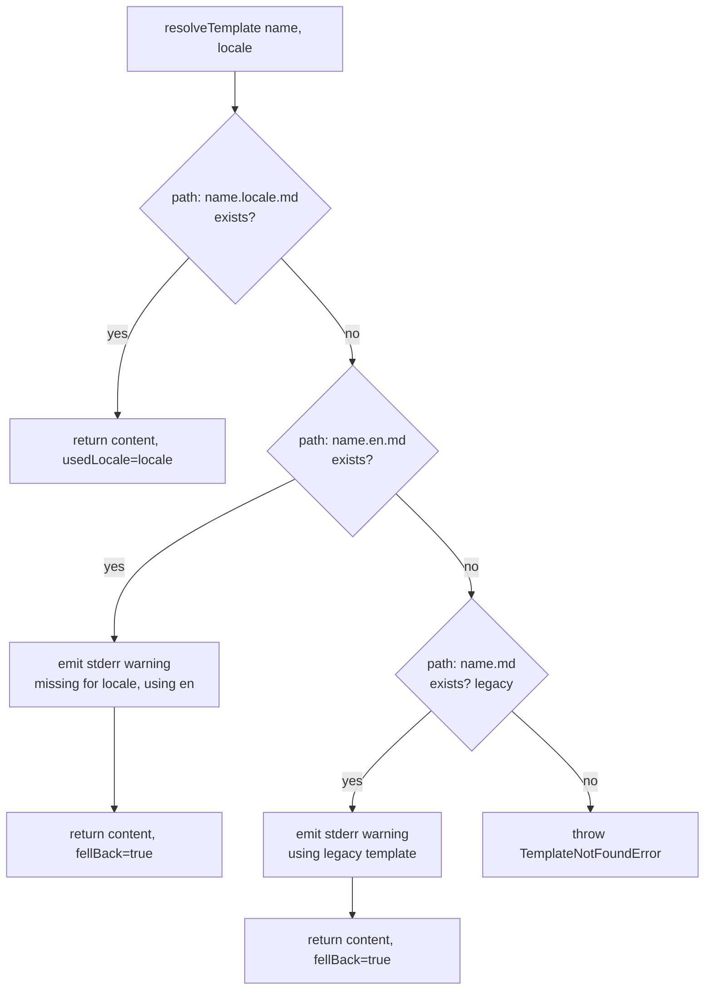

# Architecture Overview: 成果物の言語統制と EARS 多言語化

## System Diagram

## Sequence (`mspec new` 実行時のロケール解決)

## Data Model (Locale 解決の状態とリソース構造)

## Fallback Decision Tree

## Constitution Check

> Step: design (architecture-overview) | Constitution Version: 1.0.0

| Principle | Phase 0 | Phase 1 | Notes |
|-----------|---------|---------|-------|
| I. ステップ独立性 | ✅ | ✅ | 図中の locale-resolver / template-resolver は単一責務モジュールとして分離され、CLI コマンド層に副作用を持ち込まない構造を示す |
| II. 決定論的マージ | ✅ | ✅ | Fallback Decision Tree が `<name>.<locale>.md` → `<name>.en.md` → `<name>.md` の決定論的順序を明示。archive merge ルールには非干渉 |
| III. 質問駆動の要件確定 | ✅ | ✅ | 構成要素はすべて proposal / research / design ステップでユーザー確定済の意思決定に基づく |
| IV. 双方向アンカー | ✅ | ✅ | Data Model の `DELTA_SPEC` エンティティが `Requirement` / `Scenario` の英語アンカーを保持する構造を明示し、tasks.md でのアンカー付与の前提を整える |
| V. 強制ステップと拡張ステップの分離 | ✅ | ✅ | 図に現れる全モジュールは強制ステップ群の内部実装で、workflow 構造（step ID 群）には新規追加なし |

### Complexity Tracking

None

