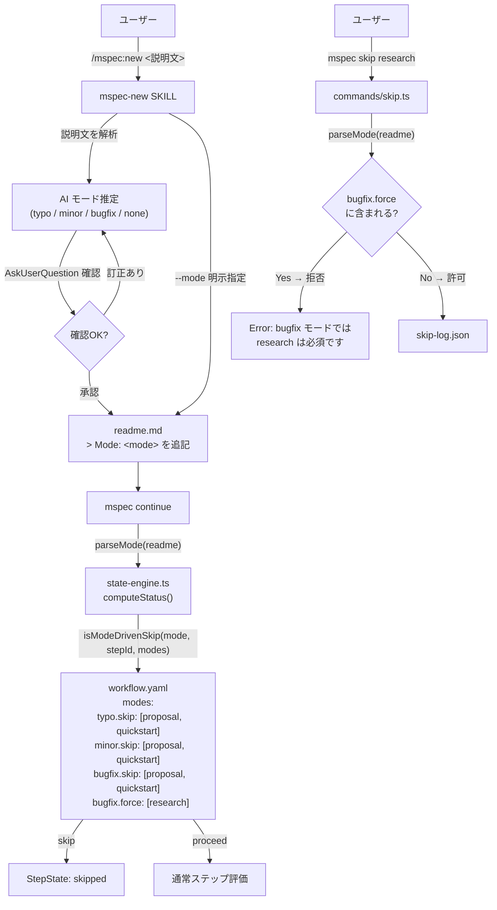
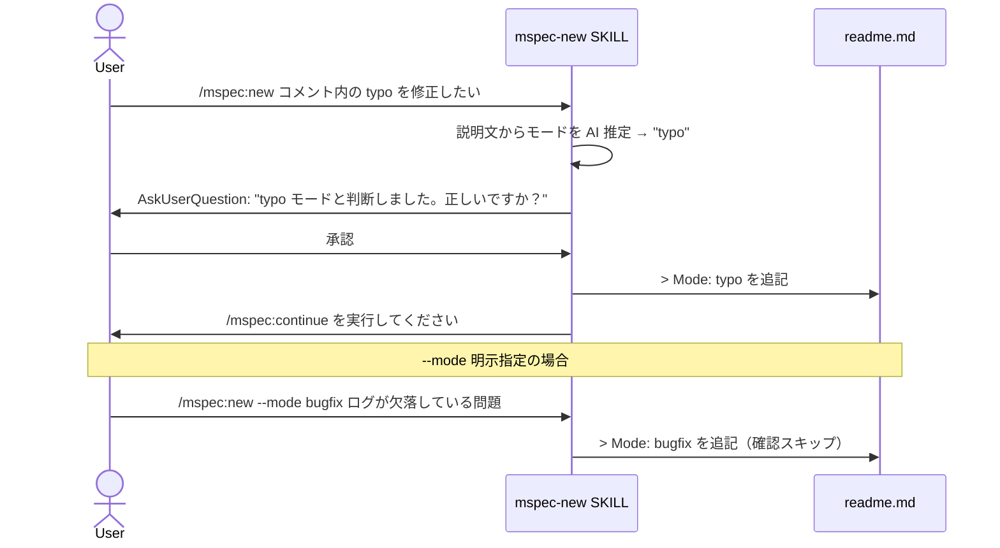
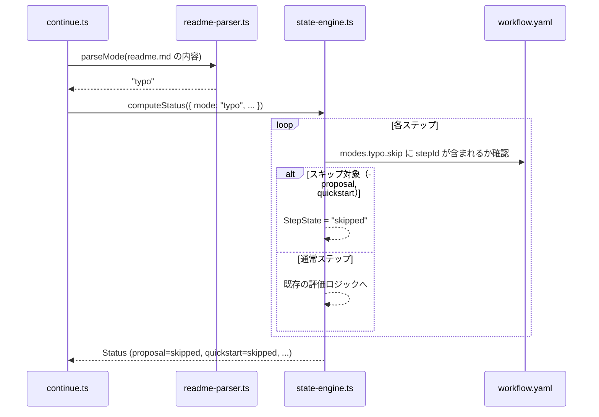
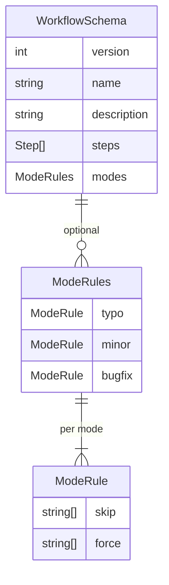

# Architecture Overview: 目的別チェンジモード（typo / minor / bugfix）

## System Diagram

## Sequence: /mspec:new でのモード推定フロー

## Sequence: mspec continue でのモード由来スキップフロー

## Data Model: WorkflowSchema 拡張

## Constitution Check

> Step: design (architecture-overview) | Constitution Version: 1.0.0

| Principle | Phase 0 | Phase 1 | Notes |
|-----------|---------|---------|-------|
| I. ステップ独立性 | ✅ | ✅ | 図中の `parseMode()` は毎回 readme.md を読む単方向データフロー。前段セッションのコンテキスト不依存で、各ステップが mode 文字列のみを参照する構造を示す |
| II. 決定論的マージ | ✅ | ✅ | `modes:` セクションはスキップルールのみ。System Diagram が示す通り archive merge ルール（CLI パーサー）には非干渉 |
| III. 質問駆動の要件確定 | ✅ | ✅ | Sequence の mspec-new SKILL → `AskUserQuestion` フローが明示。決定根拠は readme.md に永続化されユーザー確認済み |
| IV. 双方向アンカー | ✅ | ✅ | `readme-parser.ts`・`state-engine.ts`・`skip.ts`・`continue.ts` の各実装ファイルに `@mspec-delta` アンカーを付与する設計 |
| V. 強制ステップと拡張ステップの分離 | ✅ | ✅ | System Diagram が示す通り `evaluateStep()` 内の lazy skip は skip-log を経由しない。`REQUIRED_STEP_IDS` と `removable: false` は変更しない |
