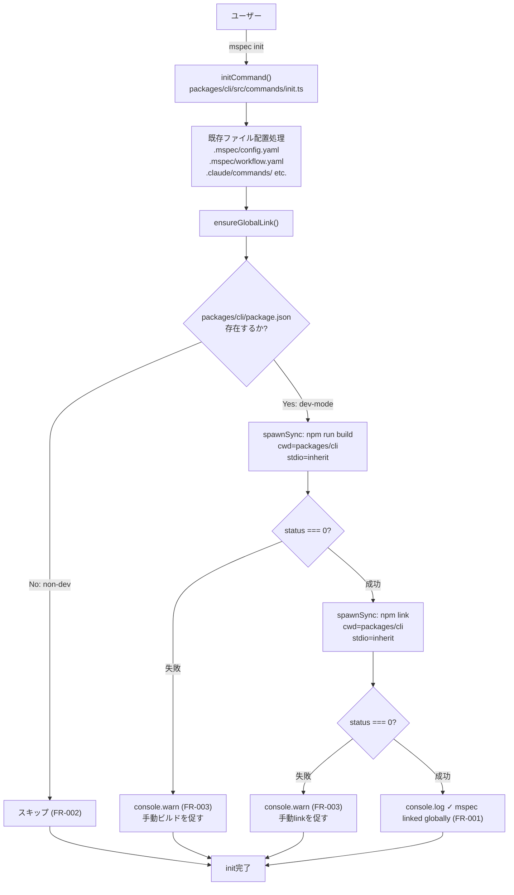
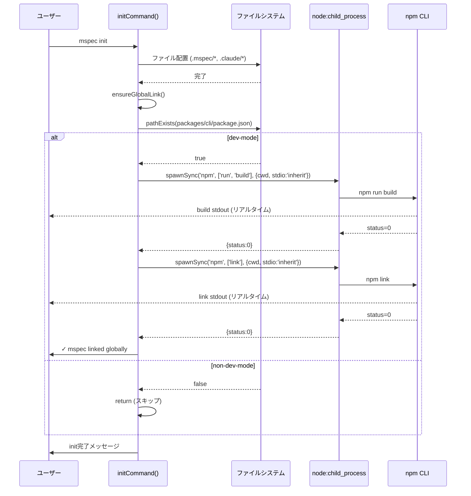

# Architecture Overview: init-link-global-bin

## System Diagram

## Sequence Diagram

## Constitution Check

| Principle | Phase 0 | Phase 1 |
|-----------|---------|---------|
| I: ステップ独立性 | ✅ 変更は `init.ts` に閉じており他コマンドとの結合なし | ✅ アーキテクチャ図が示す通り `ensureGlobalLink` は独立したフェーズとして分離 |
| II: 決定論的マージ | ✅ 追加のみ。既存フローを変更しない | ✅ `npm link` は冪等。重複実行しても安全 |
| III: 質問駆動の要件確定 | ✅ 全オープンチョイスが解決済み | ✅ アーキテクチャ図に反映済み |
| IV: 双方向アンカー | ✅ `@mspec-delta` アンカーを実装フェーズで埋め込む | ✅ System Diagram の各ノードが FR-001/002/003 に対応 |
| V: 強制ステップと拡張ステップの分離 | ✅ ファイル配置（強制）とリンク（拡張・dev-mode限定）が明確に分離 | ✅ Sequence Diagram で `alt dev-mode` として明示的に分岐 |
