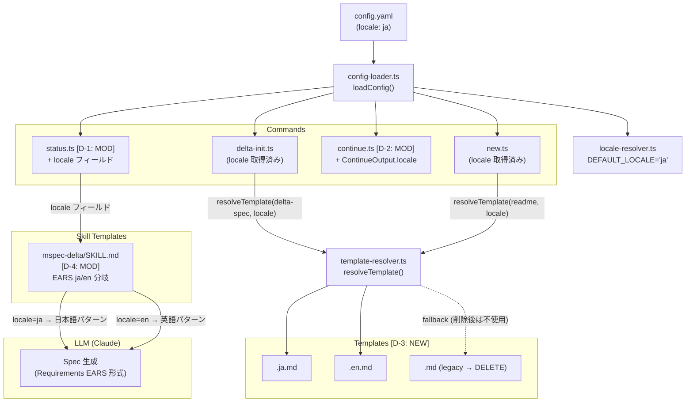
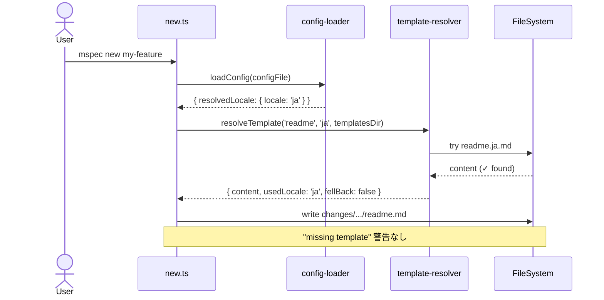
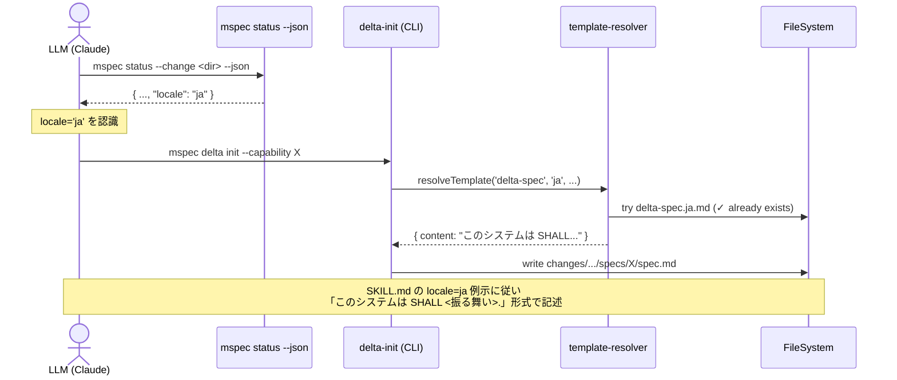
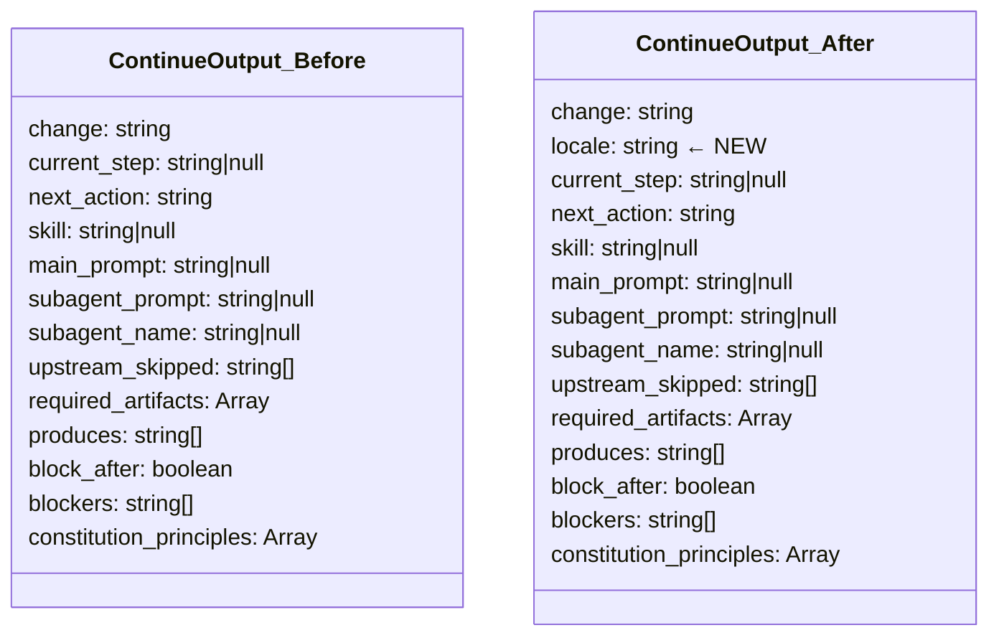

# Architecture Overview: fix-locale-spec-language

## System Diagram

ロケール解決フローの全体像。今回の変更で追加・修正されるコンポーネントを `[NEW]`/`[MOD]` で示す。

## Sequence Diagram: `mspec new` with locale=ja (After Fix)

## Sequence Diagram: `mspec:delta` skill with locale=ja (After Fix)

## Data Model: `ContinueOutput` (Before / After)

## Template Resolution Before / After

| Artifact | Before (locale=ja) | After (locale=ja) |
|----------|-------------------|-------------------|
| `delta-spec` | `delta-spec.ja.md` ✅ (既存) | 変更なし |
| `readme` | `readme.md` (legacy, 警告あり) | `readme.ja.md` ✅ (新規) |
| `glossary` | `glossary.md` (legacy, 警告あり) | `glossary.ja.md` ✅ (新規) |
| `proposal` | `proposal.md` (legacy, 警告あり) | `proposal.ja.md` ✅ (新規) |
| `research` | `research.md` (legacy, 警告あり) | `research.ja.md` ✅ (新規) |
| `design` | `design.md` (legacy, 警告あり) | `design.ja.md` ✅ (新規) |
| `architecture-overview` | `architecture-overview.md` (legacy) | `architecture-overview.ja.md` ✅ (新規) |
| `quickstart` | `quickstart.md` (legacy, 警告あり) | `quickstart.ja.md` ✅ (新規) |
| `checklist` | `checklist.md` (legacy, 警告あり) | `checklist.ja.md` ✅ (新規) |
| `tasks` | `tasks.md` (legacy, 警告あり) | `tasks.ja.md` ✅ (新規) |

## Constitution Check

| 原則 | Phase 0 | Phase 1 |
|------|---------|---------|
| I. ステップ独立性 | テンプレート追加・CLI 変更・SKILL.md 変更は独立して適用可能 ✓ | 各変更が単独でロールバック可能な設計 ✓ |
| II. 決定論的マージ | テンプレートファイルの追加は冪等。`locale` フィールド追加は既存 JSON 消費者に影響なし ✓ | フォールバックチェーン `<locale>.md` → `en.md` は決定論的 ✓ |
| III. 質問駆動の要件確定 | 全 Open Choices はユーザー確認済み ✓ | — |
| IV. 双方向アンカー | 実装ファイルに `@mspec-delta` アンカー付与予定 ✓ | — |
| V. 強制ステップと拡張ステップの分離 | CLI コア変更と設定ファイル変更を分離 ✓ | — |
