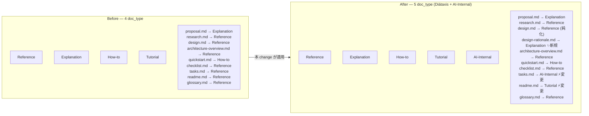
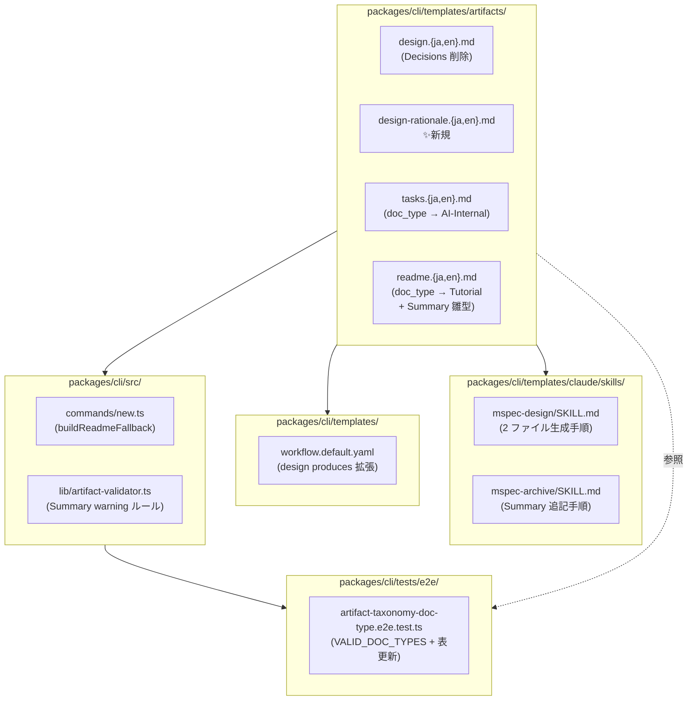
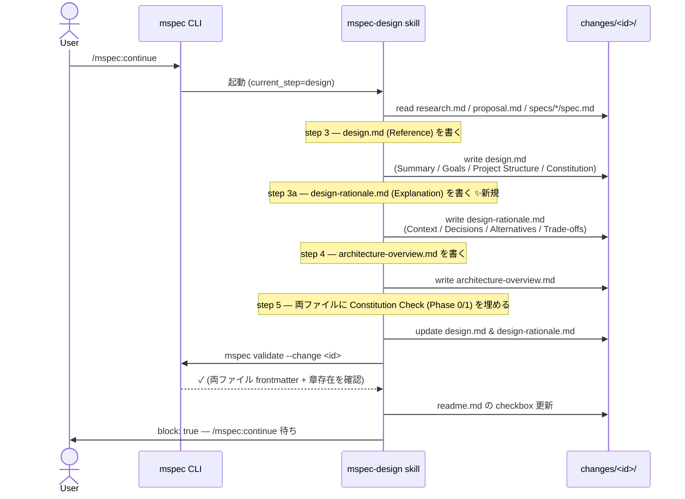
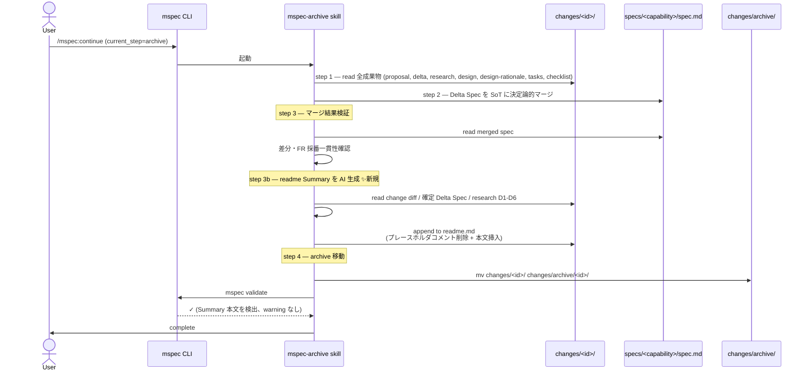
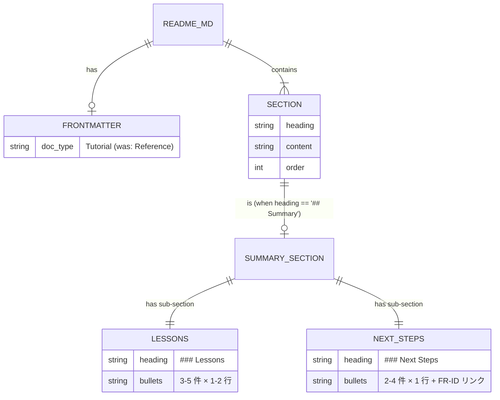

# Architecture Overview: revise-artifact-taxonomy

本 change が変更する mspec 内部構造を、変更前 (Before) → 変更後 (After) の対比で示す。図は (1) doc_type 体系全体、(2) `design` ステップの 2 ファイル生成フロー、(3) `archive` ステップの readme Summary 追記フローの 3 視点。

## System Diagram — doc_type 体系 (Before → After)

## System Diagram — 実装層の変更影響範囲

## Sequence — `design` ステップでの 2 ファイル生成（After）

## Sequence — `archive` ステップでの readme Summary 追記（After）

## Data Model — readme.md Summary セクションの構造（After）

## UI Mockup

該当なし（CLI ツール / ドキュメントテンプレ変更のみで UI 影響なし）。

## Constitution Check

> Step: design (architecture-overview.md) | Constitution Version: current

architecture-overview.md は design.md の補助図示であり、原則評価は design.md と同一結果となる。差分は「図示の責務範囲が同一 change 内に閉じているか（原則 I）」「複数 capability 間の依存表現が決定論的マージを阻害しないか（原則 II）」の 2 点に集中する。

| Principle | Phase 0 | Phase 1 | Notes |
|-----------|---------|---------|-------|
| I. ステップ独立性 | ⚠️ | ✅ | 図示する全ノード（templates / skills / workflow / CLI / tests）は本 change 内で完結し、他 change の成果物には依存しない。design.md と同様 Phase 1 で ✅ に格上げ。 |
| II. 決定論的マージ | ✅ | ✅ | System Diagram で示す capability 横断の影響は Delta Spec に分解済み（artifact-taxonomy / claude-integration / cli-workflow-engine / cli-spec-lint の 4 spec.md）。archive 時の SoT マージは各 spec 独立に進行し、図の依存矢印は実装順序を強制しない。 |
| III. 質問駆動の要件確定 | ✅ | ✅ | architecture-overview.md は research D1-D6 と design Decisions に基づく図示であり、新たな要件確定は発生しない。 |
| IV. 双方向アンカー | — | — | 図はアンカー対象（Delta Spec ↔ tasks ↔ 実装）の構造を示すのみで、アンカー仕組み自体には影響しない。 |
| V. 強制ステップと拡張ステップの分離 | ⚠️ | ⚠️ | design Sequence Diagram の step 3a（design-rationale 生成）と archive Sequence Diagram の step 3b（readme Summary 追記）は強制ステップ内のサブ成果物追加を視覚化している。design.md と同様 Phase 1 でも ⚠️ を保持し、Constitution 改訂議題として残す。 |

### Complexity Tracking

⚠️ 1 件（原則 V）。design.md の Complexity Tracking と同根拠（`design-rationale.md` 任意化はユーザー要求と矛盾、軽量モードでの design 全体スキップにより実害限定的）。本ファイルでの追加根拠なし。
