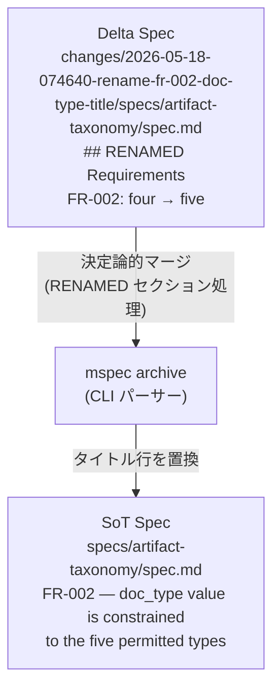

# Architecture Overview: rename-fr-002-doc-type-title

## System Diagram

## Data Flow

1. Delta Spec `## RENAMED Requirements` セクションに `FR-002 — <旧> -> FR-002 — <新>` を記述
2. `mspec archive` が SoT spec の該当 `### Requirement: FR-002 — <旧>` 行を `### Requirement: FR-002 — <新>` に置換
3. SoT spec の本文・シナリオ・FR-ID はそのまま保持

## Constitution Check

| Principle | Phase 0 | Phase 1 | Notes |
|-----------|---------|---------|-------|
| I. ステップ独立性 | ✅ | ✅ | 他ステップへの副作用なし |
| II. 決定論的マージ | ✅ | ✅ | RENAMED は CLI パーサー処理 |
| III. 質問駆動の要件確定 | ✅ | ✅ | 変更内容が自明 |
| IV. 双方向アンカー | ✅ | ✅ | SoT spec 変更にアンカー不要 |
| V. 強制ステップと拡張ステップの分離 | ✅ | ✅ | ワークフロー構造に変更なし |
