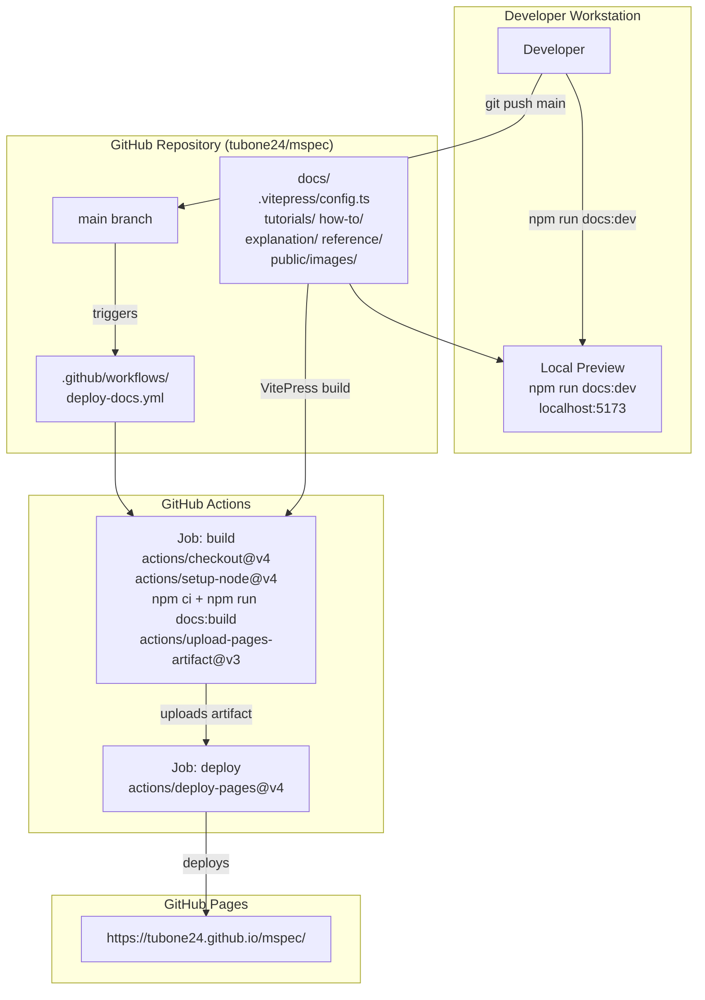
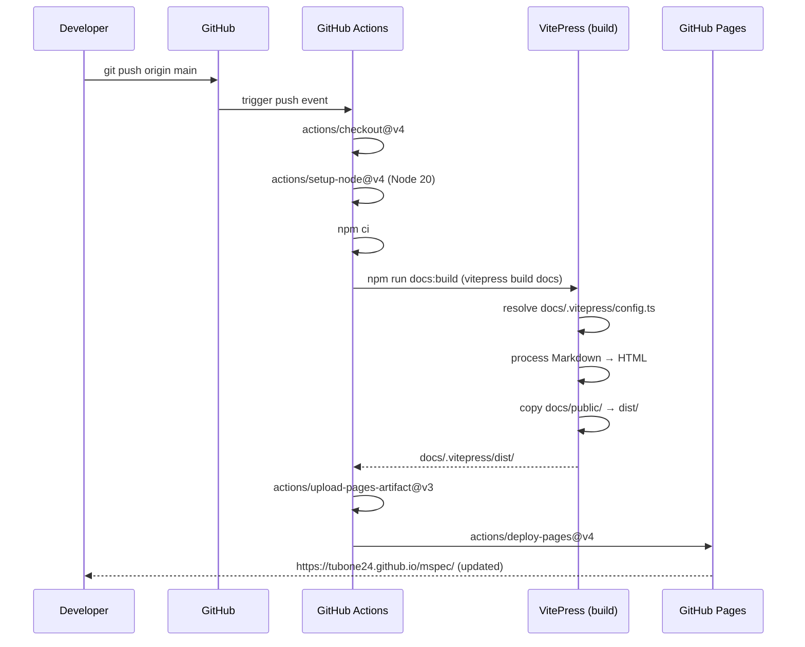
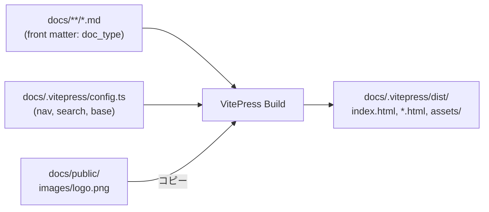

# Architecture Overview: docs-github-pages

## System Diagram



## Build Sequence Diagram



## File Structure

```
mspec/                                     # プロジェクトルート
├── package.json                           # 新規 — VitePress devDependency + docs:* scripts
├── .github/
│   └── workflows/
│       └── deploy-docs.yml                # 新規 — GitHub Actions ワークフロー
└── docs/                                  # VitePress ビルドルート (vitepress build docs)
    ├── .vitepress/
    │   ├── config.ts                      # 新規 — base, nav, search, logo 設定
    │   └── dist/                          # ビルド出力 (.gitignore 対象)
    ├── public/
    │   └── images/
    │       └── logo.png                   # 移動元: docs/images/logo.png
    ├── README.md                          # 既存維持 — VitePress root index
    ├── tutorials/
    │   └── getting-started.md             # 既存維持
    ├── how-to/
    │   ├── *.md                           # 既存維持 (3 files)
    ├── explanation/
    │   └── *.md                           # 既存維持 (1 file)
    └── reference/
        └── *.md                           # 既存維持 (5 files)
```

## Data Flow: Markdown → HTML



## Key Configuration Parameters

| パラメータ | 値 | 役割 |
|-----------|-----|------|
| `base` | `/mspec/` | GitHub Pages サブパス（リポジトリ名と一致） |
| `vitepress build docs` | `docs` がルート | `docs/.vitepress/config.ts` を読み込む |
| `themeConfig.search` | `{ provider: 'local' }` | ビルトイン全文検索（追加依存なし） |
| `themeConfig.nav` | 4エントリ | Diátaxis 4カテゴリナビゲーション |
| `permissions.pages: write` | GitHub Actions | `actions/deploy-pages` の OIDC 認証に必要 |
| `permissions.id-token: write` | GitHub Actions | OIDC トークン発行に必要 |
| `concurrency.group: pages` | `pages` | 同時デプロイを防ぎ、最新ビルドのみをデプロイ |

## Prerequisites（手動設定）

1. GitHub リポジトリ Settings → Pages → **Source: "GitHub Actions"** に変更
2. 管理者権限が必要（一度きりの設定）
3. ワークフロー初回 push 前に完了させること

## Constitution Check

> Step: design | Constitution Version: 1.0.0

### Phase 0

| Principle | Phase 0 | Notes |
|-----------|---------|-------|
| I. ステップ独立性 | ✅ | architecture-overview.md はアーキテクチャ図として独立。mspec コアに干渉なし |
| II. 決定論的マージ | ✅ | 新規ファイル作成のみ |
| III. 質問駆動の要件確定 | ✅ | System / Sequence / Data Flow 図が design.md の Decision と対応 |
| IV. 双方向アンカー | ✅ | File Structure と Key Configuration が design.md の各 Decision を視覚的に補完 |
| V. 強制ステップと拡張ステップの分離 | ✅ | design は必須ステップ |

### Phase 1

| Principle | Phase 1 | Notes |
|-----------|---------|-------|
| I. ステップ独立性 | ✅ | 図のみを含む Reference ドキュメント。コード生成や spec 変更なし |
| II. 決定論的マージ | ✅ | 既存ファイルへの変更なし |
| III. 質問駆動の要件確定 | ✅ | Prerequisites セクションで手動設定の前提条件を明示 |
| IV. 双方向アンカー | ✅ | File Structure が FR-001〜FR-005 の実装対象ファイルを網羅 |
| V. 強制ステップと拡張ステップの分離 | ✅ | 図の範囲が proposal の Goals と一致 |

### Complexity Tracking

None
