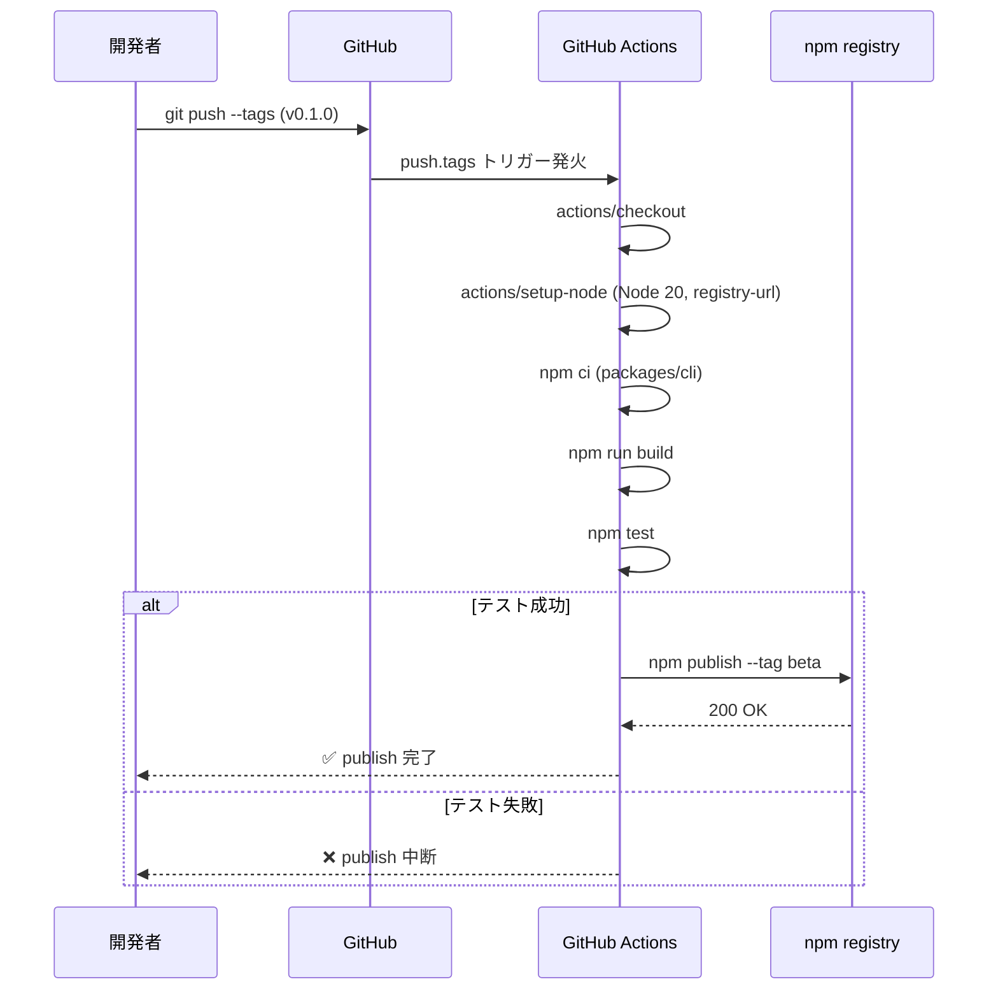
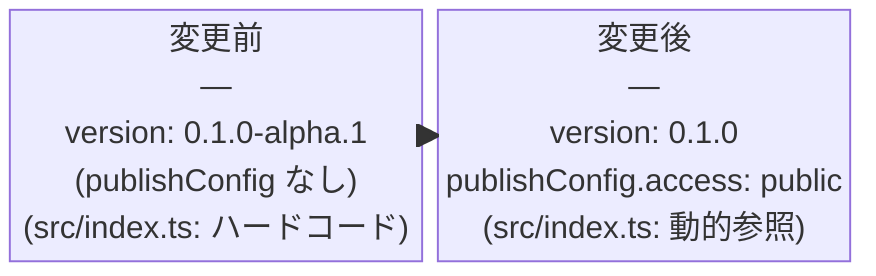

# Architecture Overview: npm-publish-v0-1-beta

## System Diagram

```mermaid
graph TD
    subgraph Developer["開発者フロー"]
        A[git tag v0.1.0] -->|git push --tags| B[GitHub]
        C[gh release create] -->|released event| B
    end

    subgraph GHA["GitHub Actions: publish.yml"]
        B --> D[actions/checkout@v4]
        D --> E[actions/setup-node@v4\nNode 20 LTS]
        E --> F[npm ci\nworking-dir: packages/cli]
        F --> G[npm run build\ntsup → dist/]
        G --> H[npm test\nvitest]
        H -->|success| I[npm publish --tag beta\nNODE_AUTH_TOKEN=NPM_TOKEN]
        H -->|failure| J[❌ publish 中断]
    end

    subgraph NPM["npm registry"]
        I -->|@mspec/cli@0.1.0\ntag: beta| K[npm registry]
    end

    subgraph User["ユーザーフロー"]
        K -->|npx @mspec/cli init| L[mspec init コマンド実行]
        K -->|npm install -g @mspec/cli@beta| M[グローバル mspec コマンド]
    end
```

---

## Sequence Diagram: npm publish フロー



---

## Data Model: package.json の変更差分



---

## ファイル変更マップ

| ファイル | 操作 | 変更内容 |
|----------|------|----------|
| `packages/cli/package.json` | 修正 | `version` bump + `publishConfig` 追加 |
| `packages/cli/src/index.ts` | 修正 | `program.version()` を `package.json` から動的参照 |
| `.github/workflows/publish.yml` | 新規作成 | tag push / GitHub Release トリガーの publish ワークフロー |

## Constitution Check

| Principle | Phase 0 | Phase 1 |
|-----------|---------|---------|
| I. ステップ独立性 | ✅ architecture-overview のみ生成 | ✅ design.md と独立したファイル |
| II. 決定論的マージ | ✅ 新規ファイルのみ | ✅ 既存ファイルとの競合なし |
| III. 質問駆動の要件確定 | ✅ research 済み | ✅ 図はすべて確定済み設計を反映 |
| IV. 双方向アンカー | ✅ design.md と整合 | ✅ ファイル変更マップが FR と対応 |
| V. 強制ステップと拡張ステップの分離 | ✅ 強制ステップのみ | ✅ Mermaid 図で実装前に構造を可視化 |
