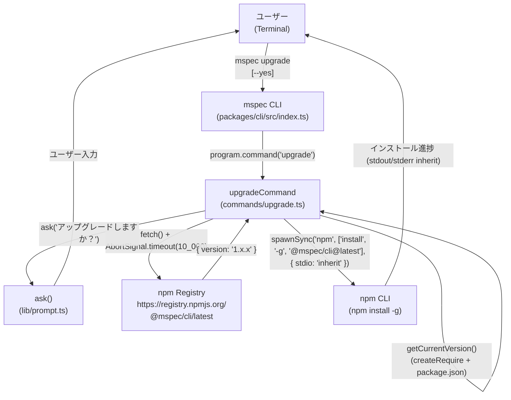
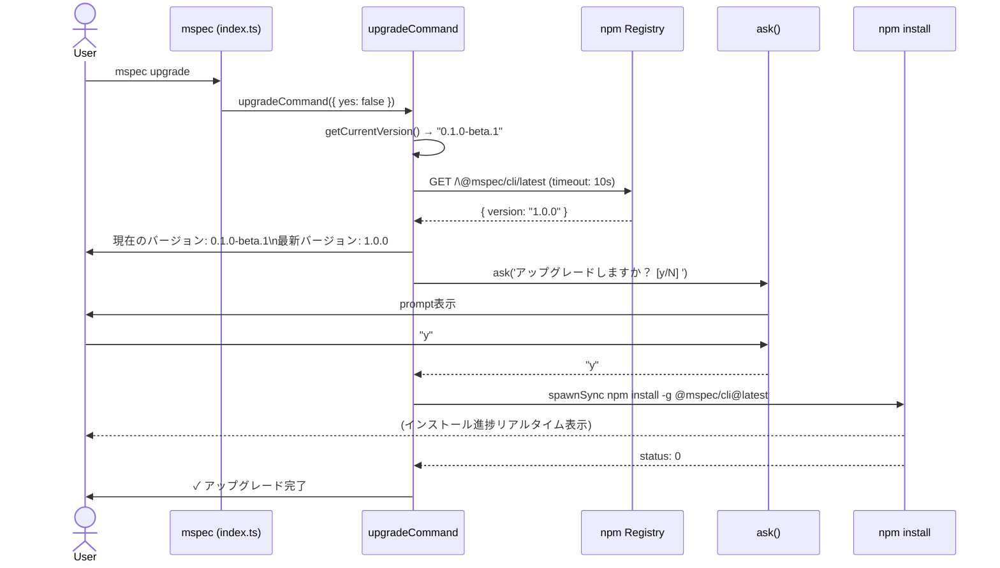
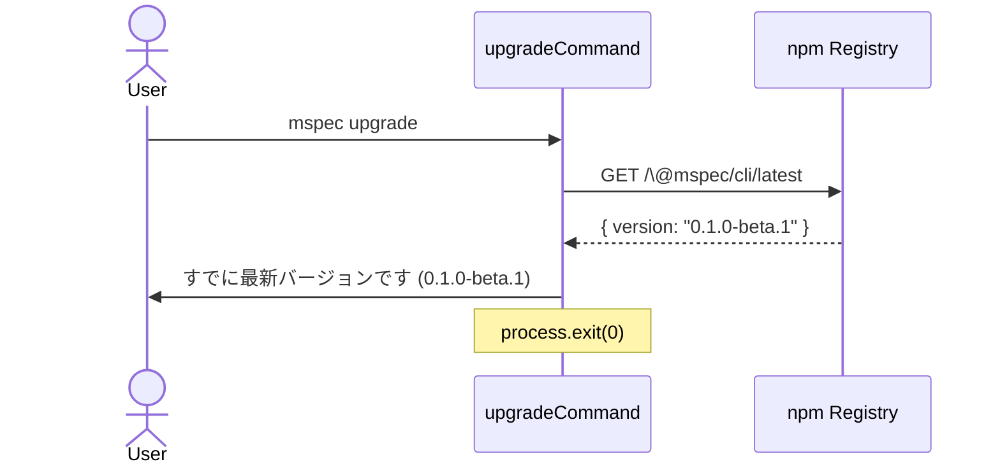
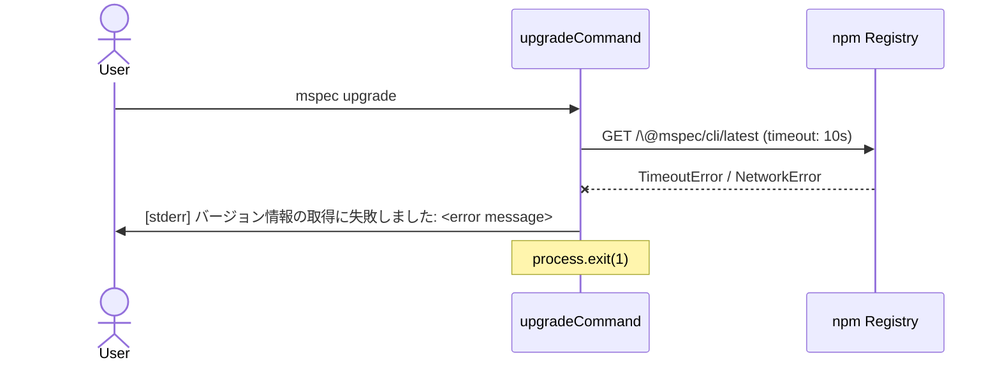
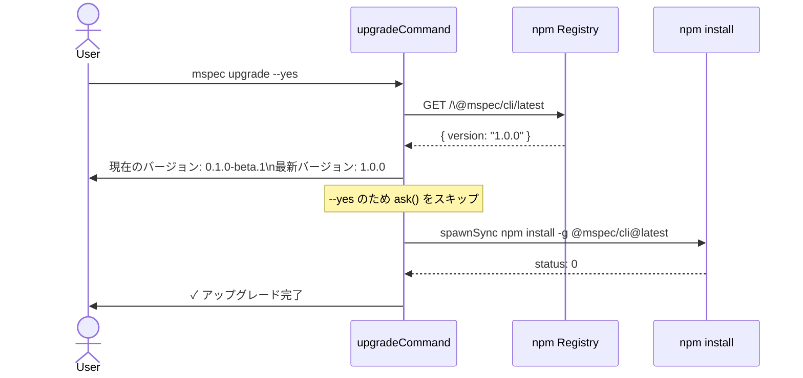
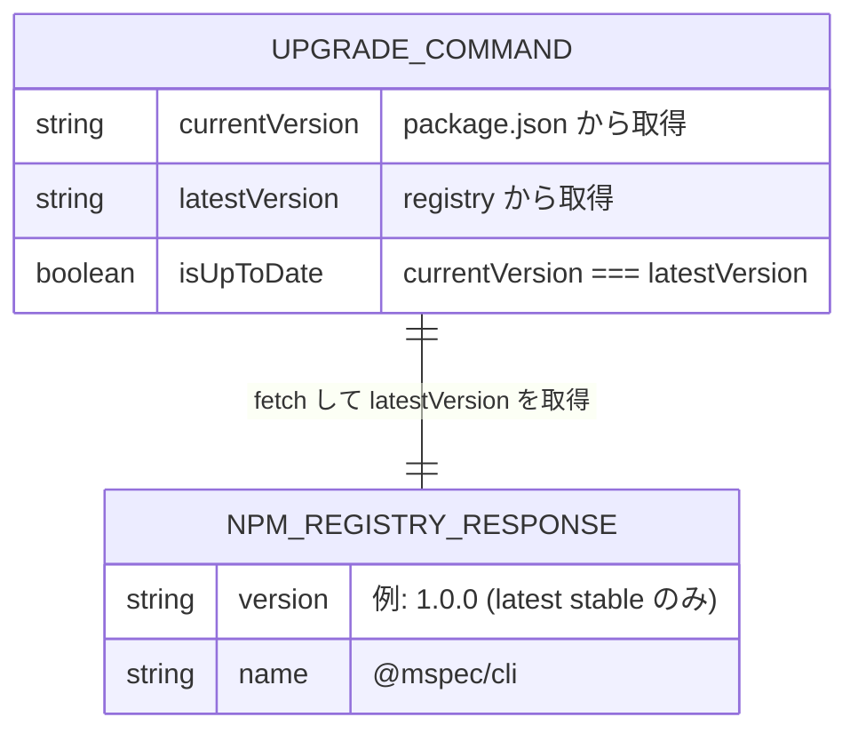

# Architecture Overview: cli-upgrade

## System Context Diagram



## Sequence Diagram: mspec upgrade（通常フロー）



## Sequence Diagram: already up-to-date フロー



## Sequence Diagram: ネットワークエラーフロー（version-check FR-002）



## Sequence Diagram: --yes フラグによる確認スキップ



## Data Model: npm Registry レスポンス（使用フィールドのみ）



## File Structure: 変更対象

```
packages/cli/
├── src/
│   ├── index.ts               ← 変更: upgradeCommand を import・登録
│   └── commands/
│       └── upgrade.ts         ← 新規作成
└── package.json               ← 変更なし（依存追加なし）
```

## Constitution Check

| 原則 | Phase 0 (Architecture Overview) | Phase 1 (Architecture Overview) |
|------|--------------------------------|--------------------------------|
| I ステップ独立性 | OK — 本図は design.md の構造を視覚化したもので、後続ステップへの依存なし | OK — Phase 1: 図の内容は design.md の契約のみを反映しており、実装詳細を含まない |
| II 決定論的マージ | OK — ファイル構成・コンポーネント間の接続が一意に表現されており、曖昧さなし | OK — Phase 1: 各シーケンス図は Delta Spec の Scenario に対応しており、実装時の解釈ブレなし |
| III 質問駆動の要件確定 | OK — 図は確定済みの設計を視覚化するもので、新たな要件を導入していない | OK — Phase 1: 未解決の設計選択肢を含まない |
| IV 双方向アンカー | OK — シーケンス図の各フローは cli-upgrade / version-check の FR 番号と対応 | OK — Phase 1: ER 図のフィールドは version-check FR-001/FR-003 の要件と整合 |
| V 強制ステップと拡張ステップの分離 | OK — 実装コードは含まず、構造・フローの可視化に限定 | OK — Phase 1: テストケースや実装手順は tasks.md に委ねている |

### Complexity Tracking

None
