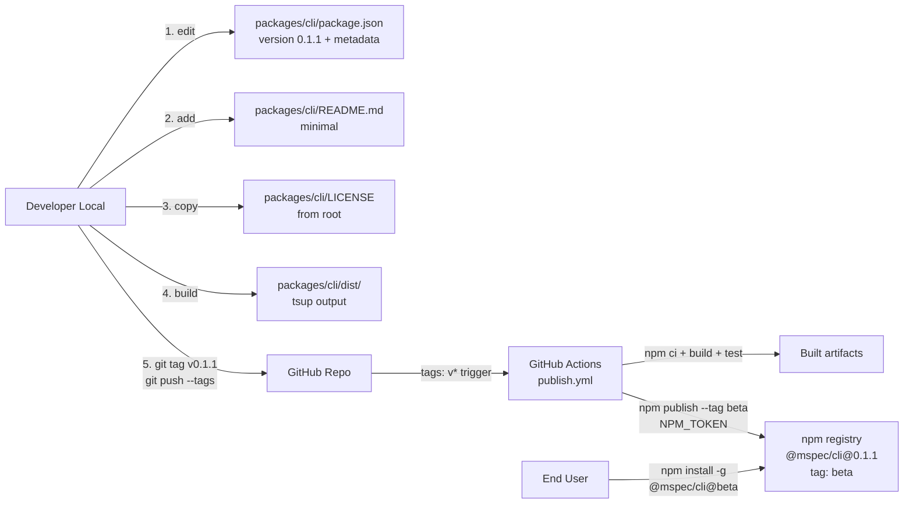
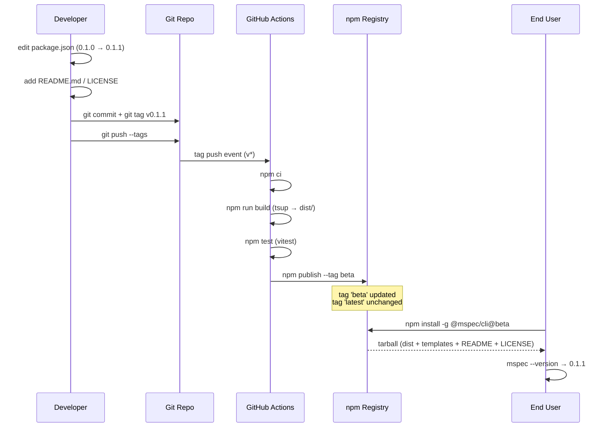

# Architecture Overview: prepare-npm-publish-0-1-1

## System Diagram

## Sequence

## Data Model

該当なし（本変更は静的ファイル更新のみで永続データ構造の変更は無い）。

## UI Mockup

該当なし（CLI ツールの publish 準備のため UI 変更なし）。

## Constitution Check

| Principle | Phase 0 | Phase 1 | Notes |
|-----------|---------|---------|-------|
| I. ステップ独立性 | ✅ | ✅ | architecture-overview は静的な構造図のみで他ステップへの依存・逆流なし |
| II. 決定論的マージ | ✅ | ✅ | 図表のみで spec マージへの影響なし、archive 時の処理に矛盾を生じない |
| III. 質問駆動の要件確定 | ✅ | ✅ | design 段階で全要件確定済み、図表生成に追加質問不要 |
| IV. 双方向アンカー | ✅ | ✅ | System Diagram で design.md の Project Structure / Migration Plan を可視化、相互参照可能 |
| V. 強制ステップと拡張ステップの分離 | ✅ | ✅ | architecture-overview は拡張ステップ、強制ステップへの侵害なし |
