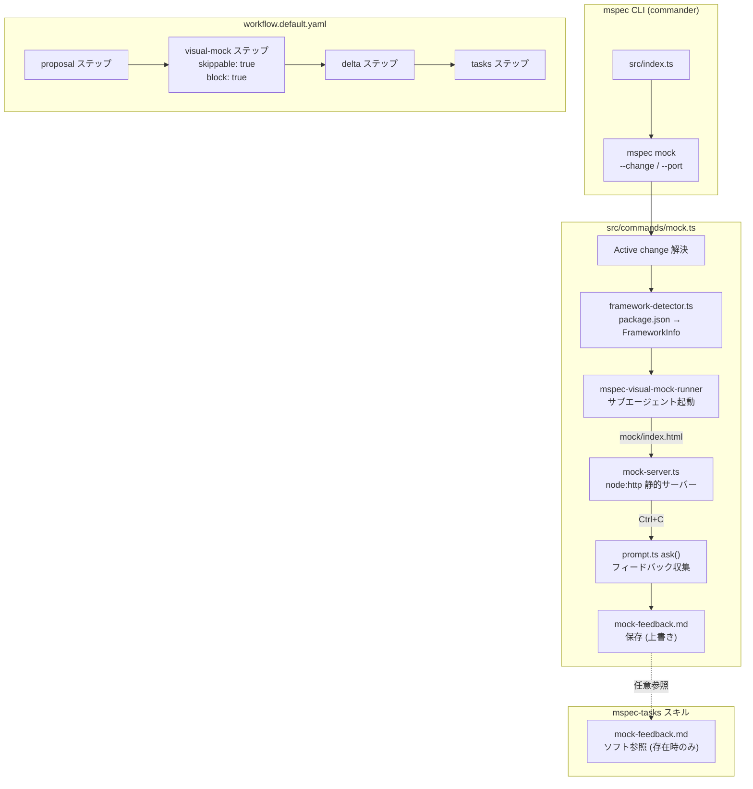
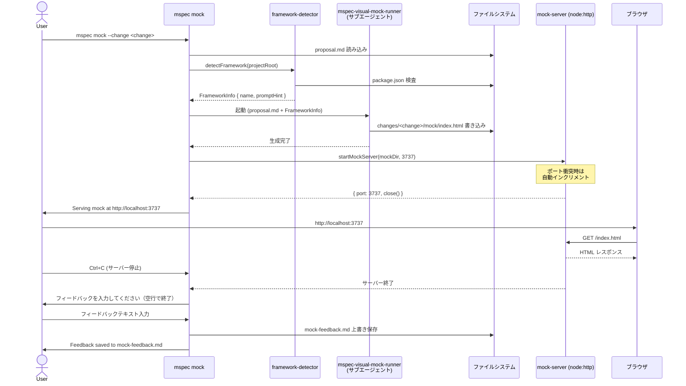
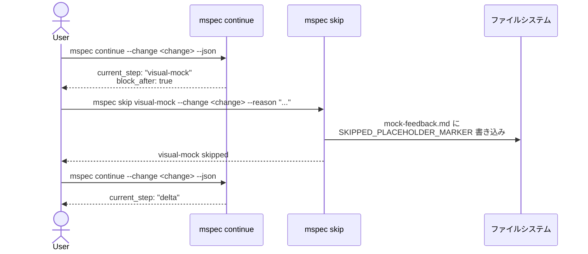

# Architecture Overview: ui-visual-mock-workflow

## System Diagram



---

## Sequence Diagram: mspec mock 実行フロー



---

## Sequence Diagram: visual-mock ステップ skip フロー



---

## Data Model: mock-feedback.md

```
changes/<change>/
├── mock/
│   └── index.html          ← mspec-visual-mock-runner が生成
└── mock-feedback.md        ← mspec mock が生成（または skip placeholder）
```

**mock-feedback.md フォーマット（通常時）:**
```markdown
# Mock Feedback

> Recorded: 2026-05-21T06:00:00Z
> Mock: changes/<change>/mock/index.html

<ユーザーが入力したフィードバック本文>
```

**mock-feedback.md フォーマット（skip 時）:**
```markdown
<!-- mspec: skipped step -->
```

---

## Component Responsibility Matrix

| コンポーネント | 責務 | 境界 |
|--------------|------|------|
| `src/commands/mock.ts` | コマンド引数解析・全体オーケストレーション | CLI 入出力 |
| `src/lib/mock-server.ts` | 静的ファイル配信・ポート管理 | TCP ソケット |
| `src/lib/framework-detector.ts` | CSS フレームワーク判定 | ファイルシステム読み取り |
| `mspec-visual-mock-runner` (SKILL) | HTML/CSS 生成 | LLM + ファイル書き込み |
| `mspec-visual-mock` (SKILL) | ワークフローステップ制御 | mspec workflow engine |
| `prompt.ts` (既存) | stdin 対話入力 | stdin/stdout |
