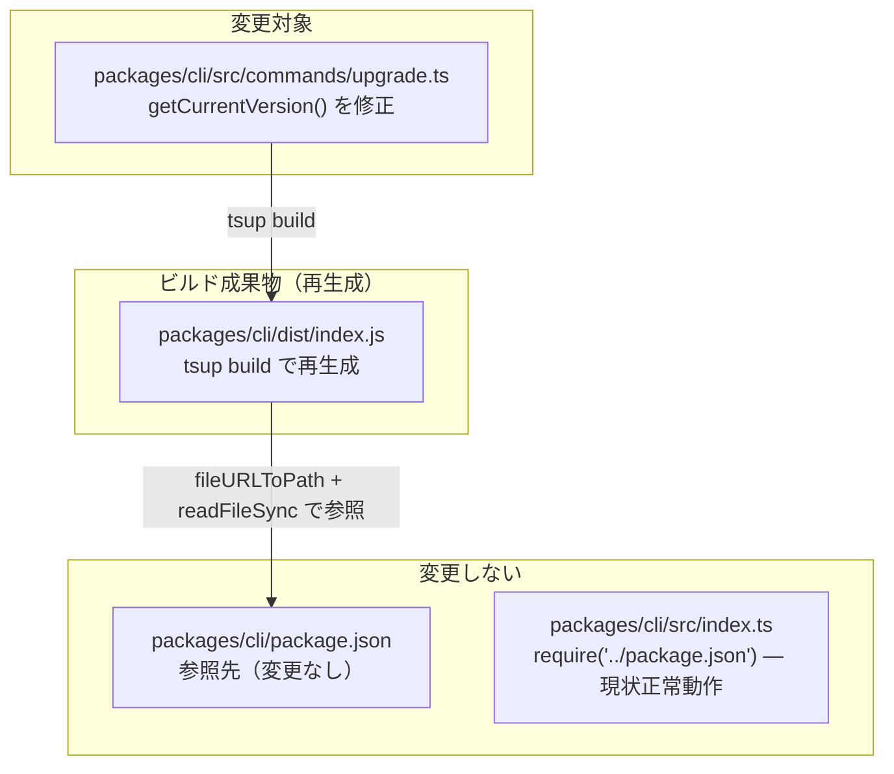
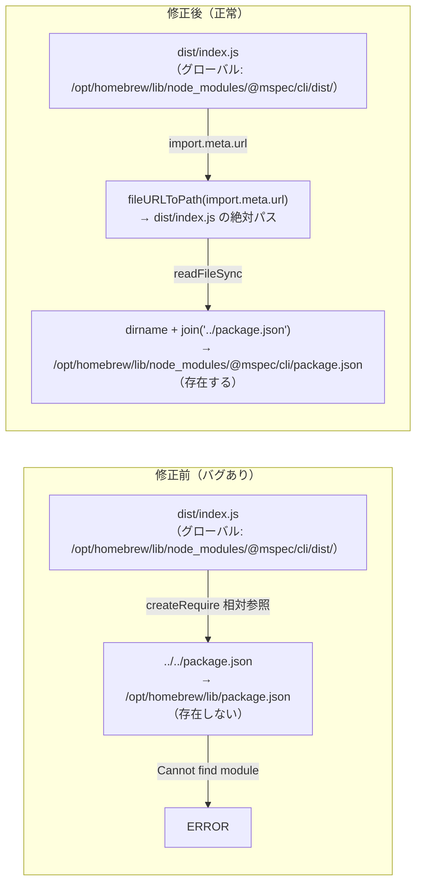
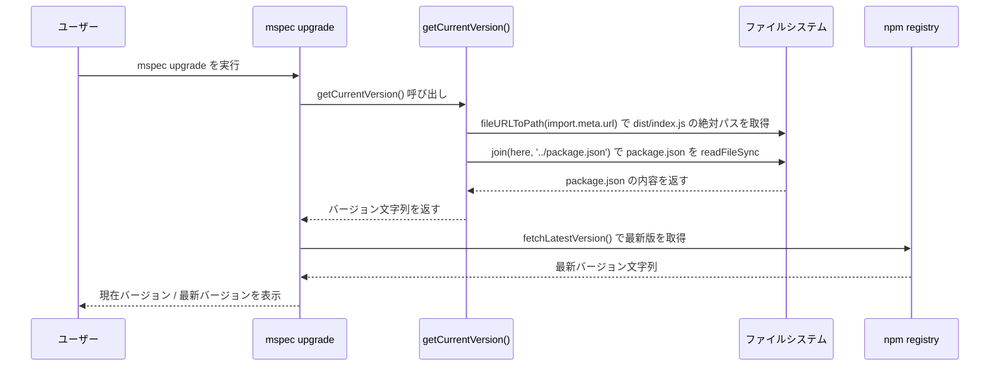

# Architecture Overview: fix-upgrade-package-json-path

## System Diagram

## パス解決: 修正前後の比較

## Change Sequence

## Scope Boundary

| ファイル | 対象 | 理由 |
|----------|------|------|
| `packages/cli/src/commands/upgrade.ts` | 変更 | `getCurrentVersion()` のバグ修正 |
| `packages/cli/dist/index.js` | 再生成 | tsup build で自動更新 |
| `packages/cli/src/index.ts` | 変更しない | `require('../package.json')` は現状正常動作 |
| `packages/cli/package.json` | 変更しない | 参照先（バグとは無関係） |

## Constitution Check

| Principle | Phase 0 | Phase 1 |
|-----------|---------|---------|
| I. ステップ独立性 | ✅ architecture-overview.md のみ生成、実装なし | ✅ 他ステップの成果物に依存せず独立 |
| II. 決定論的マージ | ✅ 新規ファイルのみ、競合なし | ✅ 図が変更対象を一意に特定している |
| III. 質問駆動の要件確定 | ✅ research 段階で設計方針確定済み | ✅ 追加の判断事項なし |
| IV. 双方向アンカー | ✅ design.md と相互参照 | ✅ 図が FR-001/FR-002 のシナリオと整合 |
| V. 強制ステップと拡張ステップの分離 | ✅ 強制ステップのみ実行 | ✅ 拡張ステップへの依存なし |

### Complexity Tracking

None
