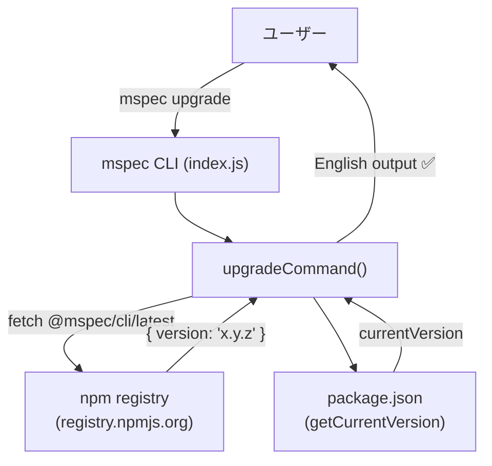
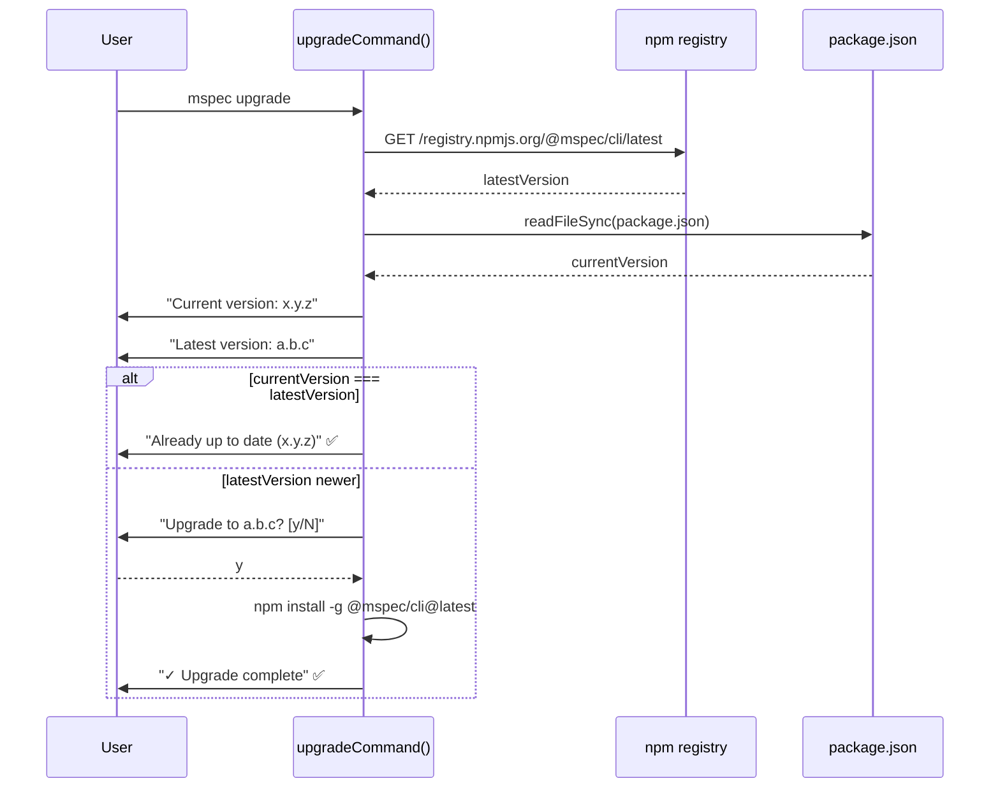

# Architecture Overview: cli-output-english

## System Diagram

## Sequence Diagram: mspec upgrade (after this change)

## Change Scope

この変更はアーキテクチャに影響しない。変更されるのは `upgradeCommand()` 内の文字列リテラル8箇所のみ。モジュール構成・依存関係・インターフェースはすべて不変。

## Constitution Check

| Principle | Phase 0 | Phase 1 |
|-----------|---------|---------|
| I ステップ独立性 | ✅ アーキテクチャ図は設計の可視化のみ | ✅ |
| II 決定論的マージ | ✅ 変更スコープが明確に定義されている | ✅ |
| III 質問駆動の要件確定 | ✅ 設計判断はすべて design.md / design-rationale.md で確定 | ✅ |
| IV 双方向アンカー | ✅ シーケンス図が FR-002/FR-004 の受け入れ基準を可視化 | ✅ |
| V 強制ステップと拡張ステップの分離 | ✅ architecture-overview は設計成果物として分離 | ✅ |

### Complexity Tracking

None
