# Architecture Overview: deprecate-ai-internal-doc-type

## System Diagram — 変更の連鎖

```mermaid
graph TD
    SoT["artifact-validator.ts<br/>VALID_DOC_TYPES[]<br/>(Single Source of Truth)"]

    SoT -->|"自動連動\n(join)"| ErrMsg["エラーメッセージ<br/>VALID_DOC_TYPES_LIST"]
    SoT -->|"手動更新"| TmpJa["templates/artifacts/tasks.ja.md<br/>doc_type: Reference"]
    SoT -->|"手動更新"| TmpEn["templates/artifacts/tasks.en.md<br/>doc_type: Reference"]
    SoT -->|"手動更新"| E2E1["artifact-taxonomy-doc-type.e2e.test.ts<br/>VALID_DOC_TYPES / EXPECTED_DOC_TYPES 更新"]
    SoT -->|"手動更新"| E2E2["template-doc-type-invariant.e2e.test.ts<br/>FR-004 → FR-007 / AI-Internal → Reference"]
    SoT -->|"手動更新"| E2E3["doc-type-enforcement.e2e.test.ts<br/>accepts → rejects テスト反転"]
    SoT -->|"手動更新"| E2E4["workflow-visual-mock.e2e.test.ts<br/>proposal.md モック AI-Internal → Explanation"]
    SoT -->|"手動更新"| Docs["docs/reference/doc-types.md<br/>Roadmap セクション（L50）廃止済みに更新"]
    SoT -->|"archive後に更新"| Spec1["specs/artifact-taxonomy/spec.md<br/>FR-001/FR-002 MODIFIED, FR-004 REMOVED"]
    SoT -->|"archive後に更新"| Spec2["specs/cli-spec-lint/spec.md<br/>FR-015 MODIFIED + RENAMED"]

    subgraph "テンプレート層"
        TmpJa
        TmpEn
    end

    subgraph "テスト層"
        E2E1
        E2E2
        E2E3
        E2E4
    end

    subgraph "ドキュメント層"
        Docs
    end

    subgraph "仕様層（SoT spec — archive 後）"
        Spec1
        Spec2
    end
```



## Sequence Diagram — `mspec validate` の doc_type チェックフロー（変更後）

```mermaid
sequenceDiagram
    participant User
    participant CLI as mspec validate
    participant Validator as artifact-validator.ts
    participant Template as tasks.ja.md / tasks.en.md

    User->>CLI: mspec validate --change <dir>
    CLI->>Validator: validateArtifact(filePath, contents, produces)
    Validator->>Validator: parseFrontmatter(contents)
    Validator->>Validator: VALID_DOC_TYPES.includes(doc_type)?
    alt doc_type = "Reference" (新規)
        Validator-->>CLI: ✅ PASS
    else doc_type = "AI-Internal" (廃止済み)
        Validator-->>CLI: ❌ ERROR: "AI-Internal は無効な doc_type です; 許容値: Reference, Explanation, How-to, Tutorial"
        CLI-->>User: exit code 1
    end
```

## Data Model — doc_type 制約の変化

```mermaid
erDiagram
    ARTIFACT_TEMPLATE {
        string doc_type "Reference | Explanation | How-to | Tutorial"
        string content  "テンプレート本文"
    }

    VALID_DOC_TYPES {
        string value "Reference"
        string value "Explanation"
        string value "How-to"
        string value "Tutorial"
    }

    REMOVED_DOC_TYPES {
        string value "AI-Internal (廃止)"
    }

    ARTIFACT_TEMPLATE ||--o{ VALID_DOC_TYPES : "doc_type MUST BE one of"
    ARTIFACT_TEMPLATE ||--x{ REMOVED_DOC_TYPES : "MUST NOT USE"
```

## Constitution Check

| 原則 | Phase 0 | Phase 1 |
|---|---|---|
| I: ステップ独立性 | ✅ architecture-overview は他ステップ成果物を変更しない | ✅ 図はドキュメントのみ。実装に副作用なし |
| II: 決定論的マージ | ✅ この図は SoT spec マージに影響しない | ✅ 変更対象ファイルとの競合なし |
| III: 質問駆動の要件確定 | ✅ research ステップで確定済み | ✅ 図に未解決の設計判断なし |
| IV: 双方向アンカー | ✅ 各ノードが design.md の Technical Context テーブルと対応 | ✅ 「自動連動」と「手動更新」の分類が tasks.md のタスク粒度に反映される |
| V: 強制ステップと拡張ステップの分離 | ✅ design は拡張ステップ | ✅ 図は既存要件の可視化のみ。新規要件の追加なし |

### Complexity Tracking

None
