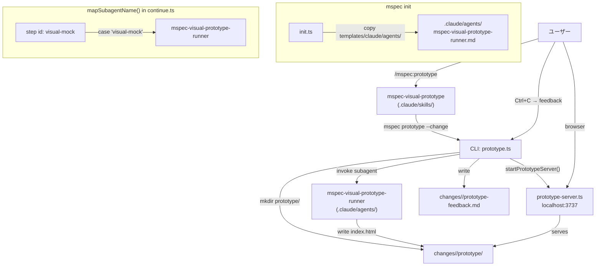
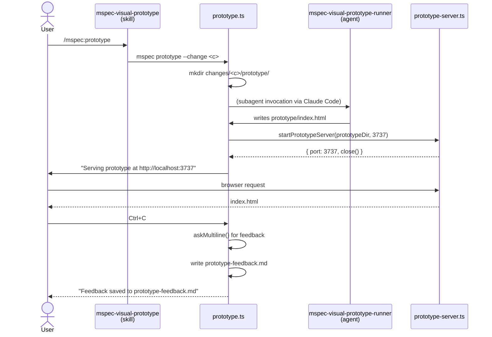
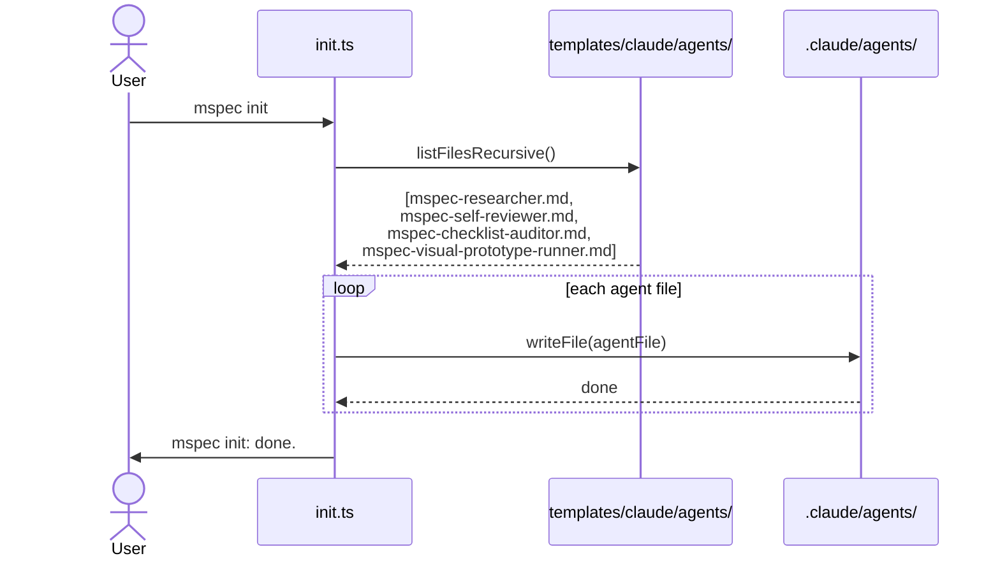
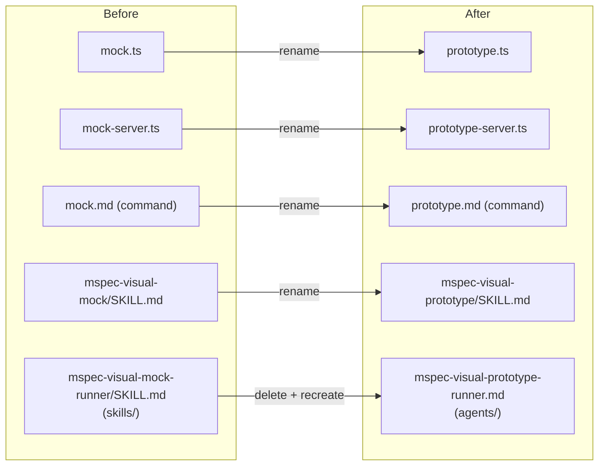

# Architecture Overview: rename-visual-mock-to-prototype

## System Diagram

## Sequence Diagram: `/mspec:prototype` 実行フロー

## Sequence Diagram: `mspec init` でのサブエージェントインストール

## ファイル改名マッピング

## Constitution Check

| Principle | Phase 0 | Phase 1 |
|-----------|---------|---------|
| I  ステップ独立性 | ✅ architecture-overview は他ステップ成果物を変更しない | ✅ `changes/` 以下にのみ配置される |
| II  決定論的マージ | ✅ SoT spec と衝突なし | ✅ — |
| III  質問駆動の要件確定 | ✅ ユーザー確認済み（エイリアス・関数名リネーム） | ✅ 未解決事項なし |
| IV  双方向アンカー | ✅ Delta Spec アンカーに対応するダイアグラムを記述 | ✅ — |
| V  強制ステップと拡張ステップの分離 | ✅ visual-mock は任意ステップ。必須ステップに影響しない | ✅ — |

### Complexity Tracking

None
