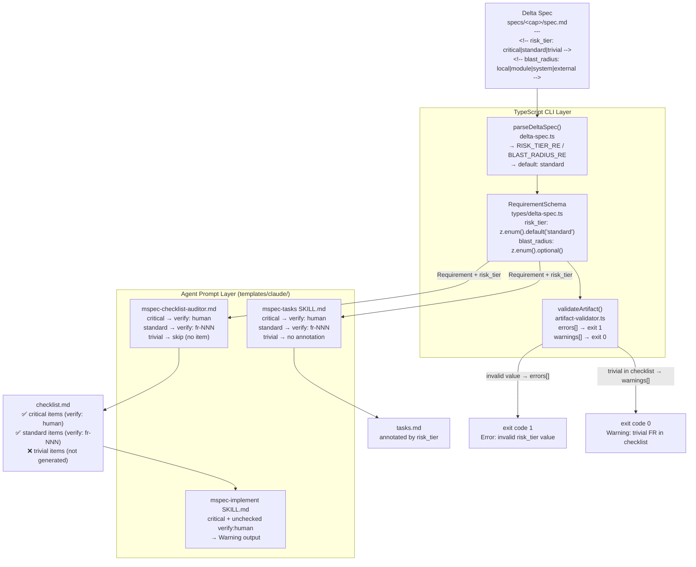
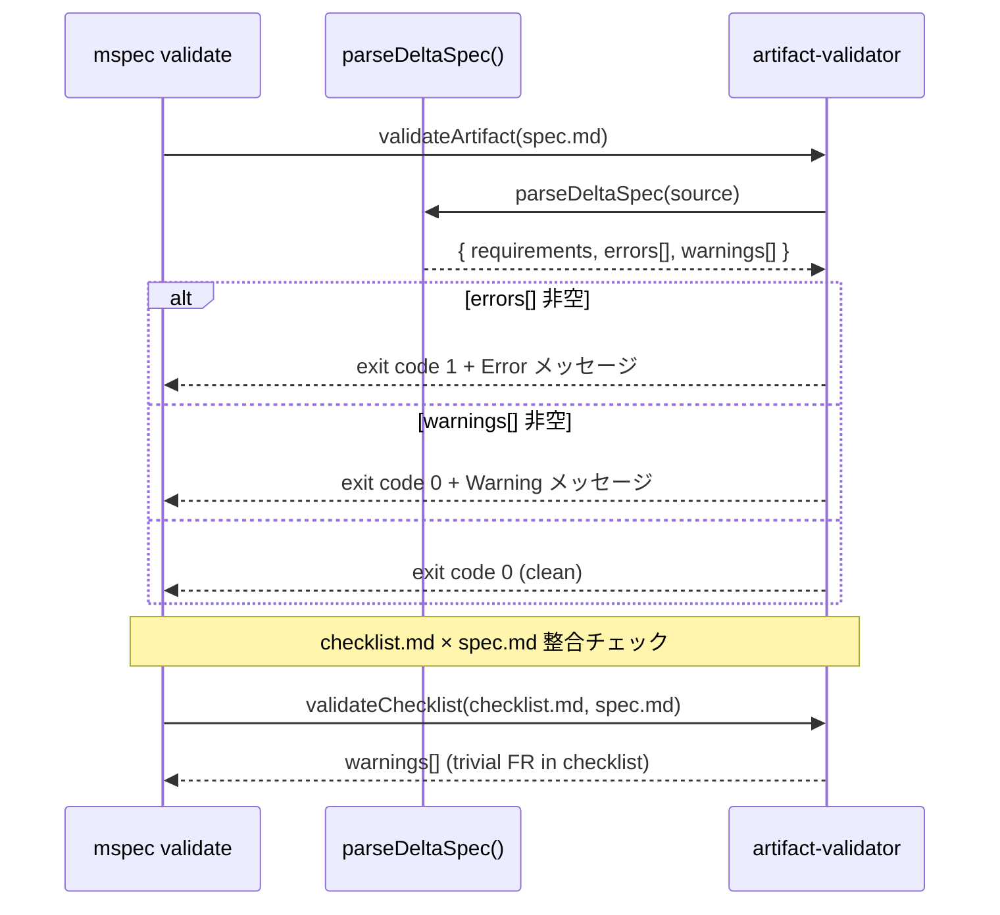

<!-- @mspec-delta 2026-05-24-085415-risk-tier-field/specs/delta-spec/spec.md -->
<!-- Requirements implemented: FR-001, FR-002, FR-003, FR-004, FR-005 -->
<!-- Change: risk-tier-field -->

<!-- @mspec-delta 2026-05-24-085415-risk-tier-field/specs/verify-routing/spec.md -->
<!-- Requirements implemented: FR-001, FR-002, FR-003, FR-004, FR-005 -->
<!-- Change: risk-tier-field -->

# Architecture Overview: risk-tier-field

## System Diagram



## Data Model

### RequirementSchema（変更後）

```typescript
// packages/cli/src/types/delta-spec.ts
const RequirementSchema = z.object({
  fr_id:        z.string(),                                        // "FR-NNN"
  title:        z.string(),
  body:         z.string(),
  raw_block:    z.string(),
  scenarios:    z.array(ScenarioSchema),
  risk_tier:    z.enum(['critical', 'standard', 'trivial'])        // NEW
                 .default('standard'),
  blast_radius: z.enum(['local', 'module', 'system', 'external']) // NEW
                 .optional(),
});
```

### Delta Spec Markdown 表現（変更後）

```markdown
### Requirement: FR-001 — 外部 API 連携

<!-- risk_tier: critical -->
<!-- blast_radius: external -->

外部 API を呼び出すとき、このシステムは SHALL ...

#### Scenario: ...
```

## Validate フロー（変更後）



## Constitution Check

> Step: design | Constitution Version: 1.0.0

| Principle | Phase 0 | Phase 1 | Notes |
|-----------|---------|---------|-------|
| I. ステップ独立性 | ✅ | ✅ | 図はパーサー・バリデーション・エージェントプロンプト各層を独立して表現している |
| II. 決定論的マージ | ✅ | ✅ | architecture-overview.md は Reference ドキュメント。SoT spec にマージされない |
| III. 質問駆動の要件確定 | ✅ | ✅ | 設計判断はすべて AskUserQuestion で確定済み |
| IV. 双方向アンカー | ✅ | ✅ | @mspec-delta アンカーを付与済み |
| V. 強制ステップと拡張ステップの分離 | ✅ | ✅ | ステップ構造は変更なし |

### Complexity Tracking

None
