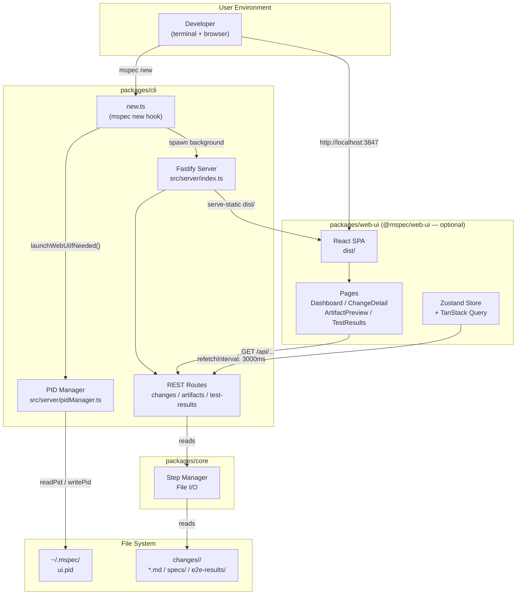
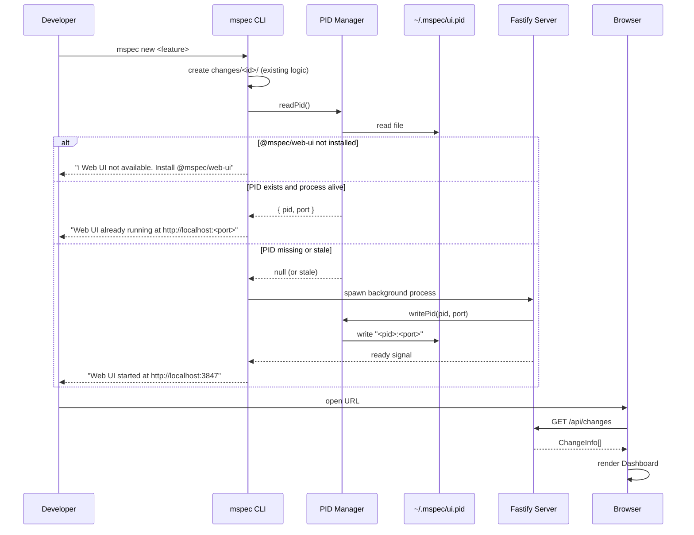
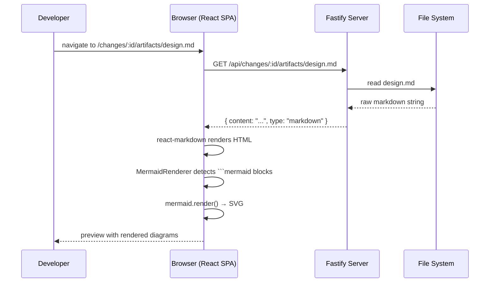
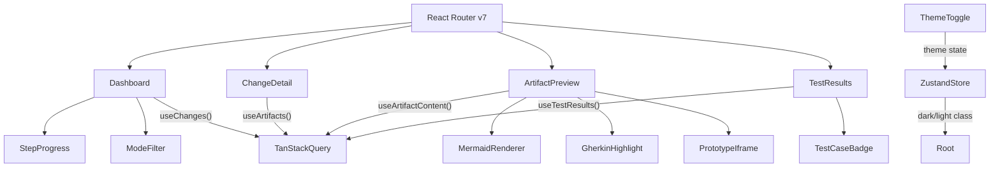
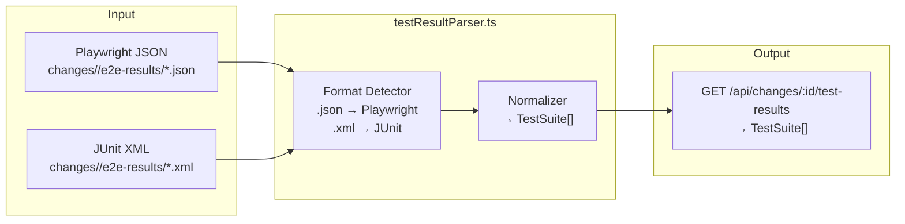
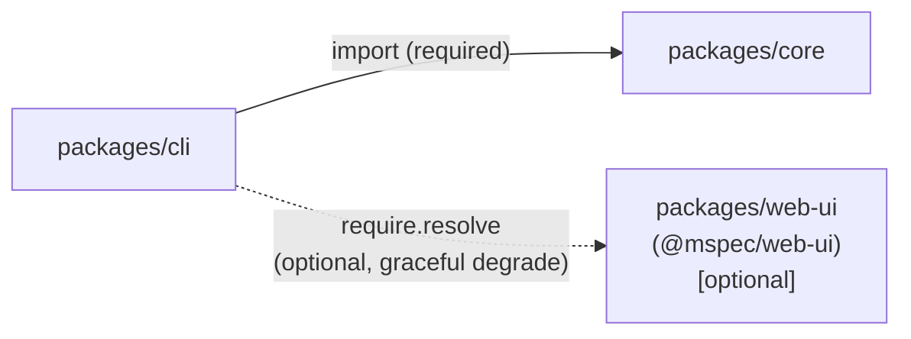

# Architecture Overview: mspec-web-ui

## System Diagram

## Sequence: Server Startup (mspec new)

## Sequence: Artifact Preview (MD with Mermaid)

## Component Diagram (Frontend)

## Data Flow: Test Result Parsing

## Package Dependency Graph

## Constitution Check

| 原則 | Phase 0 | Phase 1 |
|------|---------|---------|
| I ステップ独立性 | ✅ architecture-overview は design.md と同一ステップで生成され、外部成果物に依存しない | ✅ 各 Mermaid 図は独立して参照・更新可能な単位として設計されている |
| II 決定論的マージ | ✅ 新規ファイルであり既存ファイルへの影響なし | ✅ Mermaid 記法は構造化されており、将来の更新が確定的 |
| III 質問駆動の要件確定 | ✅ 全設計決定は proposal・research・設計時の AskUserQuestion を経て確定している | ✅ 図は確定済みの設計決定のみを反映しており、未解決の選択肢は含まない |
| IV 双方向アンカー | ✅ System Diagram が design.md の Project Structure と対応している | ✅ Sequence 図が Delta Spec（cli-integration / web-ui-server）の Scenario と 1:1 で対応している |
| V 強制ステップと拡張ステップの分離 | ✅ architecture-overview は design ステップの強制成果物として管理されている | ✅ Mermaid 図（必須）と追加 Sequence 図（拡張）が明確に分かれている |

### Complexity Tracking

None.
