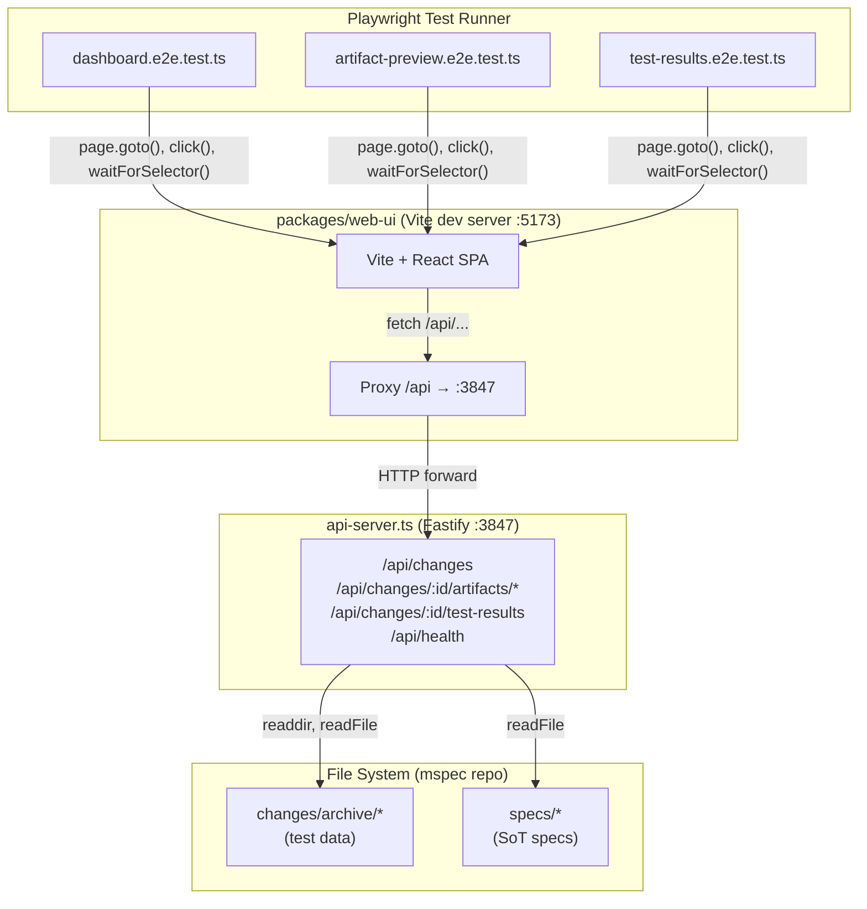
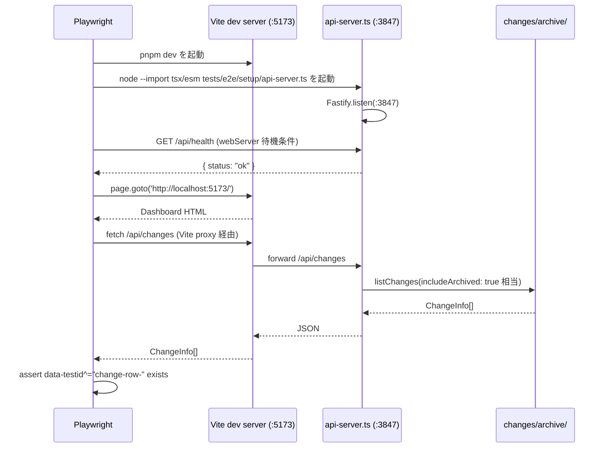
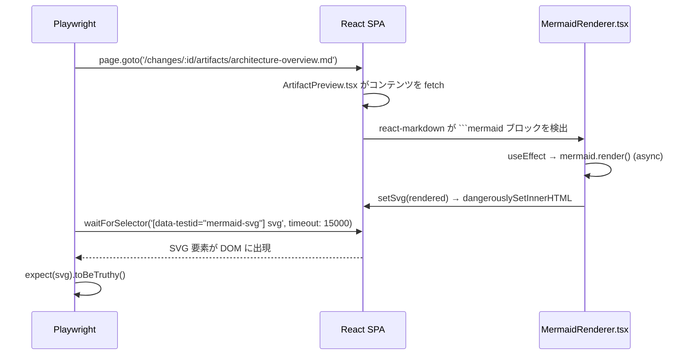
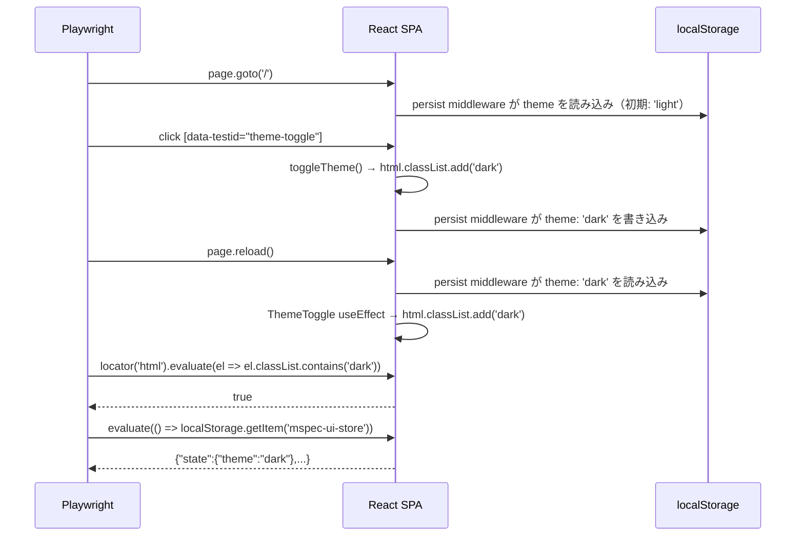
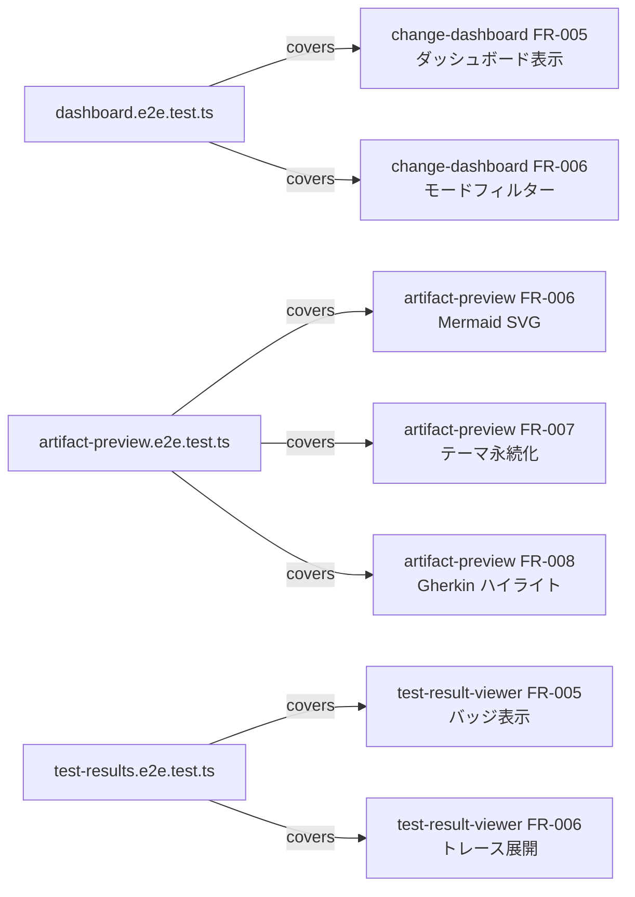

# Architecture Overview: mspec-web-ui-e2e

## System Diagram

## Sequence: E2E テスト起動フロー

## Sequence: Mermaid SVG レンダリング検証

## Sequence: テーマ切り替え + LocalStorage 永続化検証

## テストファイルと FR のマッピング

## Constitution Check

| 原則 | Phase 0 | Phase 1 |
|------|---------|---------|
| I ステップ独立性 | ✅ architecture-overview は design.md と同一ステップで生成、外部依存なし | ✅ 各 Mermaid 図は独立して参照・更新可能 |
| II 決定論的マージ | ✅ 新規ファイルで既存への影響なし | ✅ Mermaid 記法は構造化されており将来の更新が確定的 |
| III 質問駆動の要件確定 | ✅ 全設計決定は proposal・research・AskUserQuestion を経て確定している | ✅ 図は確定済みの設計決定のみを反映している |
| IV 双方向アンカー | ✅ System Diagram が design.md の Project Structure と対応している | ✅ テストファイルマッピング図が各 FR に 1:1 で対応している |
| V 強制ステップと拡張ステップの分離 | ✅ architecture-overview は design ステップの強制成果物として管理されている | ✅ Mermaid 図（必須）と追加 Sequence 図（拡張）が明確に分かれている |

### Complexity Tracking

None.
