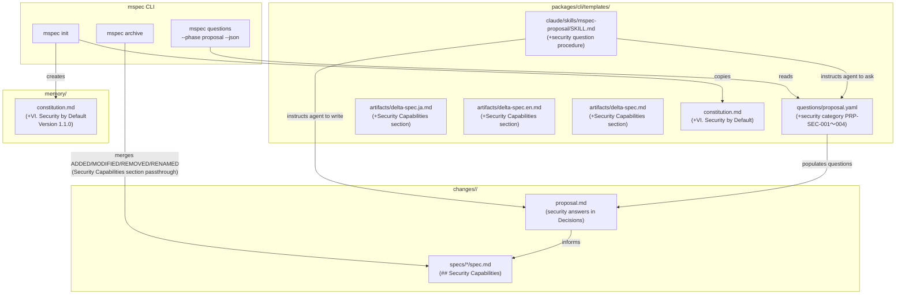
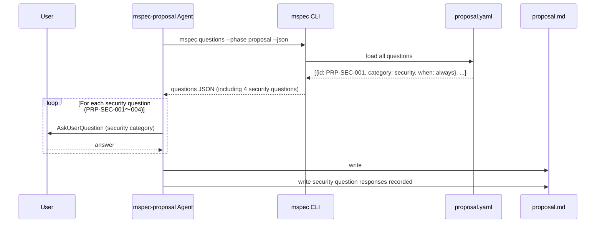
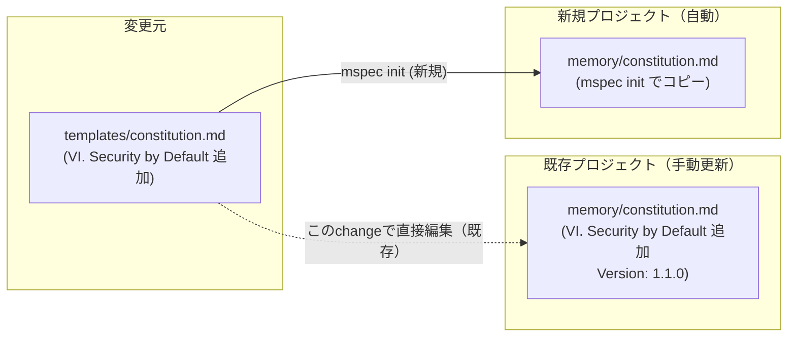

# Architecture Overview: security-as-default

## System Diagram

変更対象ファイルと既存コンポーネントの関係：

## Sequence Diagram: Security Questions Flow

proposalステップでのsecurity質問フロー：

## Data Flow: Constitution Update

## Component Overview

| コンポーネント | 役割 | 変更種別 |
|--------------|------|---------|
| `proposal.yaml` | security質問バンク | 追記（末尾に4問追加） |
| `delta-spec.ja/en/delta-spec.md` | delta specテンプレート | 追記（Security Capabilitiesセクション） |
| `memory/constitution.md` | 現プロジェクトの原則集 | 追記（VI原則 + バージョン更新） |
| `templates/constitution.md` | 新規プロジェクト雛形 | 修正（III〜V プレースホルダー + VI実文） |
| `mspec-proposal/SKILL.md` | エージェント実行手順 | 修正（security質問手順 + アンカー追記） |

---

## Constitution Check

| 原則 | Phase 0 評価 | Phase 1 評価 |
|------|-------------|-------------|
| I. ステップ独立性 | ✅ PASS | ✅ PASS |
| II. 決定論的マージ | ✅ PASS | ✅ PASS |
| III. 質問駆動の要件確定 | ✅ PASS | ✅ PASS |
| IV. 双方向アンカー | ✅ PASS | ✅ PASS |
| V. 強制ステップと拡張ステップの分離 | ✅ PASS | ✅ PASS |

### Complexity Tracking

None
