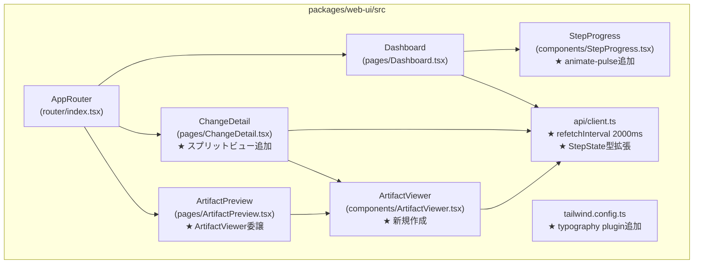
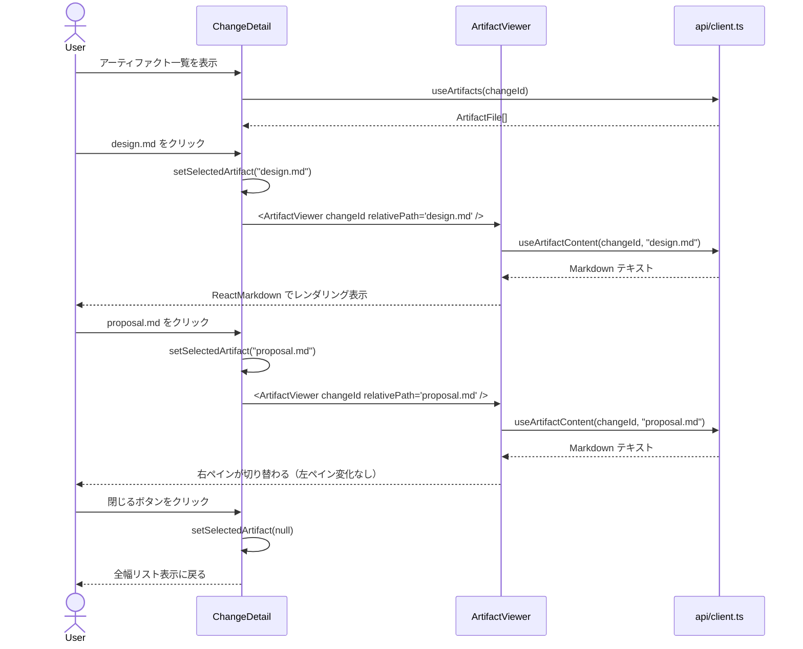
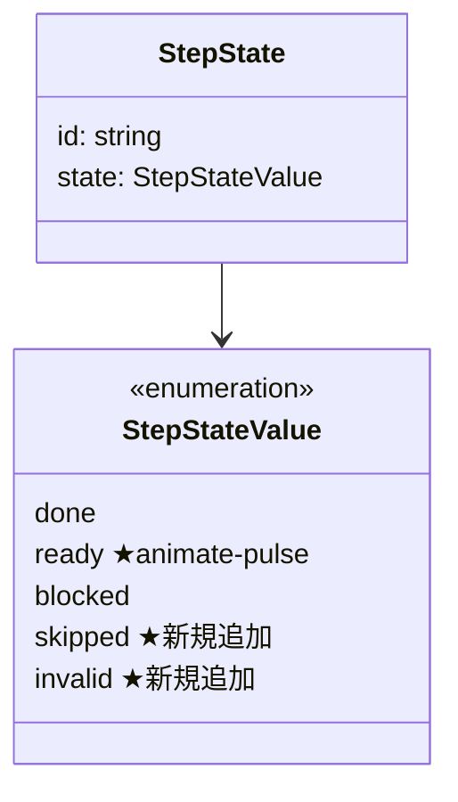
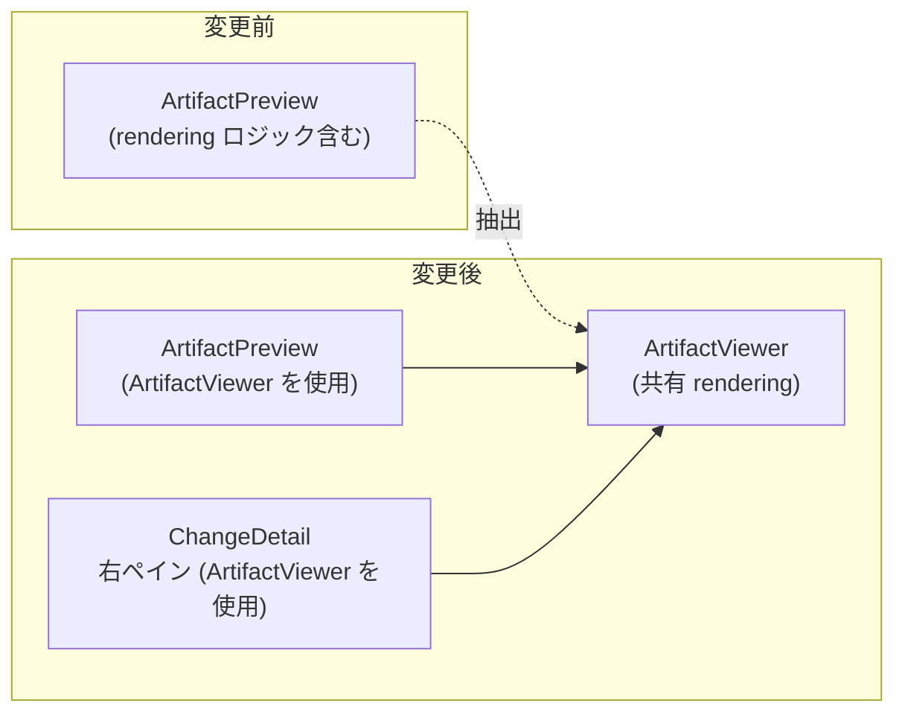

# Architecture Overview: web-ui-viewer-improvements

## System Diagram

## Sequence Diagram: スプリットビューでのアーティファクト表示

## Data Model: StepState 型の拡張

## コンポーネント構成: ArtifactViewer の抽出

## ファイル変更サマリー

| ファイル | 変更種別 | 影響範囲 |
|----------|----------|----------|
| `tailwind.config.ts` | 修正（プラグイン追加） | 全 `prose` クラスの CSS 出力が有効化 |
| `api/client.ts` | 修正（型 + 設定値） | StepProgress・Dashboard・ChangeDetail に影響 |
| `components/StepProgress.tsx` | 修正（スタイル） | Dashboard のステップ表示 |
| `components/ArtifactViewer.tsx` | 新規作成 | ChangeDetail・ArtifactPreview が依存 |
| `pages/ChangeDetail.tsx` | 修正（レイアウト + 状態） | アーティファクト一覧ページ全体 |
| `pages/ArtifactPreview.tsx` | 修正（委譲） | ArtifactViewer への移譲のみ、ルートは維持 |

## Constitution Check

| 原則 | Phase 0 | Phase 1 |
|------|---------|---------|
| I ステップ独立性 | ✅ | ✅ 構造図は research・design を参照するのみ。実装に依存しない |
| II 決定論的マージ | ✅ | ✅ 図は設計の可視化のみ。FR 番号・ファイルパスは design.md と一致 |
| III 質問駆動の要件確定 | ✅ | ✅ 設計上の選択肢はすべて research・design ステップで確定済み |
| IV 双方向アンカー | ✅ | ✅ design.md のアンカーコメントが本ファイルをカバー |
| V 強制/拡張ステップの分離 | ✅ | ✅ minor モードの強制ステップとして正しく位置づけられている |

## Complexity Tracking

None
