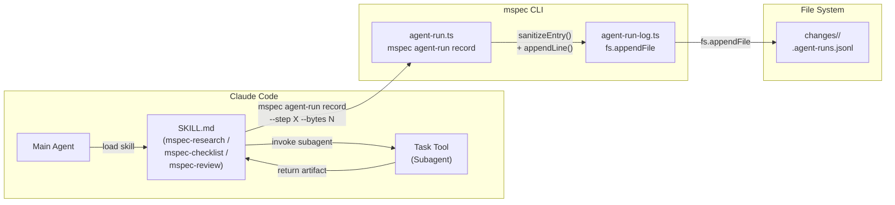
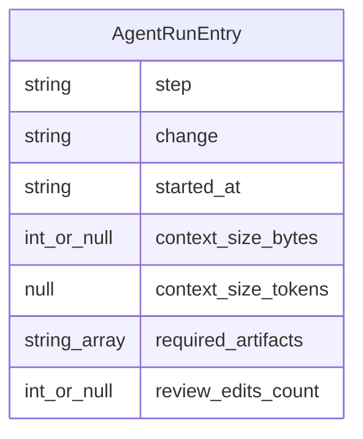

# Architecture Overview: agent-experience-manifest

## System Diagram



## Sequence Diagram

```mermaid
sequenceDiagram
  participant M as Main Agent (Claude Code)
  participant SK as SKILL.md
  participant T as Task Tool (Subagent)
  participant CLI as mspec agent-run record
  participant FS as .agent-runs.jsonl

  M->>SK: execute step (e.g., research)
  Note over SK: Steps 1-4: read inputs, invoke subagent
  SK->>T: invoke via Task tool (subagent_prompt)
  T-->>SK: return artifact content
  SK->>SK: write artifact to disk
  Note over SK: New step (Observation)
  SK->>CLI: mspec agent-run record<br/>--step research<br/>--change &lt;name&gt;<br/>--bytes &lt;N&gt;<br/>--artifacts &lt;paths&gt;
  CLI->>CLI: sanitizeEntry()<br/>(allowlist check)
  CLI->>FS: fs.appendFile() — one JSONL line
  FS-->>CLI: ok
  CLI-->>SK: exit 0
```

## Data Model



### .agent-runs.jsonl サンプル

```jsonl
{"step":"research","change":"2026-05-25-131216-agent-experience-manifest","started_at":"2026-05-26T03:00:00.000Z","context_size_bytes":4821,"context_size_tokens":null,"required_artifacts":["proposal.md","specs/agent-runner/spec.md","specs/skill-observability/spec.md"],"review_edits_count":null}
{"step":"checklist","change":"2026-05-25-131216-agent-experience-manifest","started_at":"2026-05-26T04:00:00.000Z","context_size_bytes":12340,"context_size_tokens":null,"required_artifacts":["proposal.md","specs/agent-runner/spec.md","design.md"],"review_edits_count":null}
{"step":"self-review","change":"2026-05-25-131216-agent-experience-manifest","started_at":"2026-05-26T05:00:00.000Z","context_size_bytes":22180,"context_size_tokens":null,"required_artifacts":["proposal.md","design.md","tasks.md"],"review_edits_count":2}
```

## Constitution Check

> Step: design | Constitution Version: 1.1.0

| Principle | Phase 0 | Phase 1 | Notes |
|-----------|---------|---------|-------|
| I. ステップ独立性 | ✅ | ✅ | ログ追記は各 step の完了後に独立して実行。step 間依存なし |
| II. 決定論的マージ | ✅ | ✅ | `.agent-runs.jsonl` は SoT spec マージ対象外。archive 移動のみ |
| III. 質問駆動の要件確定 | ✅ | ✅ | 全 Open Choices を design ステップで確定済み |
| IV. 双方向アンカー | ✅ | ✅ | 新規ファイルに `@mspec-delta` アンカーを付与。既存構造は変更しない |
| V. 強制ステップと拡張ステップの分離 | ✅ | ✅ | 補助コマンド追加のみ。workflow ステップ構造は不変 |
| VI. Security by Default | ✅ | ✅ | `AgentRunEntry` 型 + `sanitizeEntry()` の二重防御でプロンプト漏洩を型レベルで封じる |

### Complexity Tracking

None

### ファイル配置

```
changes/
  2026-05-25-131216-agent-experience-manifest/
    .agent-runs.jsonl        ← 新規（archive 時に一緒に移動）
    proposal.md
    research.md
    design.md
    ...
  archive/
    2026-05-25-.../
      .agent-runs.jsonl      ← archive 後の最終配置

packages/cli/src/
  commands/
    agent-run.ts             ← 新規（mspec agent-run record）
  lib/
    agent-run-log.ts         ← 新規（JSONL 書き込みライブラリ）
  index.ts                   ← 修正（コマンド登録）

.claude/skills/
  mspec-research/SKILL.md    ← 修正（Observation セクション追記）
  mspec-checklist/SKILL.md   ← 修正（同上）
  mspec-review/SKILL.md      ← 修正（同上 + --edits オプション）
```
