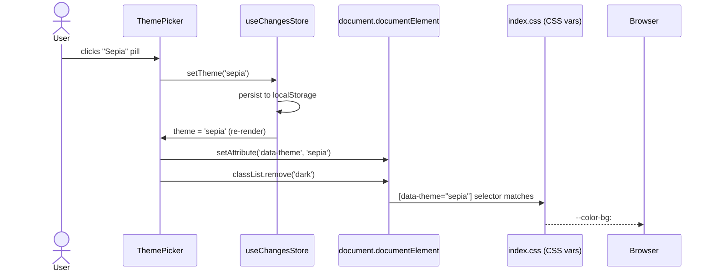
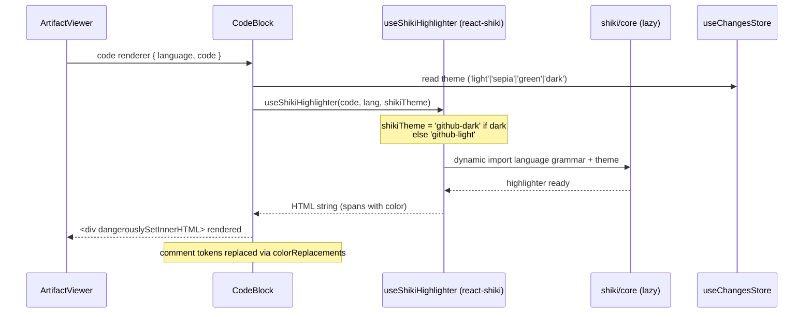
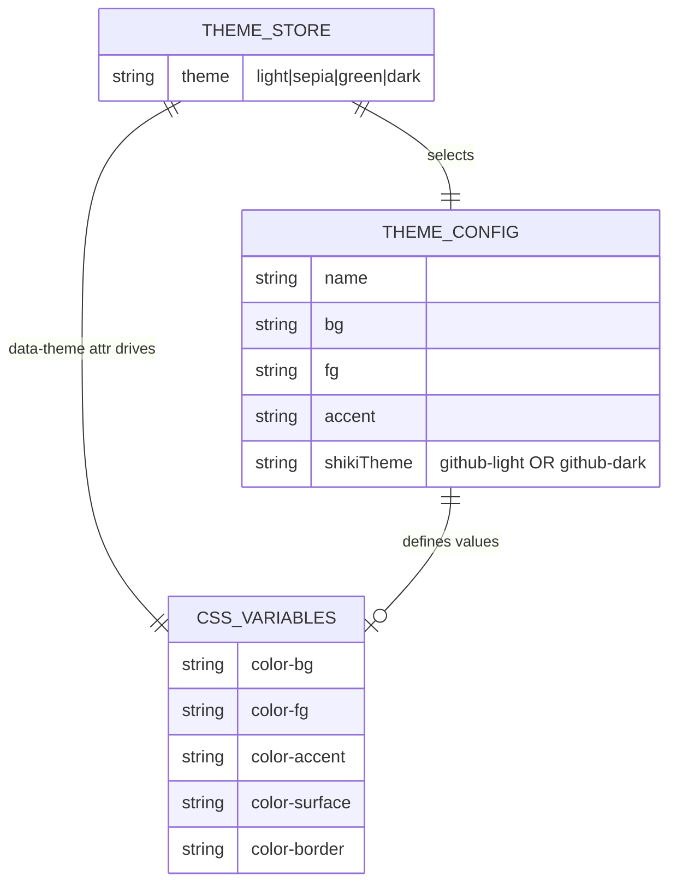

# Architecture Overview: reading-mode-themes

## System Diagram

```mermaid
graph TD
    subgraph Browser
        LS[localStorage<br/>mspec-ui-store]
        HTML[document.documentElement<br/>data-theme=&quot;light|sepia|green|dark&quot;<br/>class=&quot;dark&quot; when dark]
    end

    subgraph React App
        TP[ThemePicker<br/>Pill ボタン群]
        ZS[useChangesStore<br/>theme: Theme<br/>setTheme]
        AV[ArtifactViewer<br/>ReactMarkdown]
        CB[CodeBlock<br/>useShikiHighlighter]
        RCD[rehypeCommentDim<br/>rehype plugin]
    end

    subgraph CSS Layer
        IDX[index.css<br/>--color-bg / --color-fg<br/>--color-surface / --color-border<br/>.md-comment]
        TW[tailwind.config.ts<br/>darkMode selector<br/>bg-theme / text-theme tokens]
    end

    subgraph External
        GF[Google Fonts CDN<br/>確定フォント]
        SK[shiki/core<br/>github-light / github-dark]
    end

    TP -->|setTheme| ZS
    ZS -->|persist| LS
    LS -->|rehydrate| ZS
    ZS -->|useEffect| HTML
    HTML -->|CSS cascade| IDX
    IDX -->|var tokens| TW
    AV -->|code renderer| CB
    AV -->|rehypePlugins| RCD
    RCD -->|span.md-comment| IDX
    CB -->|useChangesStore theme| ZS
    CB -->|lazy import| SK
    GF -->|font-family| IDX
```

## Theme Application Sequence



## Syntax Highlighting Flow



## Data Model Diagram



## Theme Color Table

| Theme | `--color-bg` | `--color-fg` | `--color-accent` | Shiki Theme |
|-------|-------------|-------------|-----------------|-------------|
| light | `#FFFFFF` | `#1a1a1a` | `#4B7BEC` | `github-light` |
| sepia | `#FBF0D9` | `#5F4B32` | `#7A5C3F` | `github-light` |
| green | `#C5E8C5` ★ | `#1A3D1A` | `#2D5A2D` | `github-light` |
| dark  | `#1C1C1E` | `#E5E5EA` | `#4B7BEC` | `github-dark` |

★ Visual Prototype ステップで確認予定

---

## Constitution Check

| Principle | Phase 0 | Phase 1 |
|-----------|---------|---------|
| I. ステップ独立性 | ✅ architecture-overview は design.md を参照するが書き込みは発生しない | ✅ 後続ステップへの依存なし |
| II. 決定論的マージ | ✅ 全コンポーネント・データフローが図示済み | ✅ Green カラー暫定値を ★ で明示 |
| III. 質問駆動の要件確定 | ✅ 全コンポーネント間のインタフェースが確定 | ✅ 追加確認事項なし |
| IV. 双方向アンカー | ✅ コンポーネント名・ファイル名が design.md と一致 | ✅ Sequence diagram が実装順序を示す |
| V. 強制ステップと拡張ステップの分離 | ✅ フォント URL は index.html placeholder として委譲 | ✅ Visual Prototype なしでも主要実装が進行可能 |
| VI. Security by Default | ✅ Shiki は `dangerouslySetInnerHTML` を使用するが、入力は Markdown コードブロック内のコードのみ（ユーザー入力ではなく静的ファイル） | ✅ rehypeCommentDim はコメント内容をテキストノードとして出力しエスケープ済み |

### Complexity Tracking

None
