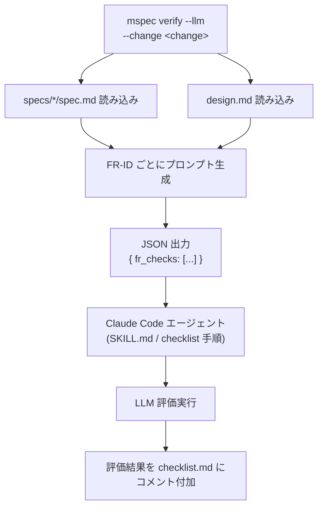
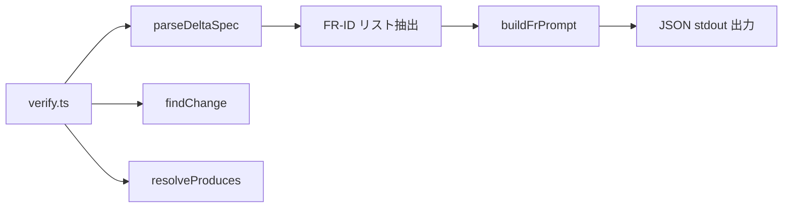

# Architecture Overview: mspec verify --llm

## Constitution Check

| 原則 | Phase 0 |
|------|---------|
| I. 仕様駆動 | ✅ |
| II. TDD | ✅ |
| III. 双方向アンカー | ✅ |
| IV. 決定論的アーカイブ | ✅ |
| V. リスク比例検証 | ✅ |

## 案A方式のデータフロー

## verify.ts のコンポーネント

