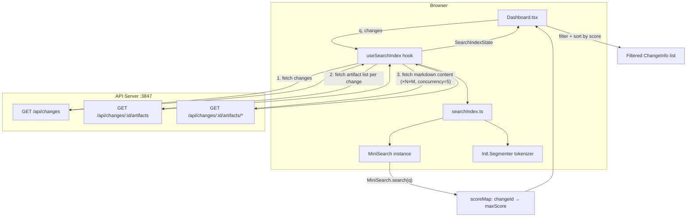
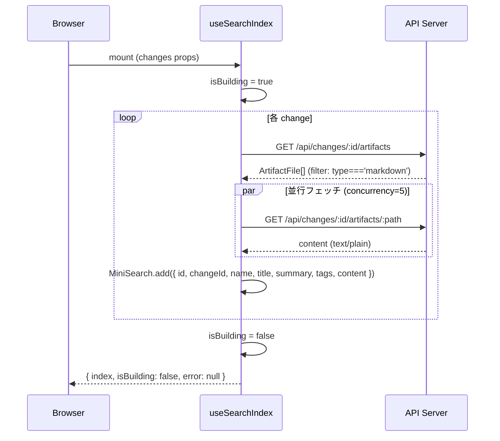
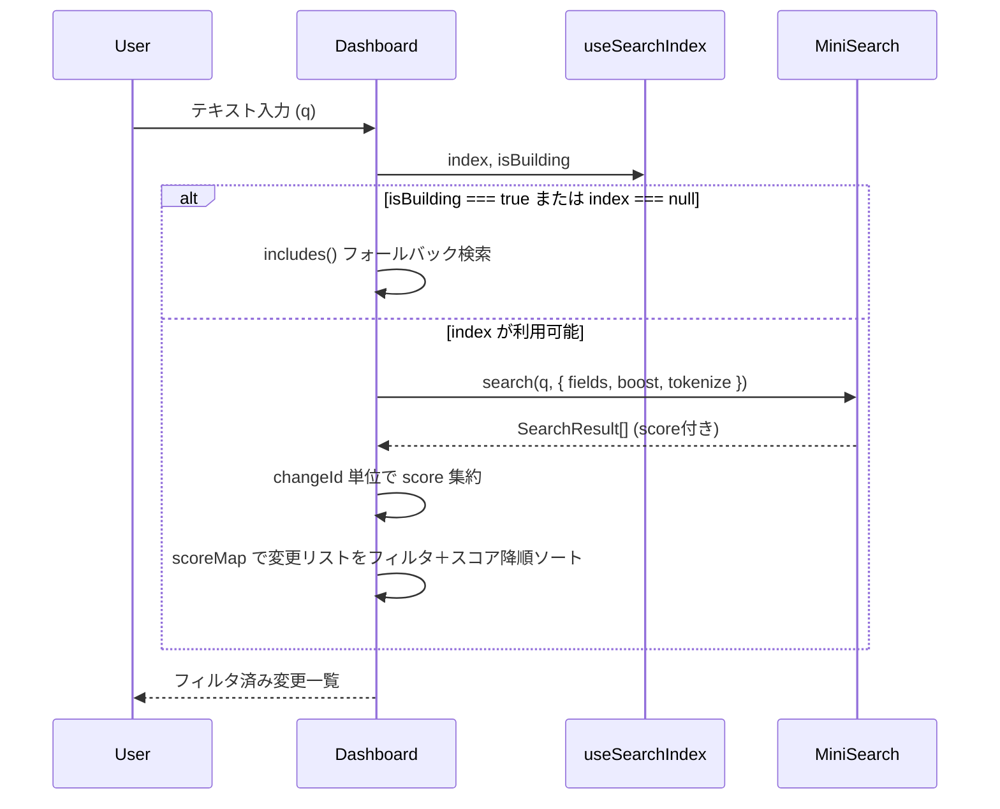
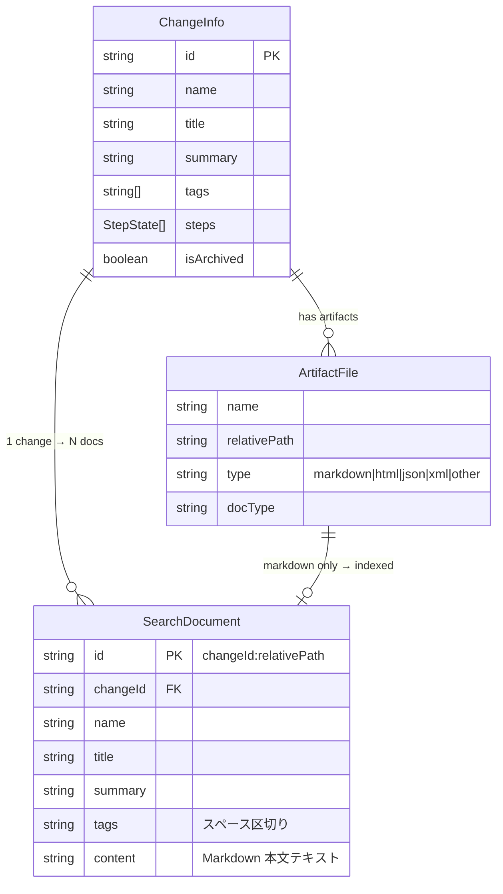

# Architecture Overview: Full-Text Search 拡張

## System Diagram

## Sequence Diagram: インデックス構築フロー

## Sequence Diagram: 検索フロー

## Data Model

## Component Responsibilities

| コンポーネント | 責務 | 変更種別 |
|--------------|------|---------|
| `lib/searchIndex.ts` | MiniSearch インスタンス生成・トークナイザー定義 | NEW |
| `hooks/useSearchIndex.ts` | インデックス構築・状態管理 | NEW |
| `pages/Dashboard.tsx` | 検索ロジックの切り替え（includes → MiniSearch） | MODIFIED |
| `components/Search.tsx` | 変更なし（UI のみ） | UNCHANGED |
| `api/client.ts` | 変更なし（既存 useArtifacts / useArtifactContent を流用） | UNCHANGED |

## Constitution Check

| 原則 | Phase 0 | Phase 1 |
|------|---------|---------|
| I. ステップ独立性 | ✅ architecture-overview はコードを変更しない | ✅ 既存コンポーネントの責務を変更しない設計 |
| II. 決定論的マージ | ✅ 単一のアーキテクチャ概要ファイル | ✅ 図と表が design.md と整合している |
| III. 質問駆動の要件確定 | ✅ 全設計決定が research.md と proposal.md に基づく | ✅ コンポーネント責務が FR に対応 |
| IV. 双方向アンカー | ✅ 後続 tasks でアンカー付与予定 | ✅ 各図が FR の Scenario に対応 |
| V. 強制ステップと拡張ステップの分離 | ✅ architecture-overview は強制ステップの成果物 | ✅ 実装詳細（コード）は tasks.md で扱う |
| VI. Security by Default | ✅ サーバー権限変更なし・クライアントサイド完結 | ✅ API は既存エンドポイントのみ使用。新規権限付与なし |
