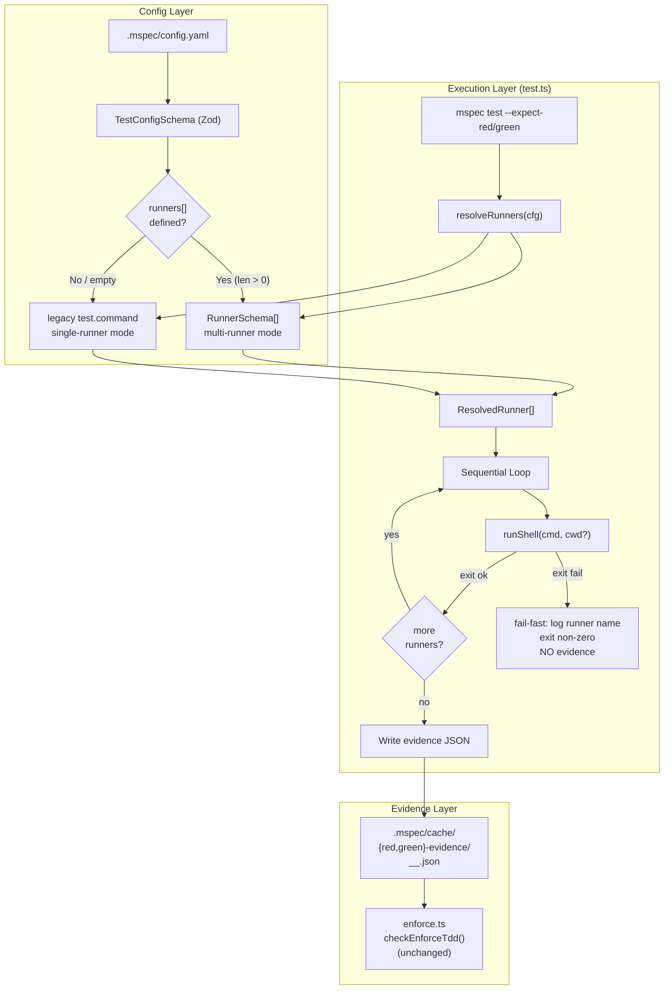
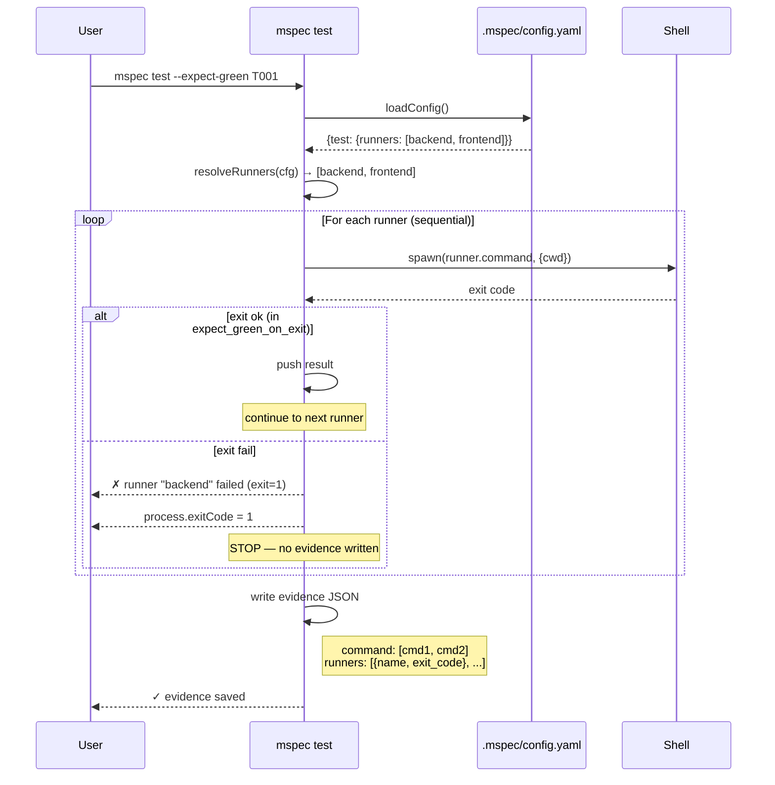
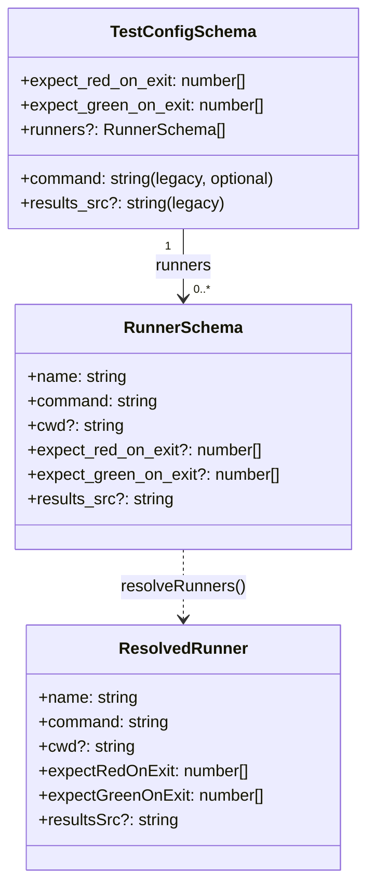
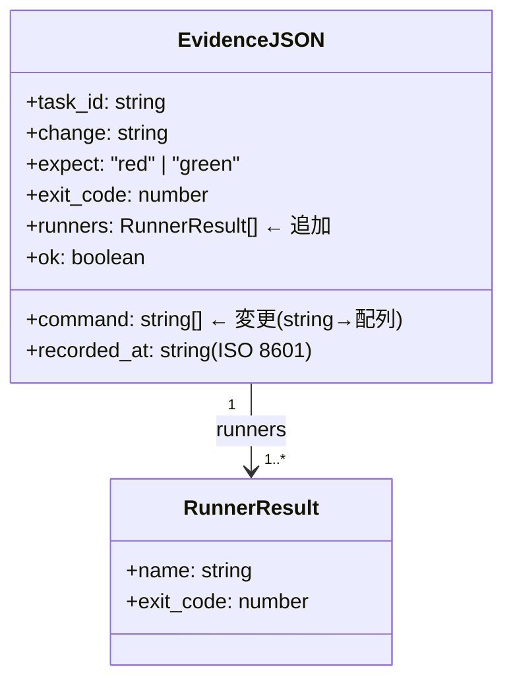

# Architecture Overview: multi-test-runner-support

## System Diagram

## Sequence Diagram: Multi-Runner Execution

## Data Model: Config Schema Extension

## Data Model: Evidence JSON Payload (拡張後)

## File Copy Paths: results_src の変化

| モード | コピー元 | コピー先 |
|--------|---------|---------|
| Legacy (runners なし) | `<results_src>` | `e2e-results/<basename>` |
| Multi-runner | `runner.results_src` | `e2e-results/<runner-name>/<basename>` |

## Constitution Check

| 原則 | Phase 0 | Phase 1 |
|------|---------|---------|
| I ステップ独立性 | ✅ | ✅ architecture-overview は図のみ。コード変更なし |
| II 決定論的マージ | ✅ | ✅ |
| III 質問駆動の要件確定 | ✅ | ✅ |
| IV 双方向アンカー | ✅ | ✅ design.md と相互参照済み |
| V 強制/拡張ステップ分離 | ✅ | ✅ |
| VI Security by Default | ✅ | ✅ |

### Complexity Tracking

None
