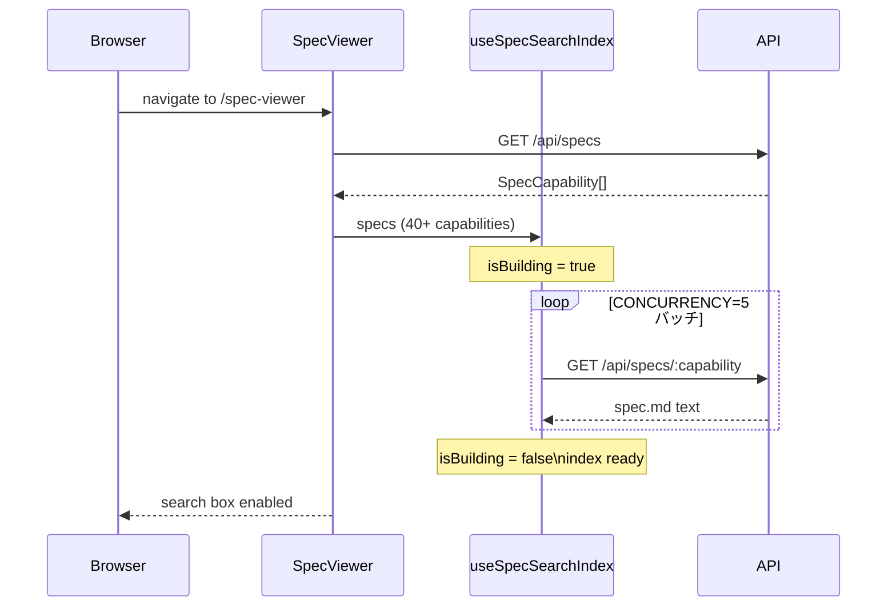
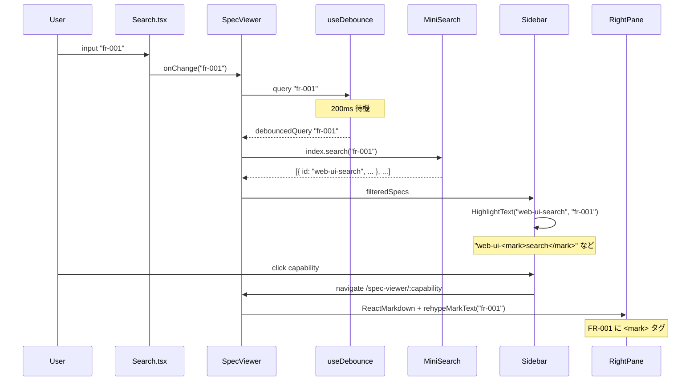
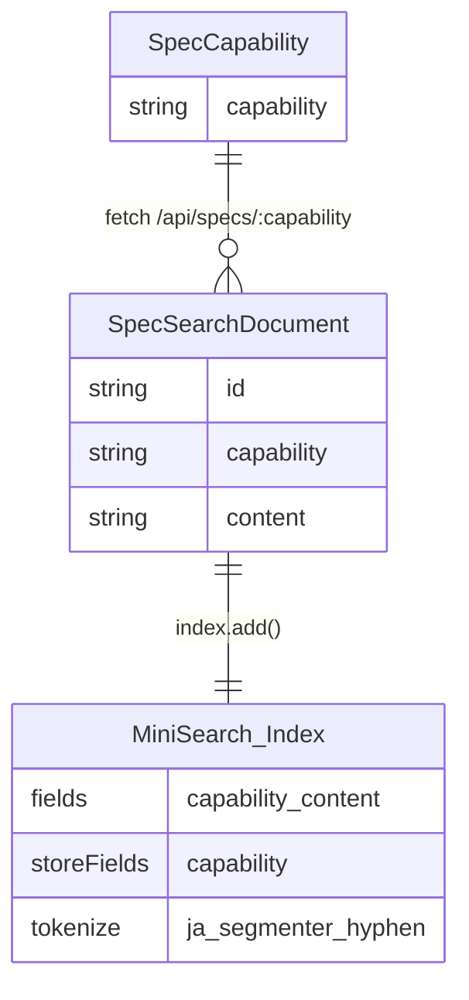
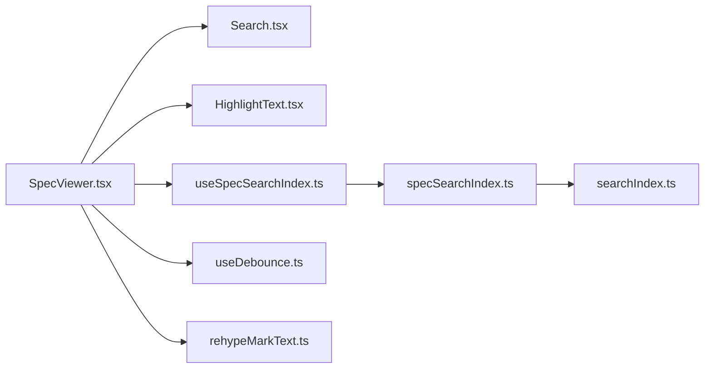

<!-- @mspec-delta 2026-05-27-062657-spec-viewer-fulltext-search/specs/spec-viewer-search/spec.md -->
<!-- Requirements implemented: FR-001, FR-002, FR-003, FR-004, FR-005, FR-006, FR-007 -->
<!-- Change: spec-viewer-fulltext-search -->

# Architecture Overview: Spec Viewer Full-Text Search

## System Diagram

```mermaid
flowchart TD
    SV[SpecViewer.tsx]
    SI[useSpecSearchIndex]
    UD[useDebounce]
    SSI[lib/specSearchIndex.ts]
    ST[lib/searchIndex.ts\ntokenize]
    API[/api/specs]
    SB[Sidebar\nfiltered list]
    RP[Right Pane\nReactMarkdown]
    HT[HighlightText.tsx]
    RMT[rehypeMarkText.ts]
    SC[Search.tsx\nplaceholder + onClear]

    SV -->|useSpecs| API
    SV -->|useSpecSearchIndex| SI
    SI -->|batch fetch CONCURRENCY=5| API
    SI -->|createSpecSearchIndex| SSI
    SSI -->|import tokenize| ST
    SV -->|useDebounce 200ms| UD
    UD -->|debouncedQuery| SV
    SV -->|filteredSpecs| SB
    SB -->|text + query| HT
    SV -->|renders| RP
    RP -->|rehypeMarkText debouncedQuery| RMT
    SV -->|value + onClear| SC
```

## Index Build Sequence



## Search Query Flow



## Data Model



## Component Dependency Graph



## Constitution Check

| 原則 | Phase 0 | Phase 1 |
|---|---|---|
| I. ステップ独立性 | ✅ architecture-overview は design と独立した成果物 | ✅ 他ステップのアーティファクトを変更しない |
| II. 決定論的マージ | ✅ 新規 capability spec-viewer-search のみ | ✅ ダイアグラムは変更ファイルリストに一致 |
| III. 質問駆動の要件確定 | ✅ proposal/research/design で要件確定済み | ✅ シーケンス図が FR-002/FR-003 を正確に反映 |
| IV. 双方向アンカー | ✅ `@mspec-delta` アンカーを冒頭に記載 | ✅ 全 FR を網羅するアンカーが存在 |
| V. 強制ステップと拡張ステップの分離 | ✅ 強制ステップのみを対象 | ✅ 実装詳細は tasks.md で分離される |
| VI. Security by Default | ✅ 外部 API 追加なし | ✅ D-05 escapeRegExp がダイアグラムに反映 |
