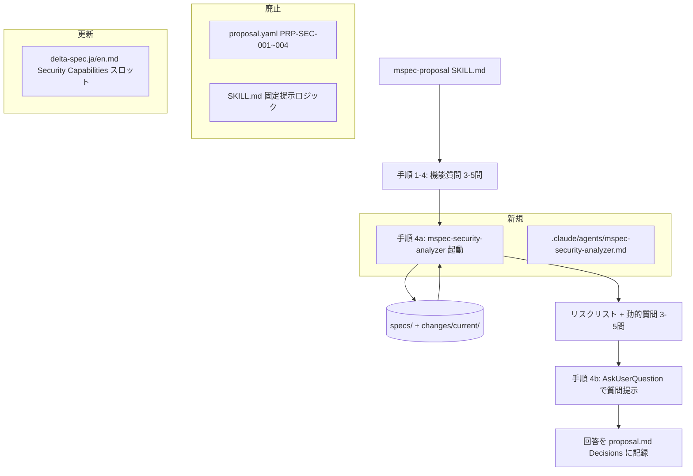
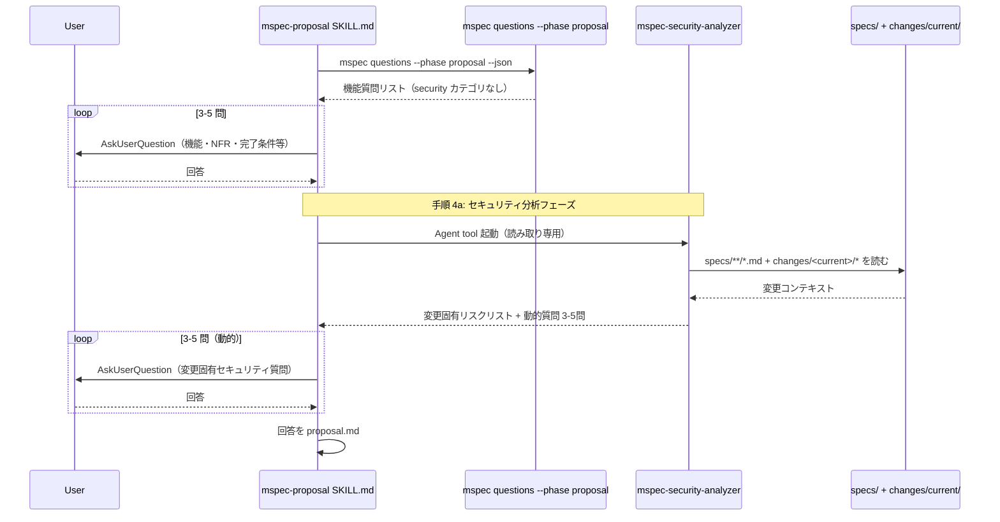
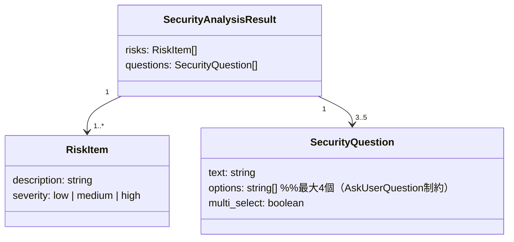
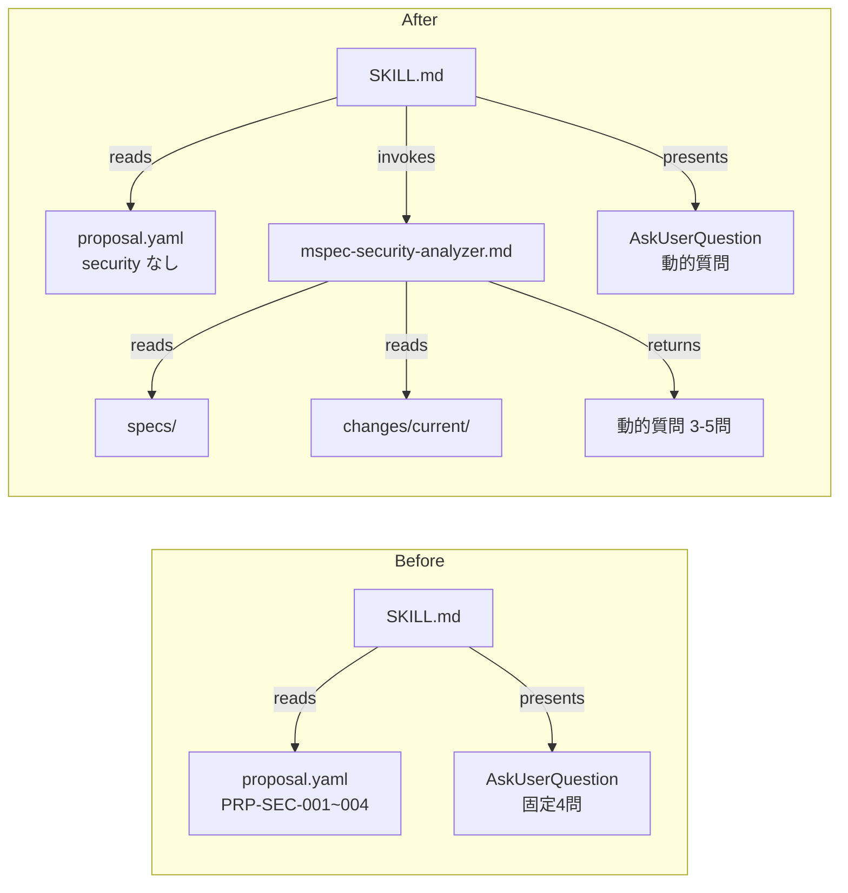

# Architecture Overview: dynamic-security-questions

## System Diagram

## Sequence Diagram: proposal ステップ（変更後）

## Data Model: mspec-security-analyzer の出力形式

サブエージェントは以下の JSON ライクな構造のテキストを返す（実際は markdown リスト形式）:

## 変更前後のファイル依存関係

## Constitution Check

| Principle | Phase 0 | Phase 1 |
|-----------|---------|---------|
| I ステップ独立性 | OK | OK — アーキテクチャは proposal スキルの内部フローのみを変更する。他ステップの入出力インターフェースは不変 |
| II 決定論的マージ | OK | OK — 図に示す全ファイル変更は git revert で単一コミットとして元に戻せる |
| III 質問駆動の要件確定 | OK | OK — 図の動的質問数（3〜5）・スコープ（specs/ + changes/<current>/）は OC-3/5 で確定済み |
| IV 双方向アンカー | OK | OK — implement ステップで変更ファイルに `@mspec-delta` アンカーを付与する |
| V 強制ステップと拡張ステップの分離 | OK | OK — 変更前後のシーケンス図が示すとおり、workflow.yaml の step 境界は不変 |
| VI Security by Default | CAUTION | OK — Sequence Diagram の「読み取り専用」注記がエージェント制約を文書化。スコープは specs/ + changes/<current>/ に限定 |

### Complexity Tracking

None
