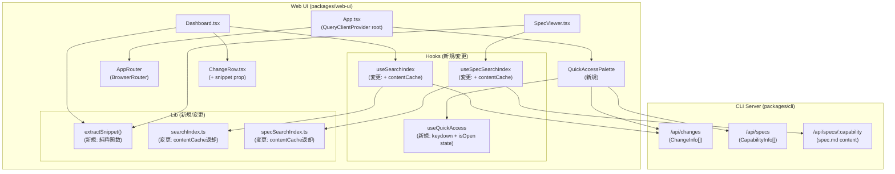
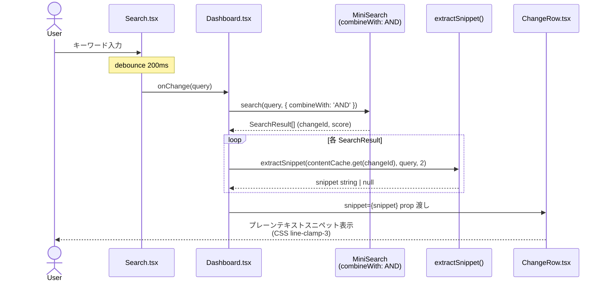
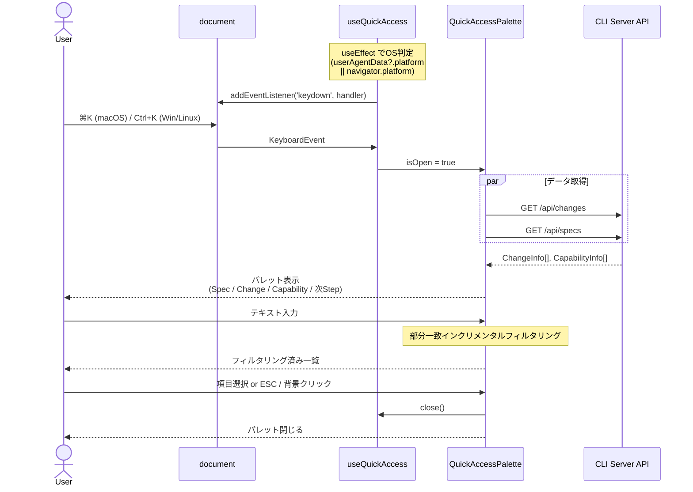
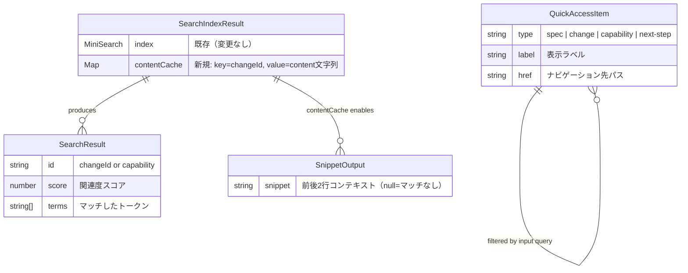

# Architecture Overview: markdown-search-and-quick-access

## システム構成図



## シーケンス図: Markdown全文検索とスニペット表示



## シーケンス図: クイックアクセスパレット（⌘K/Ctrl+K）



## データモデル変更



## `extractSnippet` ロジック概要

```
入力: content (string), query (string), context (number = 2)
1. query をスペース分割してトークン配列に変換
2. content を行分割（split('\n')）
3. 各行を小文字正規化し、最初のトークンが含まれる行インデックスを検索
4. hitIndex ± context の範囲でスライス
5. スライス結果を改行で結合して返す
6. マッチなしの場合は null を返す
正規表現: 不使用（ReDoS回避）
```

## 変更影響範囲まとめ

| Capability | 変更種別 | 影響ファイル数 |
|-----------|---------|-------------|
| spec-viewer-search | 拡張 | 4（useSpecSearchIndex, specSearchIndex, SpecViewer, extractSnippet） |
| web-ui-search | 拡張 | 4（useSearchIndex, searchIndex, Dashboard, ChangeRow） |
| quick-access-palette | 新規 | 4（useQuickAccess, QuickAccessPalette, App.tsx, i18n/en.ts） |
| 共有ユーティリティ | 新規 | 1（extractSnippet.ts） |

## Constitution Check

| Principle | Phase 0 | Phase 1 |
|-----------|---------|---------|
| I ステップ独立性 | OK — architecture-overview は設計ドキュメント。実装への変更を含まない | OK — 3Capability（spec-viewer-search/web-ui-search/quick-access-palette）はそれぞれ独立したモジュールとして図示。共有は `extractSnippet` 純粋関数のみ |
| II 決定論的マージ | OK — 新規ファイル追加のみ | OK — 図内の全コンポーネントは git revert で確実に復元可能な変更のみ |
| III 質問駆動の要件確定 | OK — 図に示す設計は research の Open Choices で確定済み | OK — contentCache Map・line-clamp-3・次Step直近1件の全決定が図に反映されている |
| IV 双方向アンカー | OK — 参照するFR-IDはdeltaステップで付与済み | OK — 図内コンポーネントの対応FRはdesign.md Decisionsで追跡 |
| V 強制ステップと拡張ステップの分離 | OK — 概要図は参照ドキュメント。強制フロー変更なし | OK — QuickAccessPaletteはApp.tsxへのSidecar追加のみ。AppRouterや既存ルーターを変更しない |
| VI Security by Default | OK — UA文字列クライアント利用・textContent使用・ReDoS回避が図とロジック概要に明示 | OK — extractSnippetロジック概要に「正規表現不使用（ReDoS回避）」を明記 |

### Complexity Tracking

None
