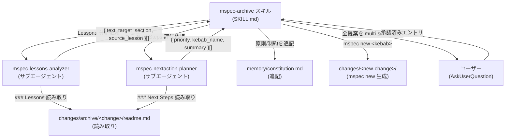
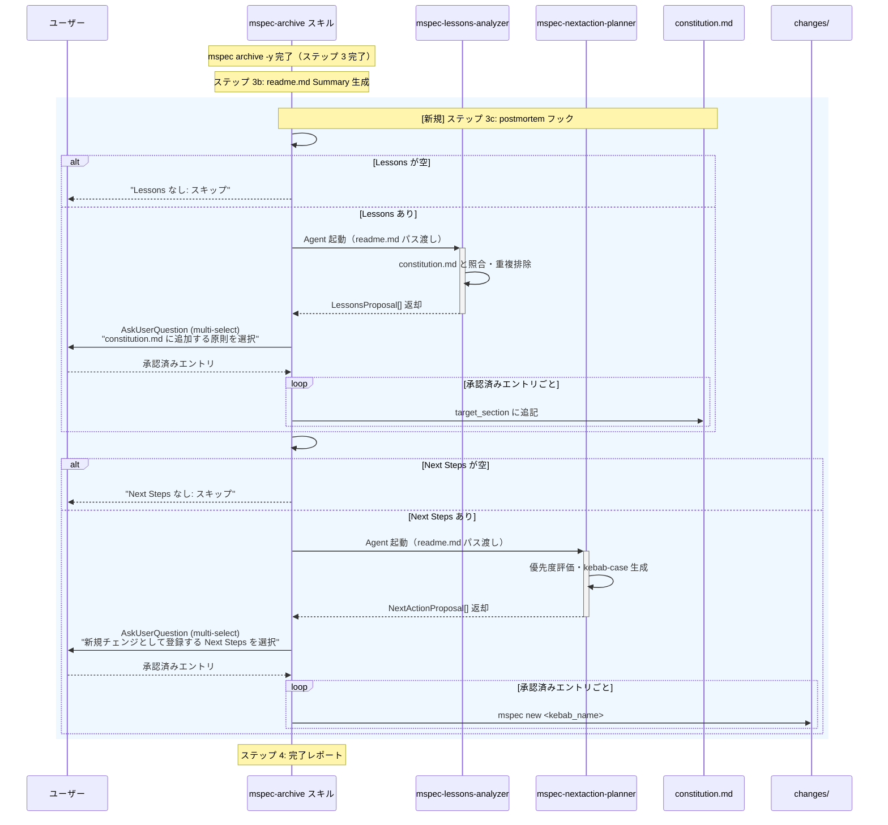
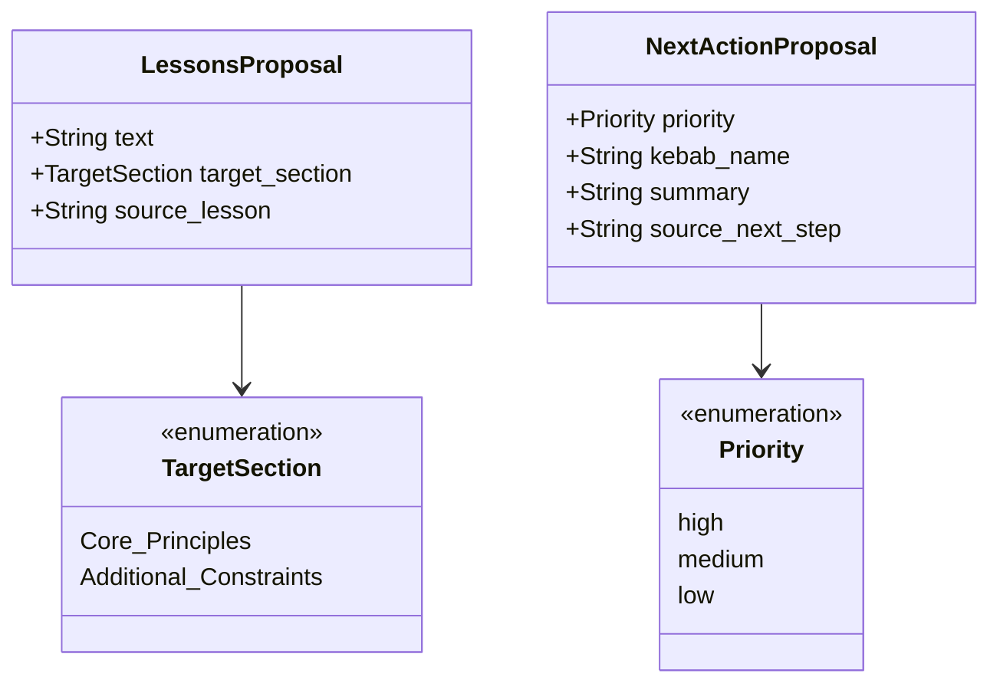

<!-- @mspec-delta 2026-05-27-115017-postmortem-archive-integration/specs/mspec-archive/spec.md -->
<!-- Requirements implemented: FR-001, FR-002, FR-003, FR-004 -->
<!-- Change: postmortem-archive-integration -->

<!-- @mspec-delta 2026-05-27-115017-postmortem-archive-integration/specs/memory-constitution/spec.md -->
<!-- Requirements implemented: FR-001, FR-002 -->
<!-- Change: postmortem-archive-integration -->

<!-- @mspec-delta 2026-05-27-115017-postmortem-archive-integration/specs/mspec-lessons-analyzer/spec.md -->
<!-- Requirements implemented: FR-001, FR-002 -->
<!-- Change: postmortem-archive-integration -->

<!-- @mspec-delta 2026-05-27-115017-postmortem-archive-integration/specs/mspec-nextaction-planner/spec.md -->
<!-- Requirements implemented: FR-001, FR-002 -->
<!-- Change: postmortem-archive-integration -->

# Architecture Overview: postmortem-archive-integration

## System Component Diagram

## Sequence Diagram: postmortem フロー

## Data Model

## Constitution Check

| 原則 | Phase 0 | Phase 1 |
|------|---------|---------|
| I. ステップ独立性 | OK — 各サブエージェントが独立したコンテキストで動作 | OK — シーケンス図の通り、各エージェントは readme.md パスのみを受け取り前段文脈に依存しない |
| II. 決定論的マージ | OK — 追記はテキスト追加のみ | OK — target_section の固定 enum によりどのセクションに追記するかが決定論的 |
| III. 質問駆動の要件確定 | OK — 全提案を AskUserQuestion で確認 | OK — multi-select で全件一覧表示してから選択するフロー設計 |
| IV. 双方向アンカー | OK — SKILL.md にアンカーを付与 | OK — architecture-overview.md 自体も @mspec-delta アンカーの対象（tasks.md で対応） |
| V. 強制ステップと拡張ステップの分離 | OK — workflow.yaml 変更なし | OK — シーケンス図でステップ 3c が archive の内部動作として明示されている |
| VI. Security by Default | OK — インジェクション対策・最小権限・承認ゲート | OK — データモデルで kebab_name が正規化済みであることを型で表現 |

### Complexity Tracking

None
