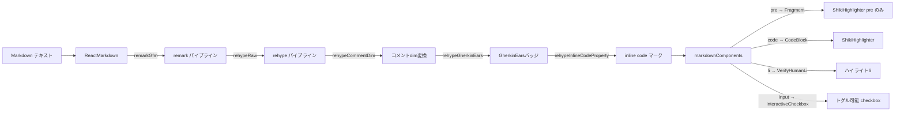
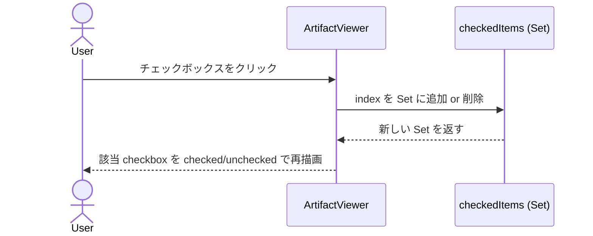
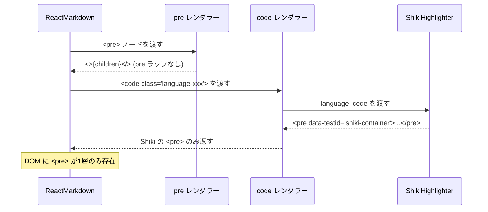

<!-- @mspec-delta 2026-05-27-131059-fix-pre-tag-checklist-ui/specs/code-syntax-highlight/spec.md -->
<!-- Requirements implemented: FR-006 -->
<!-- Change: fix-pre-tag-checklist-ui -->

<!-- @mspec-delta 2026-05-27-131059-fix-pre-tag-checklist-ui/specs/web-ui-server/spec.md -->
<!-- Requirements implemented: FR-005, FR-006 -->
<!-- Change: fix-pre-tag-checklist-ui -->

# Architecture Overview: fix-pre-tag-checklist-ui

## System Diagram



## Sequence: チェックボックストグル操作



## Sequence: コードブロック描画（修正後）



## UI Mockup: verify-human ハイライト

```
┌─────────────────────────────────────────────────────────────┐
│ checklist.md                                                │
├─────────────────────────────────────────────────────────────┤
│ ☑ FR-001: 自動テストで確認できる項目                            │
│ ☑ FR-002: 自動テストで確認できる項目                            │
│                                                             │
│ ┌─── 警告ハイライト（bg-amber-50 / border-l-4 border-amber-400）──┐ │
│ │⚠ ☐ Principle I — 人手確認が必要な項目  [verify: human]    │ │
│ └────────────────────────────────────────────────────────────┘ │
│                                                             │
│ ☐ FR-003: 自動テストで確認できる項目                            │
└─────────────────────────────────────────────────────────────┘
```

## Constitution Check

| Principle | Phase 0 | Phase 1 | Notes |
|-----------|---------|---------|-------|
| I. ステップ独立性 | ✅ | ✅ | 変更は `ArtifactViewer.tsx` 単体。アーキテクチャ図は他ステップに依存しない |
| II. 決定論的マージ | ✅ | ✅ | カスタムレンダラー追加のみ。既存コンポーネント変更なし |
| III. 質問駆動の要件確定 | ✅ | ✅ | Open Choices なし。全設計方針が research.md で確定済み |
| IV. 双方向アンカー | ✅ | ✅ | `@mspec-delta` アンカーを FR-006/FR-005/FR-006 に付与済み |
| V. 強制ステップと拡張ステップの分離 | ✅ | ✅ | CLI ワークフロー変更なし。UI 拡張のみ |
| VI. Security by Default | ✅ | ✅ | DOM 操作のみ。外部送信・ファイル書き込みなし |
