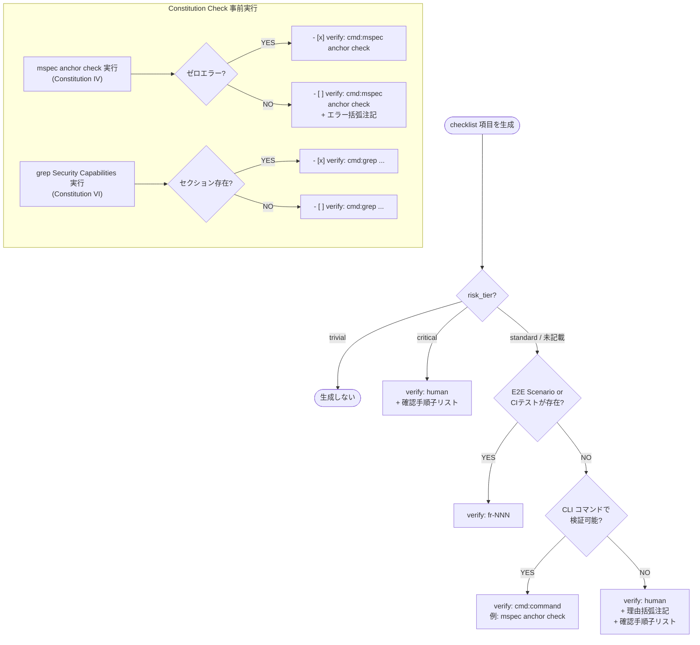
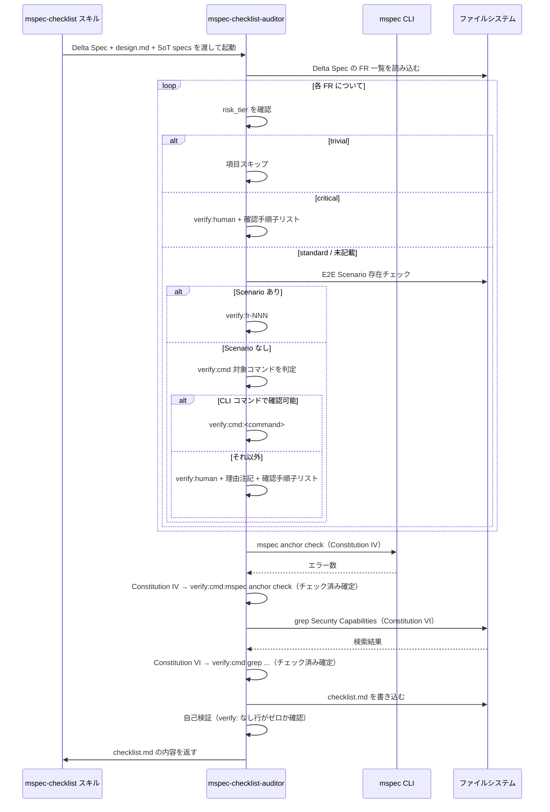
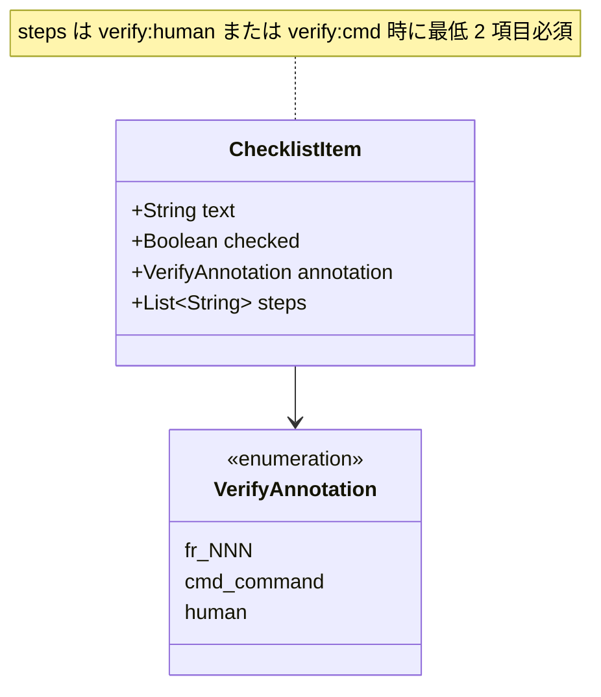
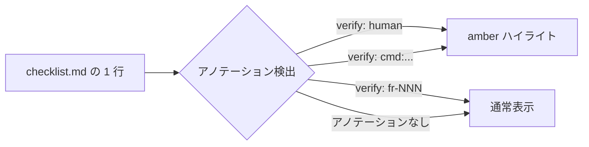

# Architecture Overview: checklist-reduce-verify-human

## System Diagram

変更前後の verify アノテーション決定フローを示す。

---

## Sequence Diagram: checklist-auditor の verify 判定

---

## Data Model: verify アノテーション形式

---

## Web UI: amber ハイライト対象の拡張

---

## Constitution Check

| # | 原則 | Phase 0 | Phase 1 |
|---|------|---------|---------|
| I | ステップ独立性 | pass | pass — architecture-overview.md は構造の可視化のみ、他ステップの成果物を変更しない |
| II | 決定論的マージ | pass | pass — 図は design.md の変更内容を視覚化したもので、実装詳細を規定しない |
| III | 質問駆動の要件確定 | pass | pass — research フェーズで全 Open Choices が決定済み |
| IV | 双方向アンカー | pass | pass — アンカーコメントは design.md に集約。architecture-overview.md はアンカーなし（生成物） |
| V | 強制ステップと拡張ステップの分離 | pass | pass — design ステップ内に収まっている |
| VI | Security by Default | pass | pass — 権限変更なし。図は既存の設計変更のみを描写 |

### Complexity Tracking

None

<!-- LEARNING: architecture-overview.md に verify 判定フローを Mermaid で可視化することで、tasks.md 作成時のタスク分割が容易になる | source: FR-008 | confidence: medium -->
