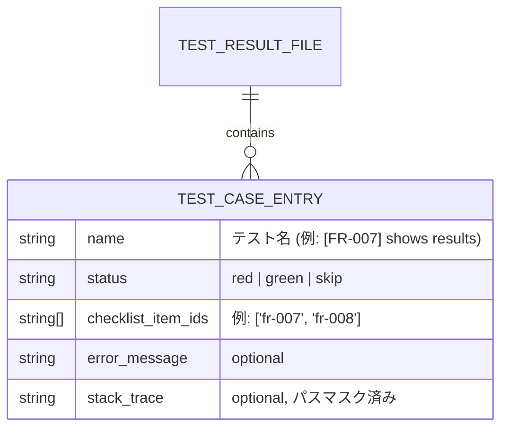
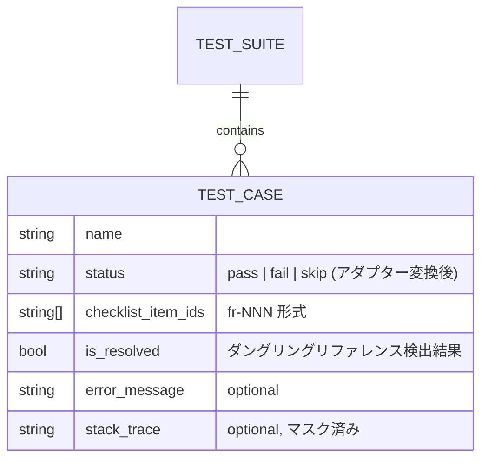

# Architecture Overview: web-ui-artifact-order-and-test-results

## System Diagram

```mermaid
graph TD
  subgraph CLI["mspec CLI"]
    CMD["mspec test-results convert\n--change &lt;id&gt;"]
    CONV["Playwright→JSON 変換\n+ パスマスク適用\n+ FR番号抽出"]
    CMD --> CONV
  end

  subgraph FS["ファイルシステム"]
    E2E["changes/&lt;id&gt;/e2e-results/\nresults.json (Playwright)"]
    TRJ["changes/&lt;id&gt;/\ntest-results.json (新スキーマ)"]
    CKL["changes/&lt;id&gt;/\nchecklist.md"]
  end

  subgraph Server["API Server (packages/cli/src/server)"]
    ART["routes/artifacts.ts\ncollectArtifacts()\n+ WORKFLOW_STEP_ORDER sort"]
    TRS["routes/testResults.ts\n+ checklist.md 読込\n+ isResolved 判定"]
    TRP["testResultParser.ts\n+ parseTestResultsJson()\n+ adaptStatus() red→fail\n+ maskAbsolutePaths()"]
    ART
    TRS --> TRP
  end

  subgraph WebUI["Web UI (packages/web-ui/src)"]
    CD["ChangeDetail.tsx\nアーティファクト一覧"]
    TR["TestResults.tsx\n+ checklist_item_ids バッジ\n+ ダングリング警告バッジ"]
  end

  E2E --> CONV --> TRJ
  TRJ --> TRS
  CKL --> TRS
  ART -->|sorted ArtifactFile[]| CD
  TRS -->|TestCase[] + isResolved| TR
```

## データフロー: テストリザルト変換

```mermaid
sequenceDiagram
  participant Dev as 開発者
  participant CLI as mspec CLI
  participant PW as e2e-results/results.json
  participant TRJ as test-results.json
  participant API as API Server
  participant UI as TestResults.tsx

  Dev->>CLI: mspec test-results convert --change &lt;id&gt;
  CLI->>PW: 読み込み (Playwright 内部フォーマット)
  CLI->>CLI: suites を平坦化
  CLI->>CLI: status 変換 (passed→green, failed→red)
  CLI->>CLI: テスト名から [FR-NNN] を正規表現抽出
  CLI->>CLI: stack_trace のパスをマスク
  CLI->>TRJ: 書き込み (新スキーマ)

  Dev->>UI: Test Result Viewer を開く
  UI->>API: GET /api/changes/:id/test-results
  API->>TRJ: 読み込み
  API->>API: adaptStatus() red→fail / green→pass
  API->>API: checklist.md を読み込み
  API->>API: checklist_item_ids vs 有効IDセット → isResolved
  API-->>UI: TestCase[] (status, checklist_item_ids, isResolved)
  UI->>UI: FR-NNN バッジ表示
  UI->>UI: isResolved=false → 「未解決」警告バッジ表示
```

## データモデル

### test-results.json スキーマ



### API レスポンス型 (TestCase — 変更後)



### アーティファクトファイル名 → ワークフローステップ マッピング

| ファイル名パターン | ステップ | ソートインデックス |
|-------------------|---------|----------------|
| `readme.md` | `new` | 0 |
| `proposal.md` | `proposal` | 1 |
| `specs/**` | `delta` | 2 |
| `research.md` | `research` | 3 |
| `design.md`, `design-rationale.md`, `architecture-overview.md` | `design` | 4 |
| `quickstart.md` | `quickstart` | 5 |
| `checklist.md` | `checklist` | 6 |
| `tasks.md` | `tasks` | 7 |
| その他 | `implement` | 8（末尾） |

## Constitution Check

| 原則 | Phase 0 | Phase 1 |
|------|---------|---------|
| I. ステップ独立性 | OK — architecture-overview は research.md と design.md のみに依存 | OK — 図はコードを参照しない（設計を視覚化するのみ） |
| II. 決定論的マージ | OK — 図のデータモデルは design.md の決定を正確に反映 | OK — スキーマ変更は test-results.json フィールド追加のみ |
| III. 質問駆動の要件確定 | OK — 確定済み設計を図示 | OK — 未確定事項はなし |
| IV. 双方向アンカー | OK — 図の各コンポーネントが design.md の Decision に対応 | OK — ファイルパスがプロジェクト構造と一致 |
| V. 強制ステップと拡張ステップの分離 | OK — 強制ステップ内の設計ドキュメントとして適切 | OK |
| VI. Security by Default | OK — パスマスク・ステータスアダプター・XSS 対策を図に明示 | OK — データフロー図でサニタイズ適用箇所を可視化 |

### Complexity Tracking

None.
