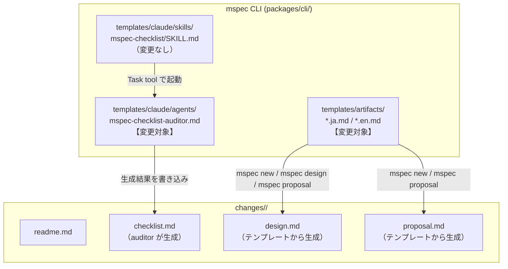
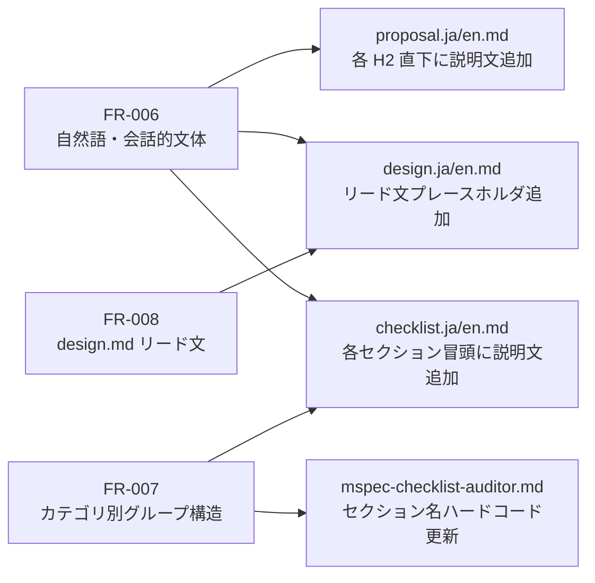
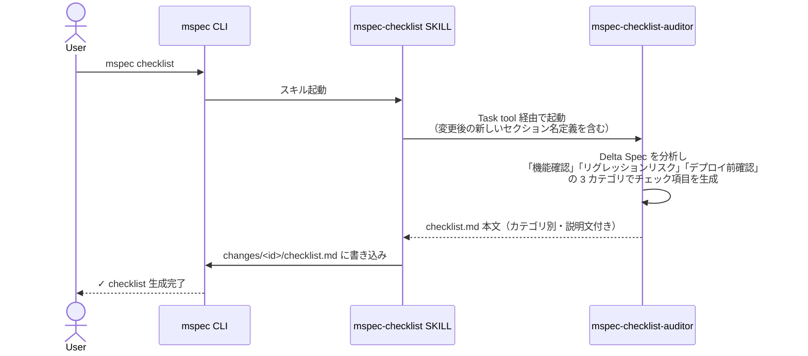

# Architecture Overview: human-friendly-artifacts

## System Diagram

mspec の成果物生成に関わるコンポーネントと今回の変更対象を示す。



### 変更の影響範囲



## Sequence Diagram: checklist 生成フロー（変更後）



## Data Model: テンプレート変更のスキーマ

変更前後のテンプレート構造を示す（ja 版を例示）。

### checklist.ja.md（変更前 → 変更後）

```
変更前:
  ## Delta Spec Coverage       ← 英語技術用語
  （説明文なし）
  ## Source-of-Truth Regression ← 英語技術用語
  （説明文なし）
  ## Constitution              ← 英語
  （説明文なし）

変更後:
  ## 機能確認                   ← 日本語・直感的
  このセクションでは実装した機能が要件を満たすか確認します。
  ## リグレッションリスク         ← 日本語・直感的
  このセクションでは既存機能への影響がないか確認します。
  ## デプロイ前確認              ← 日本語・直感的
  このセクションではリリースに向けた最終確認をします。
```

### design.ja.md（変更前 → 変更後）

```
変更前:
  ## Summary
  <設計の概要>

変更後:
  ## Summary
  このドキュメントは <変更名> の技術設計を記述します。
  読者は <対象読者> を想定しています。
  <設計の概要>
```

## Constitution Check (Phase 0 / Phase 1)

| Principle | Phase 0 | Phase 1 | 備考 |
|-----------|---------|---------|------|
| I. ステップ独立性 | ✅ | ✅ | テンプレート変更はステップ間の独立性に影響しない |
| II. 決定論的マージ | ✅ | ✅ | Delta Spec FR が明確で機械的マージ可能 |
| III. 質問駆動の要件確定 | ✅ | ✅ | OC-1〜OC-4 ユーザー確認済み |
| IV. 双方向アンカー | ✅ | ✅ | FR-006〜FR-008 との対応が明確 |
| V. 強制ステップと拡張ステップの分離 | ✅ | ✅ | workflow.yaml への変更なし |
| VI. Security by Default | ✅ | ✅ | ローカルファイル変更のみ |

### Complexity Tracking

None
