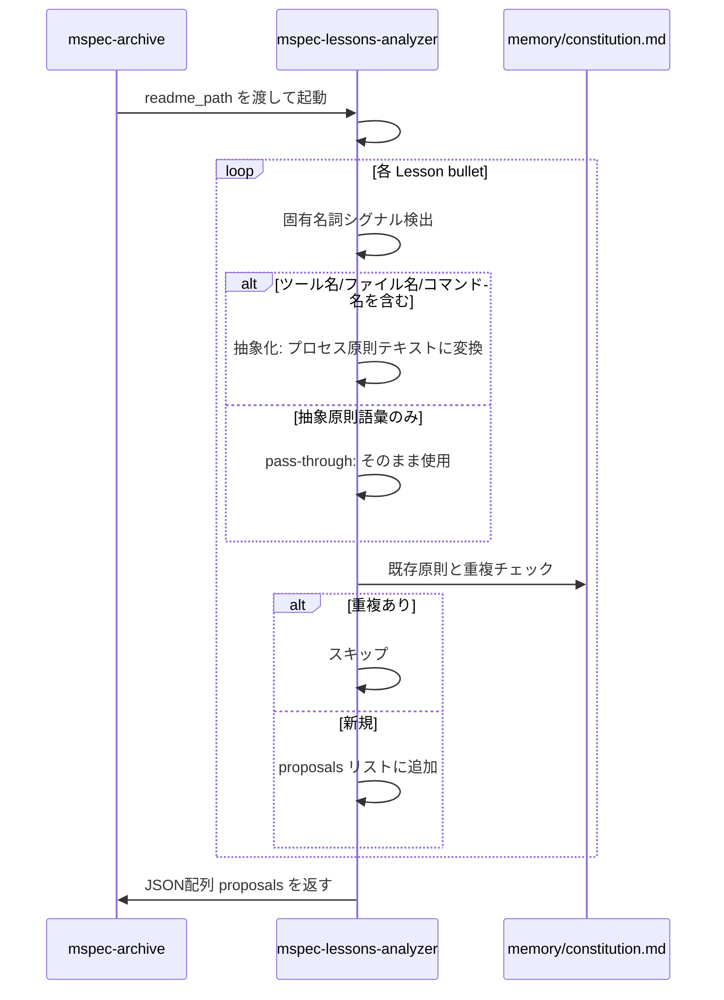
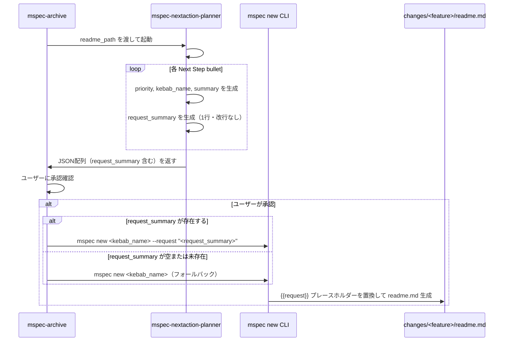

# Architecture Overview: improve-postmortem-quality

## System Diagram

変更対象コンポーネントとそのデータフローを示す。

```mermaid
graph TD
    A[mspec-archive スキル] -->|readme_path を渡す| B[mspec-lessons-analyzer]
    A -->|readme_path を渡す| C[mspec-nextaction-planner]

    B -->|JSON配列: proposals| A
    C -->|JSON配列: NextActionProposal[]| A

    B --> B1["step 5-pre: concreteness detection
    (固有名詞シグナル判定)"]
    B1 -->|固有名詞あり| B2["抽象化必須
    (ツール名・ファイル名を除去してプロセス原則へ)"]
    B1 -->|固有名詞なし| B3["pass-through
    (そのまま返す)"]

    C --> C1["request_summary フィールド生成
    (1行・改行なし・100文字以内)"]

    A -->|ユーザー承認後| D["mspec new <kebab_name>
    --request '<request_summary>'"]
    D -->|CLIが{{request}}を置換| E["changes/<timestamp>-<feature>/readme.md
    ## Request セクションに概略が記載済み"]

    style B2 fill:#ffd,stroke:#aa0
    style B3 fill:#dfd,stroke:#0a0
    style C1 fill:#ddf,stroke:#00a
    style D fill:#fdf,stroke:#a0a
    style E fill:#dfd,stroke:#0a0
```

## Sequence Diagram: Lessons 抽象化フロー（変更後）



## Sequence Diagram: request_summary 書き込みフロー（変更後）



## Data Model

### mspec-nextaction-planner 出力スキーマ（変更後）

```typescript
interface NextActionProposal {
  priority: "high" | "medium" | "low";
  kebab_name: string;              // ^[a-z0-9][a-z0-9-]*[a-z0-9]$
  summary: string;                 // 日本語サマリー（1行）
  request_summary?: string;        // NEW: 1行・改行なし・100文字以内（optional）
  source_next_step: string;        // 元テキスト（変更なし）
}
```

### mspec-lessons-analyzer 抽象化判定ロジック（変更後）

```typescript
interface ConcreteSignal {
  hasToolName: boolean;    // mspec, git, npm 等
  hasCommandName: boolean; // mspec new, mspec continue 等
  hasFileName: boolean;    // *.md, *.ts, *.json 等の拡張子
  hasFilePath: boolean;    // / または . を含むパス形式
}

type AbstractionRequired = ConcreteSignal[keyof ConcreteSignal] extends true
  ? true   // いずれかの signal があれば抽象化必須
  : false; // すべて false ならば pass-through
```

## Constitution Check

| 原則 | Phase 0 | Phase 1 |
|------|---------|---------|
| I. ステップ独立性 | ✅ architecture-overview は design.md の補足図。設計ステップの範囲内 | ✅ 図はコンポーネント間の既存依存関係を可視化するのみ。新たな依存を生成しない |
| II. 決定論的マージ | ✅ 図は Delta Spec の FR-003 から機械的に導出 | ✅ シーケンス図の各ステップが design.md の Decisions と 1:1 対応 |
| III. 質問駆動の要件確定 | ✅ 図化に際して新たな設計判断は発生していない | ✅ 全判断は research/design フェーズで確定済み |
| IV. 双方向アンカー | ✅ 図中のコンポーネント名が実ファイルパスと対応 | ✅ Data Model の型定義が Delta Spec FR-003 Scenario の THEN 条件と整合 |
| V. 強制ステップと拡張ステップの分離 | ✅ architecture-overview は拡張アーティファクト | ✅ 強制ステップのフロー変更を可視化するのみ。フローそのものは変更しない |
| VI. Security by Default | ✅ シーケンス図にフォールバックパスを明示（request_summary 未存在時） | ✅ Data Model で `request_summary?: string` を optional にしてセキュリティリスクを局所化 |

### Complexity Tracking

None
