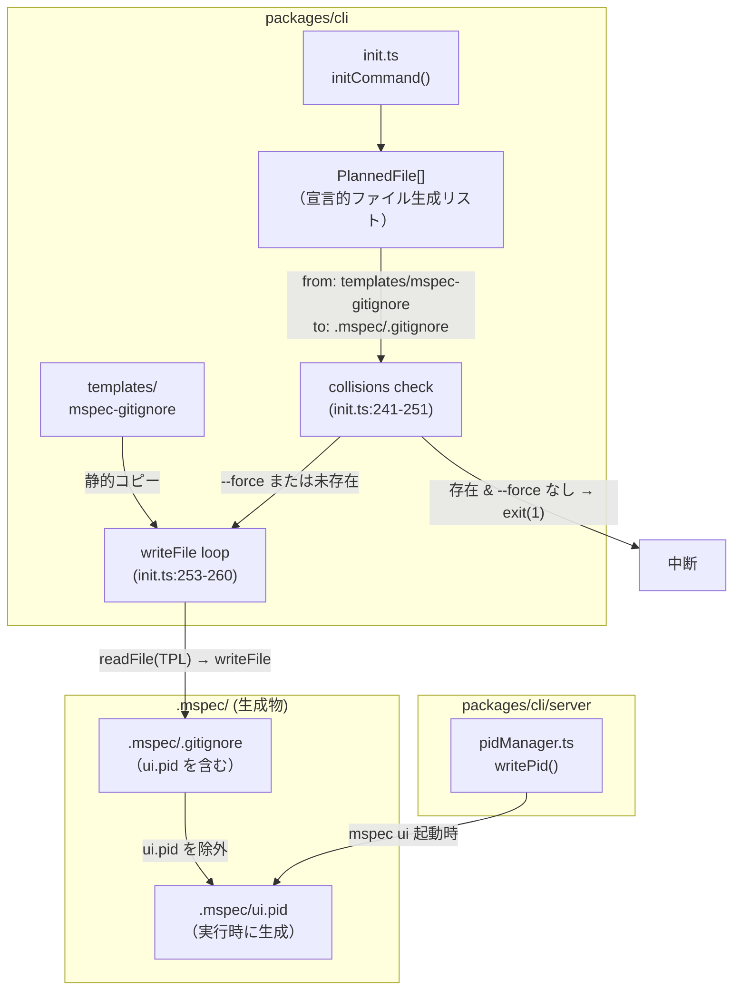
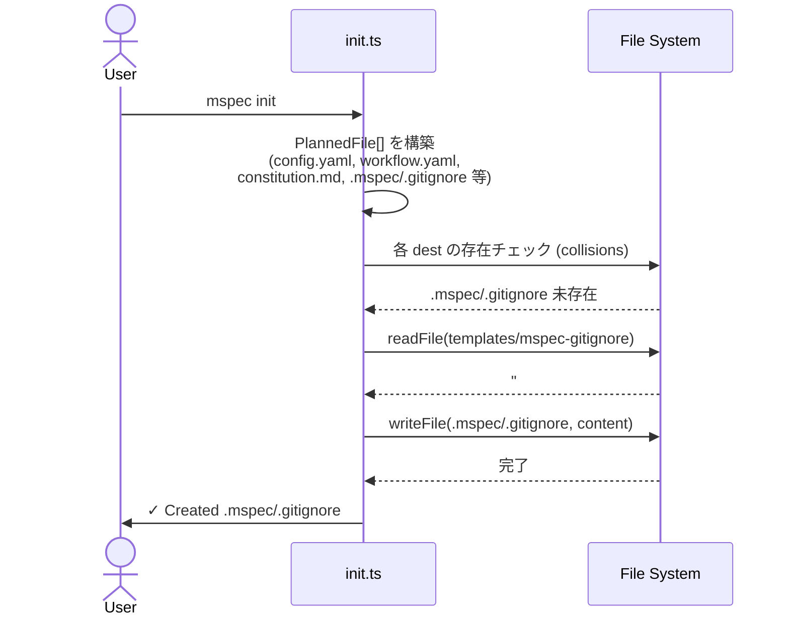
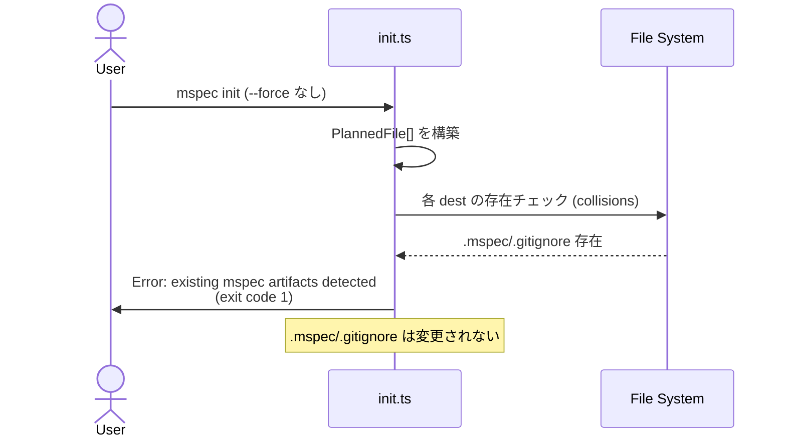
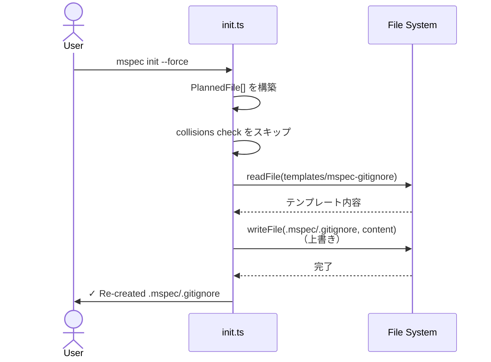

# Architecture Overview: init-gitignore-ui-pid

## System Diagram

## Sequence Diagram: mspec init (fresh project)

## Sequence Diagram: mspec init (already initialized, no --force)

## Sequence Diagram: mspec init --force

## File Change Map

| ファイル | 種別 | 変更の概要 |
|---------|------|-----------|
| `packages/cli/src/commands/init.ts` | 修正 | `PlannedFile[]` に `.mspec/.gitignore` エントリ追加 + `@mspec-delta` アンカーコメント |
| `packages/cli/templates/mspec-gitignore` | 新規 | `ui.pid` を含む静的テンプレート |

## Constitution Check

> Step: architecture-overview | Constitution Version: 1.0

| Principle | Phase 0 | Phase 1 | Notes |
|-----------|---------|---------|-------|
| I. ステップ独立性 | ✅ | ✅ | Sequence Diagram で `init.ts` が自ステップ内で完結することを図示 |
| II. 決定論的マージ | ✅ | ✅ | System Diagram で `PlannedFile[]` → `writeFile` の決定論的フローを図示 |
| III. 質問駆動の要件確定 | ✅ | ✅ | 3つの Sequence Diagram が FR-012 の3シナリオ（fresh / no-force / force）を網羅 |
| IV. 双方向アンカー | ✅ | ✅ | File Change Map に実装対象ファイルを明示。`init.ts` へのアンカー追加も明記 |
| V. 強制ステップと拡張ステップの分離 | ✅ | ✅ | System Diagram に新ステップ・新スキルの追加なし。既存 `mspec init` フロー内の拡張のみ |
| VI. Security by Default | ✅ | ✅ | System Diagram で `.mspec/.gitignore` が `ui.pid` を除外する関係を図示 |

### Complexity Tracking

None — 違反 0 件。
